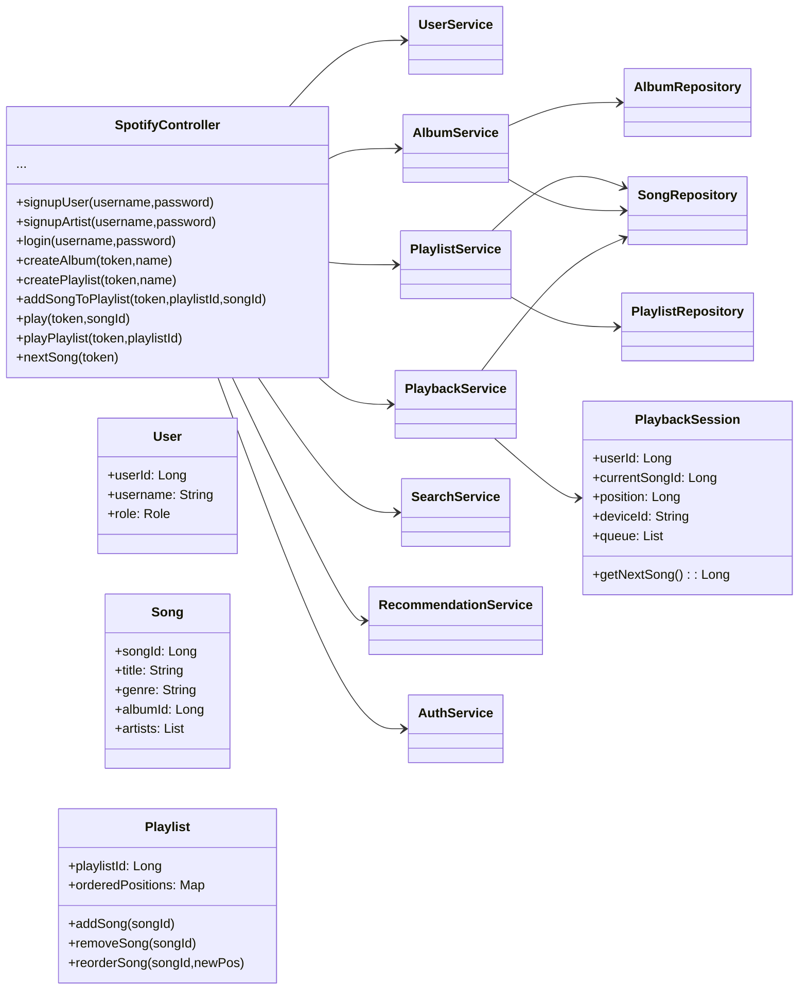

# Design a Music Streaming App: Spotify

## Step 1: Requirement Clarification and features

### Functional Requirements

- User 
  - search and play songs
  - Create playlists
- Artists
  - Post Albums (Singles/Albums)
- Songs
  - Playback Options: 
    - Play
    - Pause
    - Skip
    - Seek
- Playlist
  - ordered
  - Reordering Allowed
  - Collaborative Mode 
  - social sharing
- Authentication for Users/Artists
- Recommendations
  - Songs/Playlists Based on:
    - user preference (client input)
    - listening history (analytics)


## Interview Styled

> `Interviewer`: Let’s design Spotify. What entities would you start with?
> 
> `Candidate`: User , Artist , Album , Song , Playlist

> `Interviewer`: Define relationships.
>
> `Candidate`: Orchestrator on top
> - Artist → Albums (1..*)
> - Album → Songs (1..*)
> - Song → exactly 1 Album 
> - Playlist → ordered list of unique songs 
> - Playlist can be collaborative → multiple users own/edit

> `Interviewer`: Why do you need an Orchestrator?
>
> `Candidate`: Initially: UI → Orchestrator → Repositories
But later changed to:
Orchestrator becomes a thin Facade Layer, delegating to services.
> 
> `Comments`: Don’t let orchestrators become God objects.

> `Interviewer`: Where does business logic live?
>
> `Candidate`: In the Service Layer:
> - PlaylistService
> - UserService
> - PlaybackService
> - AuthService
> - SearchService

> `Interviewer`: How will you maintain playlist ordering?
>
> `Candidate`: 
> - In memory: Use HashMap + Doubly Linked List -> O(1) lookup and O(1) insert/delete
> - In DB: Persist using ->
>   - playlistId 
>   - songId 
>   - nextSongId 
>   - prevSongId 
> - Also apply cycle detection.


> `Interviewer`: This is hard to scale for huge playlists. What’s the weakness?
>
> `Candidate`: Playlist ordering is expensive, pointer chains break at scale.

> `Interviewer`: Caching?
>
> `Candidate`: 
> - CDN → audio files 
> - Redis → metadata 
> - App-layer → hot songs
> - Eviction → LRU 
> - Hot detection → access frequency


> `Interviewer`: Search?
>
> `Candidate`:
> - Use Elasticsearch with:
>   - n-grams 
>   - fuzzy 
>   - synonyms 
>   - autocomplete

> `Interviewer`: Where do playback states live?
>
> `Candidate`:
> - Client:
>   - queue 
>   - shuffle 
>   - repeat 
>   - currentPosition 
> - Server:
>   - deviceId 
>   - currentSongId

> `Interviewer`: Conflict resolution for collaborative playlists?
>
> `Candidate`:
> - Optimistic concurrency 
> - Redis Lua when needed 
> - Timestamp wins

> `Interviewer`: Final Playlist Ordering Strategy (Recommended)
> 
>   - Use positional indexes with gaps (10, 20, 30...)
>     - Reorder = update ONE row. 
>     - Insert anywhere = adjust 1 position. 
>     - Periodic compaction if positions get too dense.

## High-Level Architecture
```pgsql
            ┌────────────────────────────┐
            │         Mobile/Web          │
            └──────────────┬─────────────┘
                           │
                     (Controller/facade Layer)
                           │
        ┌──────────────────┼──────────────────┐
        │                  │                  │
┌────────────┐     ┌──────────────┐    ┌──────────────┐
│ AuthService│     │PlaylistService│    │PlaybackService│
└────────────┘     └──────────────┘    └──────────────┘
        │                  │                  │
        └───┬──────────────┼──────────────┬──┘
            │              │              │
        ┌────────┐   ┌──────────┐     ┌─────────┐
        │UserRepo│   │PlaylistRepo│    │SongRepo │
        └────────┘   └──────────┘     └─────────┘
               │             │               │
               ▼             ▼               ▼
         SQL/NoSQL DB    Redis Cache      Elasticsearch
               │             │               │
               ▼             ▼               ▼
                   Object Storage (S3/GCS)
                           │
                           ▼
                          CDN

```

## Sequence Diagram

### Play a Song
```yaml
User → UI: play(songId)
UI → Facade: startPlayback
Facade → AuthService: validate
AuthService → Facade: OK
Facade → PlaybackService: start
PlaybackService → Redis: get metadata
Redis → PlaybackService: metadata
PlaybackService → UI: CDN URL
UI → CDN: stream chunks
```

### Add Song to Playlist

```yaml

User → UI: addSong(songId)
UI → Facade: addSong
Facade → AuthService: checkPermission
AuthService → Facade: OK
Facade → PlaylistService: addSong
PlaylistService → DB: insert with position
DB → PlaylistService: OK
PlaylistService → Redis: invalidate
PlaylistService → Facade: OK
Facade → UI: success
```

## Caching Strategy

| Layer     | What It Stores                   | Notes               |
| --------- | -------------------------------- | ------------------- |
| CDN       | audio chunks                     | global availability |
| Redis     | song metadata, playlist metadata | fast reads          |
| App cache | hot songs                        | LFU or LRU          |
| DB        | source of truth                  | SQL/NoSQL           |


## Tradeoff
| Decision          | Alternatives                 | Final Choice        |
| ----------------- | ---------------------------- | ------------------- |
| Playlist ordering | Linked list, CRDT, skip list | Positional indexing |
| Search engine     | DB LIKE, Solr                | Elasticsearch       |
| Caching strategy  | Write-through, write-behind  | LRU + TTL           |
| Playback state    | server-only, client-only     | Hybrid              |
| Orchestrator      | Controller-heavy app         | Thin Facade         |


## Class Diagram



## Concurrency
- Executors in PlaybackService
  - Benefits: commands for the same user are executed sequentially; concurrent commands across different users still run in parallel.

## Design Patterns
| **Pattern**                              | **Where Used**                                                                                  | **Purpose**                                                                    | **Why It Fits Spotify**                                                                              |
|------------------------------------------|-------------------------------------------------------------------------------------------------|--------------------------------------------------------------------------------|------------------------------------------------------------------------------------------------------|
| **Command Pattern**                      | PlayCommand, PauseCommand, SeekCommand, SkipCommand, TransferDeviceCommand, PlayPlaylistCommand | Encapsulates playback actions as commands; executed via single-thread executor | Ensures consistent playback state even under rapid user actions (play/seek/pause/skip conflict-free) |
| **Strategy Pattern**                     | RecommendationService with TrendingStrategy, GenreBasedStrategy, ArtistBasedStrategy            | Swap recommendation algorithms at runtime                                      | Spotify frequently switches recommendation strategies; modular and extendable                        |
| **Facade Pattern**                       | SpotifyController                                                                               | Provides unified API for user, playlist, playback, search, albums services     | Hides multiple subsystems; simplifies client usage & enforces SRP at the controller level            |
| **Repository Pattern**                   | UserRepository, AlbumRepository, SongRepository, PlaylistRepository                             | Encapsulates data access                                                       | Clean persistence layer; easy to replace in-memory DB with SQL/NoSQL later                           |
| **Singleton Pattern**                    | SpotifyController.getInstance()                                                                 | Ensures one orchestrator instance                                              | Central access point to the entire system; avoids duplicated service layers                          |
| **Actor Model / Single Thread Executor** | PlaybackService per-user executors                                                              | Serializes all commands for one user                                           | Prevents race conditions between play/seek/pause/timestamp updates                                   |
| **Read–Write Lock Pattern**              | Per-playlist lock in PlaylistService                                                            | Safe concurrent add/remove/reorder operations                                  | Ensures playlist integrity while allowing high concurrency on reads                                  |
