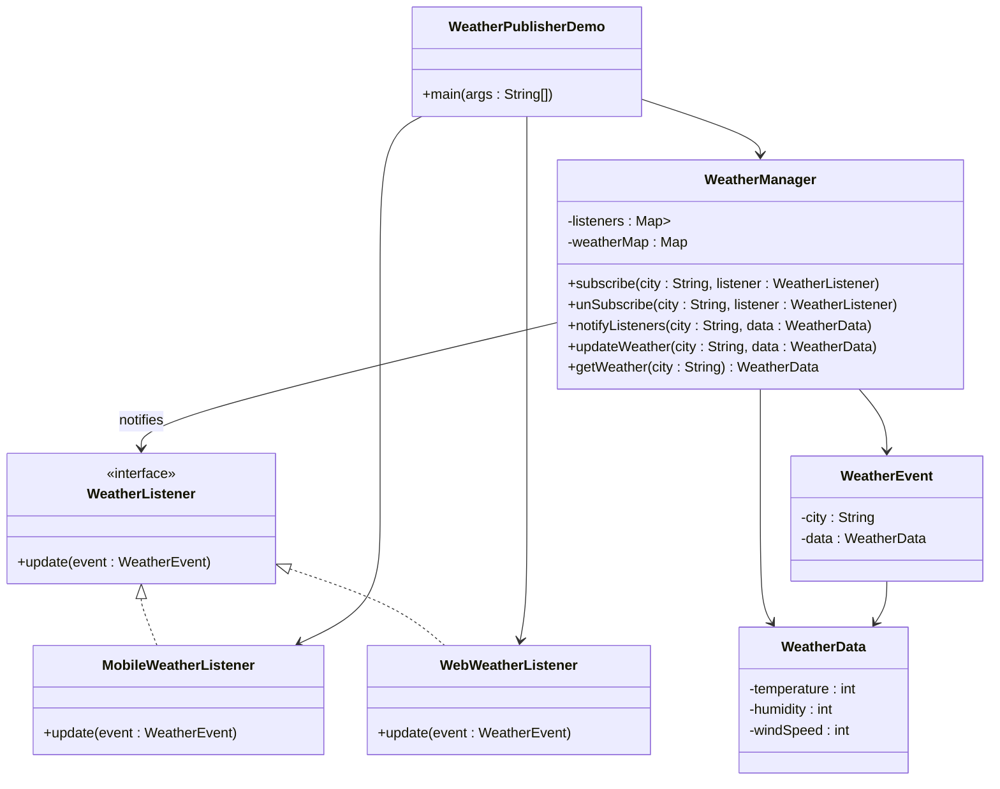

# Solution: Weather Pub Sub Model

Weather Publisher App is implemented using the Observer Design Pattern, where multiple listeners (observers) get notified whenever there is a change in weather temperature for a particular city. 

## Observer Design Pattern
- The Observer Pattern allows multiple dependent objects (Observers) to automatically receive updates when a subject (Observable) changes its state.
- In this enhanced version:
- `WeatherManager` is the Subject, managing city-wise weather data and notifying observers.
- Listeners such as `WebWeatherListener` and `MobileWeatherListener` are `Observers` that react whenever weather changes.
- Observers now receive complete weather context through a WeatherEvent object.

## Components and Their Roles
1.  **WeatherListener (`Interface`)**

   Defines the contract all listeners must follow.
   - Updated to receive full context via WeatherEvent 
   This allows observers to know:
     - Which city was updated
     - The latest weather data (temperature, humidity, windSpeed)
2. **WeatherData (``model``)**
   A structured data holder representing weather parameters.
   Contains:
   - temperature
   - humidity
   - windSpeed
   Encapsulates all weather attributes and makes the system easily extendable.
   
3. **WeatherEvent (`model`)**
   Carries contextual information during notifications.
   Includes:
   - city
   - WeatherData object
   - (optionally extendable with timestamp, event type, etc.)
   This allows observers to react meaningfully to updates.

4. **WeatherManager (`Observable`)**

    - Maintains a list of subscribers (listeners) for different cities. 
    - Stores city-wise temperature data. 
    - Notifies all subscribed listeners when a city's temperature is updated. 
    - Provides methods to:
      - **Subscribe** (`subscribe`): Register a listener to a specific city's weather updates. 
      - **Unsubscribe** (`unSubscribe`): Remove a listener from a city's updates. 
      - **Notify** (`notifyListeners`): Inform all subscribed listeners when a city's temperature changes. 
      - **Set temperature** (`setTemp`): Update the temperature of a city and notify relevant listeners. 
      - **Get temperature** (`getTemp`): Fetch the current temperature of a city.

3. **WebWeatherListener (`Observer`)**

    - Implements WeatherListener to simulate a web-based weather update system.
    - Prints "Weather Updated on Web" when notified.
4. **MobileWeatherListener (`Observer`)**

    - Implements WeatherListener to simulate a mobile app weather update system.
    - Prints "Weather Updated on Mobile" when notified.

## Class Diagram

