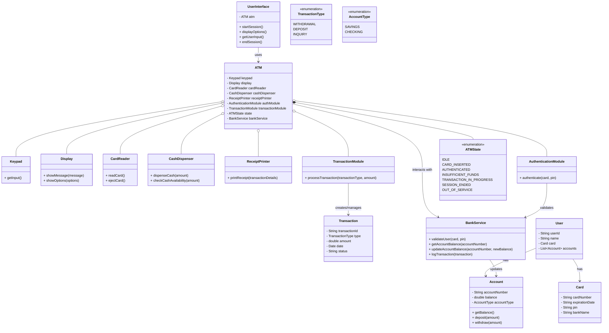

# Design an ATM system

## Entities

- `User`: Represents a bank customer with attributes such as user ID, name, card number, and PIN.
- `Card`: Represents a bank card with attributes such as card number, expiration date, and associated user ID.
- `Account`: Represents a bank account with attributes such as account number, balance, and account type
- `ATM`: Represents the ATM machine with attributes such as ATM ID, location, and cash dispenser.
- `Transaction`: Represents a transaction with attributes such as transaction ID, type (withdrawal, deposit, inquiry), amount, date, and status.
- `BankService`: Represents the backend service that interacts with the bank's systems for account validation and transaction processing.
- `UserInterface`: Represents the user interface of the ATM for user interactions.

## Design Considerations

- ATM aggregation: Instead of one bulky ATM class, following aggregations added
    - Keypad: Takes input from the user (PIN, amount, options)
    - Display: Shows messages and options to the user
    - CardReader: Reads card information and sends it for authentication
    - CashDispenser: Dispenses cash to the user
    - ReceiptPrinter: Prints transaction receipts
    - AuthenticationModule: Handles user authentication
    - TransactionModule: Manages transaction processing
- ATM State: Implementing state patterns to manage different states of the ATM
    - idle
    - card inserted
    - authenticated
    - transaction in progress
    - Session ended
    - Out of service
- ENUMs
    - TransactionType: WITHDRAWAL, DEPOSIT, INQUIRY
    - AccountType: SAVINGS, CHECKING
    - ATMState: IDLE, CARD_INSERTED, AUTHENTICATED, TRANSACTION_IN_PROGRESS, SESSION_ENDED, OUT_OF_SERVICE
- Concurrency
    - All or nothing transactions to ensure data consistency
    - Locking mechanisms to handle concurrent access
  
## Rough Design and Responsibilities
- `UserInterface` (Entry Point):
    - Responsibility: Handles user interaction and delegates actions to the ATM.
    - Relationships:
        - Uses → ATM
        - Interacts with → User (indirectly through ATM)
    - Attributes:
        - ATM instance
    - Methods:
        - startSession()
        - displayOptions()
        - getUserInput()
        - endSession()
- `User`:
    - Relationships:
        - Has → Card
        - Has → Account
    - Attributes:
        - userId
        - name
        - Card
        - Accounts (can be multiple)
- `Account`
    - Attributes:
        - accountNumber
        - balance
        - accountType (AccountType)
    - Methods:
        - getBalance()
        - deposit(amount)
        - withdraw(amount)
- `Card`
    - Attributes:
        - cardNumber
        - expirationDate
        - pin
        - bankName
- `ATM` (Aggregates various components):
    - Relationships:
        - Aggregation
            - Hardware components:
                - Keypad
                - Display
                - CardReader
                - CashDispenser
                - ReceiptPrinter
            - Logical components:
                - AuthenticationModule
                - TransactionModule
        - Composition
            - has a ATMState
        - Association
            - interacts with → BankService
- `Keypad`
    - Methods:
        - getInput()
- `Display`
    - Methods:
        - showMessage(message)
        - showOptions(options)
- `CardReader`
    - Methods:
        - readCard()
        - ejectCard()
- `CashDispenser`
    - Methods:
        - dispenseCash(amount)
        - checkCashAvailability(amount)
- `ReceiptPrinter`
    - Methods:
        - printReceipt(transactionDetails)
- `AuthenticationModule`
    - Methods:
        - authenticate(card, pin)
- `TransactionModule`
    - Methods:
        - processTransaction(transactionType, amount)
- `Transaction`
    - Attributes:
        - transactionId
        - type (TransactionType)
        - amount
        - date
        - status
- bankService
    - Methods:
        - validateUser(card, pin)
        - getAccountBalance(accountNumber)
        - updateAccountBalance(accountNumber, newBalance)
        - logTransaction(transaction)

## Components Security Considerations
- PIN Storage and Verification:
  - In traditional ATM systems, the PIN is not stored directly. Instead, a **PIN Verification Value (PVV)** is generated using a secure algorithm involving the PIN, a secret key, and the card number. This PVV is stored securely in the bank's hardware security module (HSM).
  - In modern digital banking systems or simulations, a **hashed PIN (pinHash)** approach is often used. The PIN is combined with a unique salt and hashed using a strong one-way hashing algorithm before storage.
| Aspect                 | **PVV (PIN Verification Value)**                                   | **pinHash (Hashed PIN)**                                        |
| ---------------------- | ------------------------------------------------------------------ | --------------------------------------------------------------- |
| **Used in**            | Physical ATM cards and bank HSMs                                   | Modern digital banking systems, simulations                     |
| **How it’s generated** | `PVV = encrypt(PIN, secretKey, cardNumber)`                        | `pinHash = hash(salt + PIN)`                                    |
| **Secret involved**    | Uses a **secret encryption key** known only to the bank            | Uses a **unique salt** stored with each user                    |
| **Algorithm type**     | **Symmetric encryption** (e.g., Triple DES)                        | **One-way hash** (e.g., SHA-256, bcrypt)                        |
| **Verification**       | Bank decrypts PVV using HSM and checks if it matches derived value | System hashes entered PIN with stored salt and compares hashes  |
| **Security level**     | Very high (used in real ATMs with hardware security modules)       | High (secure if salt + strong hash used)                        |
| **Where used**         | Actual banking systems with chip/PIN verification                  | Simplified software systems or simulations (like this design)   |
| **Advantages**         | Hardware-grade security, tamper-proof                              | Easier to implement, no encryption keys needed                  |
| **Disadvantages**      | Requires HSM hardware, complex key management                      | Relies on software integrity, slower if using iterative hashing |

- Using pinHash approach