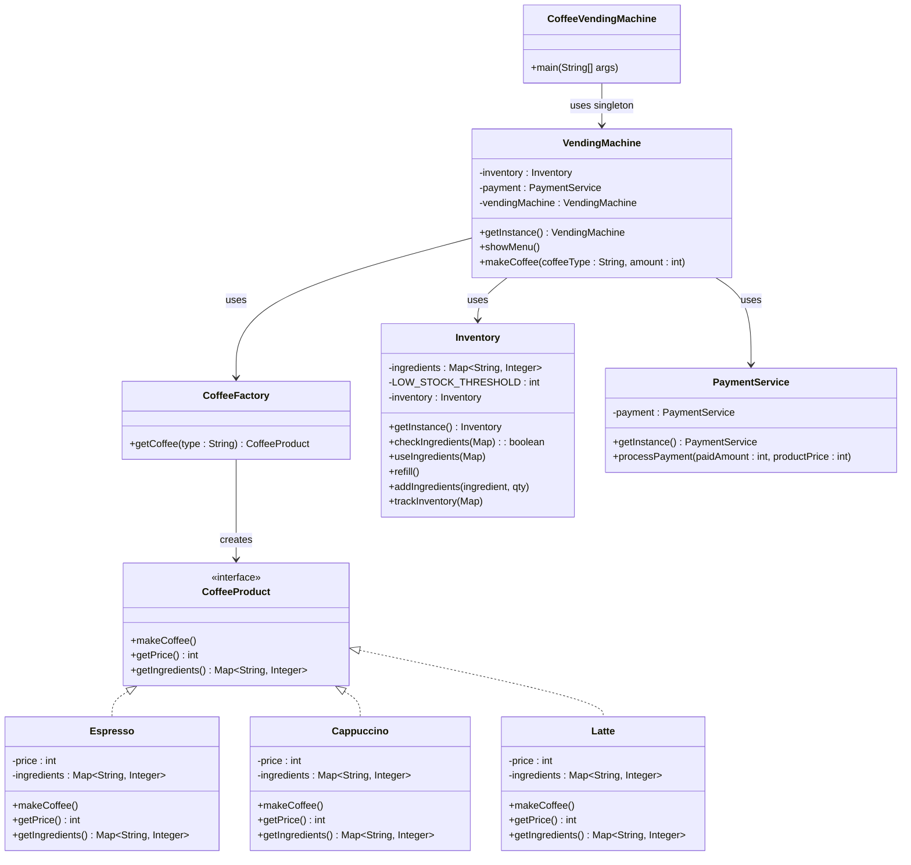

# Coffee Vending Machine Design

## Design Patterns Used

### Singleton Pattern
- **Used In**: `VendingMachine`, `Inventory`, `PaymentService`
- **Why**: Ensures only one instance of shared services.
- **Benefits**:
    - Prevents inconsistent state (especially for inventory/payment).
    - Saves memory, globally accessible instance.

---

### Factory Pattern
- **Used In**: `CoffeeFactory`
- **Why**: Encapsulates creation of different coffee types.
- **Benefits**:
    - Centralized object creation logic.
    - Easy to extend — just add new coffee class and map it in factory.

---

### Interface-based Programming
- **Used In**: `CoffeeProduct` interface
- **Why**: Enables polymorphism.
- **Benefits**:
    - Supports different coffee types with common interface.
    - Promotes Open/Closed principle.

---

### Thread Safety via `synchronized`
- **Used In**: `Inventory` methods and `VendingMachine.makeCoffee()`
- **Why**: Allows concurrent user requests without corrupting shared state.
- **Benefits**:
    - Prevents race conditions.
    - Ensures accurate ingredient usage and payment handling.

---

## Class Responsibilities

| Class Name            | Description                                                                 |
|-----------------------|-----------------------------------------------------------------------------|
| `VendingMachine`      | Singleton class that coordinates coffee making, ingredient check, payment, and inventory tracking. Thread-safe. |
| `CoffeeProduct`       | Interface for all coffee types, with methods for making coffee, pricing, and ingredients. |
| `Espresso`            | Implements `CoffeeProduct`; represents Espresso with its unique ingredients and price. |
| `Cappuccino`          | Implements `CoffeeProduct`; represents Cappuccino with its unique ingredients and price. |
| `Latte`               | Implements `CoffeeProduct`; represents Latte with its unique ingredients and price. |
| `CoffeeFactory`       | Implements the Factory Pattern to instantiate the correct coffee type based on string input. |
| `Inventory`           | Singleton class maintaining the ingredient stocks, checks for availability, and logs usage. Synchronized for thread safety. |
| `PaymentService`      | Singleton class that handles payment processing and validates the amount. |
| `CoffeeVendingMachine`| Main class that simulates users making concurrent coffee requests. Spawns threads with different coffee orders. |

---

## Alternative Design Patterns

| Use Case | Alternative Pattern | Explanation |
|----------|---------------------|-------------|
| Stateful transitions | **State Pattern** | If you reintroduce behavior changes based on stages (Idle → Payment → Dispense). |
| Notifications | **Observer Pattern** | Alert admin when stock is low or when invalid coffee is selected. |
| Request Encapsulation | **Command Pattern** | Encapsulate each user request for queueing, undo, and logging. |
| Coffee Customization | **Decorator Pattern** | Add sugar, milk, foam dynamically without modifying base classes. |
| Multiple Ingredient Sources | **Abstract Factory** | Create families of related ingredient types (e.g., Vegan, Premium). |
| Input Validation | **Chain of Responsibility** | Modular validation chain — coffee type → stock → payment. |
