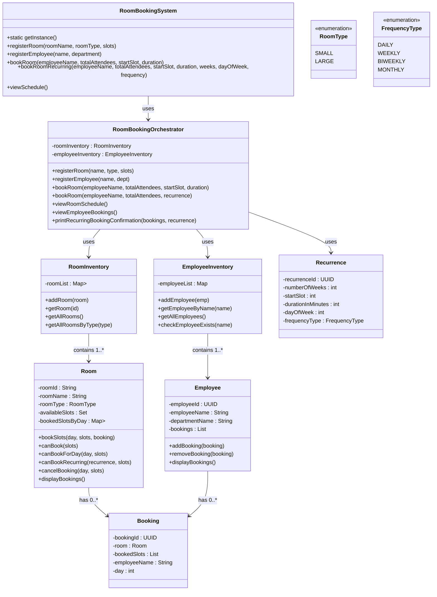

# 

## Overview

This Room Booking System is a thread-safe, singleton-based application that allows employees to book rooms for single or recurring meetings. It supports **daily, weekly, biweekly, and monthly recurrences** and manages room and employee inventories.

## Entities and Responsibilities

| Entity                                 | Responsibilities                                                                  | Key Attributes                                                                                  |
|----------------------------------------|-----------------------------------------------------------------------------------|-------------------------------------------------------------------------------------------------|
| `RoomBookingSystem` (Facade/Singleton) | Entry point for clients, delegates requests to `RoomBookingOrchestrator`          | `systemInstance`, `orchestrator`                                                                |
| `RoomBookingOrchestrator`              | Core business logic, validates bookings, finds best room, handles recurring logic | `roomInventory`, `employeeInventory`                                                            |
| `RoomInventory`                        | Stores all rooms, provides query methods by type                                  | `Map<RoomType, Map<String, Room>> roomList`                                                     |
| `EmployeeInventory`                    | Stores all employees, allows lookup by name                                       | `Map<UUID, Employee> employeeList`                                                              |
| `Room`                                 | Represents a room, manages booking slots and availability                         | `roomId`, `roomName`, `roomType`, `availableSlots`, `bookedSlotsByDay`                          |
| `Employee`                             | Represents an employee and their bookings                                         | `employeeId`, `employeeName`, `departmentName`, `bookings`                                      |
| `Booking`                              | Represents a booking instance for a room                                          | `bookingId`, `room`, `bookedSlots`, `employeeName`, `day`                                       |
| `Recurrence`                           | Holds recurrence info for repeated bookings                                       | `recurrenceId`, `numberOfWeeks`, `startSlot`, `durationInMinutes`, `dayOfWeek`, `frequencyType` |
| `RoomType`                             | Enum for room size/type                                                           | `SMALL`, `LARGE`                                                                                |
| `FrequencyType`                        | Enum for recurrence frequency                                                     | `DAILY`, `WEEKLY`, `BIWEEKLY`, `MONTHLY`                                                        |

---

## Design Patterns Used

| Pattern                             | Usage                                                                                                      |
|-------------------------------------|------------------------------------------------------------------------------------------------------------|
| **Singleton**                       | `RoomBookingSystem` ensures a single instance of the system                                                |
| **Facade**                          | `RoomBookingSystem` provides a simplified interface for clients                                            |
| **Dependency Injection**            | `RoomBookingOrchestrator` receives `RoomInventory` and `EmployeeInventory` via constructor for testability |
| **Thread-Safety / Synchronization** | `synchronized` blocks in booking methods to prevent concurrent conflicts                                   |
| **Builder-like Approach**           | `Recurrence` class encapsulates recurrence parameters                                                      |

## Sequence of Booking

1. Client calls `RoomBookingSystem.bookRoom()` or `bookRoomRecurring()`.
2. `RoomBookingSystem` forwards request to `RoomBookingOrchestrator`.
3. Orchestrator validates inputs:
    - Employee exists
    - Room capacity and available slots
    - Recurrence validity (day of week, frequency type)
4. Best-fit room is chosen based on:
    - Room capacity (SMALL/LARGE)
    - Availability of required slots
5. Booking is created using `Booking` object.
6. Room and Employee objects are updated with the booking.
7. Recurring bookings:
    - Slots checked for each occurrence
    - Rollback occurs if any occurrence conflicts

## 5. Mermaid UML

## Assumptions
1. Employee Name shouldn't ignore case sensitivity.
2. Room Name shouldn't ignore case sensitivity.
3. Time slots are represented as integers from 1 to 10, corresponding to hourly blocks from 9 AM to 6 PM.
4. Bookings are made for whole hours only. (if duration is 20 mins, still 1 hr will be booked)