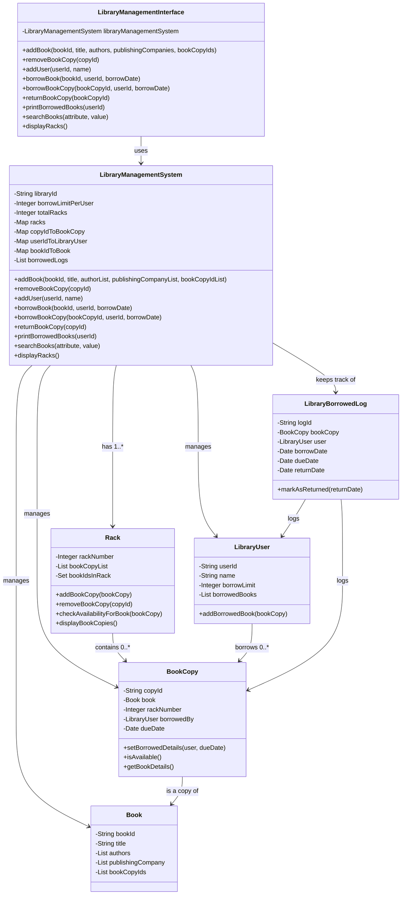

# Library Management System

## Design Patterns Used
| Pattern                 | Used Where                            | Purpose                                       |
|-------------------------|---------------------------------------|-----------------------------------------------|
| Singleton               | `LibraryManagementInterface` instance | Ensure single library instance                |
| Factory                 | `addBook()` creating `BookCopy`       | Encapsulate object creation                   |
| Composition/Aggregation | Library -> Racks, BookCopies, Users   | Manage ownership & modularity                 |
| Strategy                | `searchBooks()` by attribute          | Allow flexible search algorithms              |
| Template Method         | `borrowBook()` vs `borrowBookCopy()`  | Reuse common steps, vary selection            |

## UML Class Diagram

