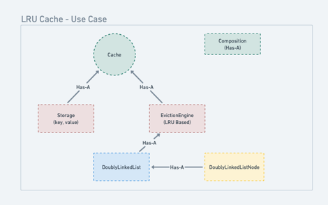

# Solution: LRU Cache

## strategy.Strategy Pattern
The eviction strategy (LRU) is encapsulated in the EvictionEngine. This allows for flexibility in changing the eviction strategy in the future without modifying the Cache class.

## Components:

1. **Cache Class:** 
   - The main interface for interacting with the cache. It contains methods to get and put key-value pairs. It delegates the storage management and eviction logic to the `Storage` and `EvictionEngine` classes.
   - Uses `Storage` for holding key-value pairs.
   - Uses `EvictionEngine` to handle eviction strategies based on cache access.
2. **Storage Class:** 
   - Represents the actual cache storage, which is a simple `HashMap`. 
   - It handles adding and retrieving key-value pairs, and interacts with the `EvictionEngine` to manage eviction when the cache exceeds its capacity. 
3. **EvictionEngine Class:** 
   - Manages the eviction strategy. It uses a Doubly Linked List to track the order of key access, enabling the eviction of the least recently used (LRU) item when the cache is full.
   - Contains methods for tracking key access (`KeyAccessed`) and evicting the least recently used key (`EvictKey`). 
4. **DoublyLinkedList Class:** 
   - A helper data structure used by the EvictionEngine to track the order of keys. The list maintains references to the latest and oldest accessed keys, supporting fast additions and removals of nodes. 
5. **DoublyLinkedListNode Class:** 
   - Represents a node in the doubly linked list. Each node contains a key and references to the previous and next nodes in the list. 
6. **CacheDemo Class:** 
   - A demo class to showcase the functionality of the cache. It creates a Cache instance, adds keys, retrieves them, and performs eviction when the cache exceeds its capacity.

## Use case Diagram
