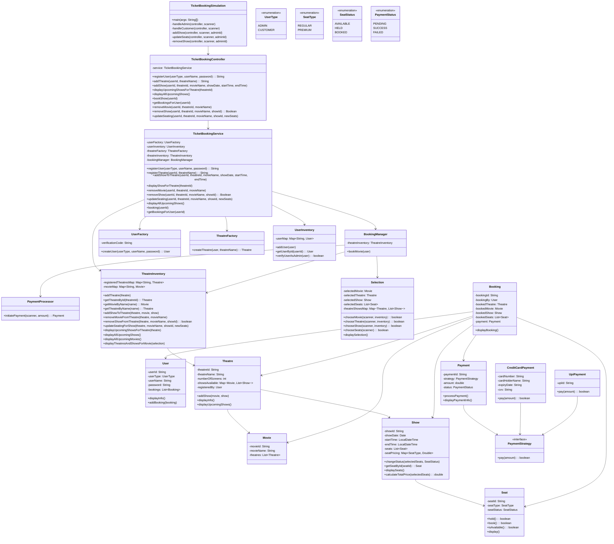

# Movie Ticket Booking System

## Class Structure

### 1. App Layer
- **`TicketBookingSimulation`**
    - Main entry point.
    - Handles CLI interactions for **Admin** and **Customer**.
    - Calls `TicketBookingController` for operations.
    - Menus: Add Theatre, Add Show, Update Seats, Book Show, etc.

### 2. Controller Layer (Facade)
- **`TicketBookingController`**
    - Exposes system functionality to the app.
    - Delegates operations to `TicketBookingService`.
    - Methods: registerUser, addTheatre, add/removeShow, updateSeating, displayShows, booking, getBookings.

- **`BookingManager`**
    - Handles end-to-end **booking workflow**.

- **`PaymentProcessor`**
    - Handles payment workflow via **strategy pattern** (UPI or Credit Card).

### 3. Service Layer
- **`TicketBookingService`** (Singleton)
    - Core business logic.
    - Coordinates UserFactory, TheatreFactory, UserInventory, TheatreInventory, BookingManager.
    - Handles: user registration, theatre registration, show management, booking management, seating updates.
- **`PaymentProcessor`**
- Handles payment workflow using **strategy pattern** (UPI or Credit Card).

### 4. Factory Layer
- **`UserFactory`**
    - Creates `User` objects (Admin/Customer).
    - Admin verification via code.
- **`TheatreFactory`**
    - Creates `Theatre` objects.
    - Verifies admin user.

### 5. Repository Layer (Singletons)
- **`UserInventory`**
    - Stores users (`Map<String, User>`).
    - Admin verification.
- **`TheatreInventory`**
    - Stores theatres (`Map<String, Theatre>`) and movies.
    - Methods to add/remove shows, update seating, get theatres/movies/shows.

### 6. Model Layer
- **`User`**
    - Attributes: userId, userName, userType, bookings.
    - Methods: addBooking, displayInfo.

- **`Theatre`**
    - Attributes: theatreId, theatreName, showsAvailable, registeredBy.
    - Methods: addShow, displayInfo, displayUpcomingShows.

- **`Movie`**
    - Attributes: movieId, movieName, theatres list.

- **`Show`**
    - Attributes: showId, date/time, seats, seat pricing.
    - Methods: calculatePrice, hold/bookSeats, displaySeats.

- **`Seat`**
    - Attributes: seatId, seatType, seatStatus.
    - Methods: hold(), book(), display().

- **`Booking`** (Builder pattern)
    - Attributes: bookingId, user, theatre, movie, show, seats, payment.
    - Method: displayBooking().

- **`Selection`**
    - Tracks current user selection (movie, theatre, show, seats).
    - Methods: chooseMovie, chooseTheatre, chooseShow, chooseSeats, displaySelection.

- **`Payment`**
    - Attributes: paymentId, strategy, amount, status.
    - Methods: processPayment(), displayPaymentInfo().

### 7. Strategy Layer (Payment)
- **`PaymentStrategy`** (interface)
- **`CreditCardPayment`** & **`UpiPayment`** (implement `PaymentStrategy`)

### 8. Enums
- `UserType`: ADMIN, CUSTOMER
- `SeatType`: REGULAR, PREMIUM
- `SeatStatus`: AVAILABLE, HELD, BOOKED
- `PaymentStatus`: PENDING, SUCCESS, FAILED

## Key Design Patterns Used
- **Singleton:** `TicketBookingService`, `UserInventory`, `TheatreInventory`.
- **Factory:** `UserFactory`, `TheatreFactory`.
- **Builder:** `Booking` object creation.
- **Strategy:** `PaymentStrategy` for payments.
- **Facade:** `TicketBookingController` exposing simplified interface.

## Summary

- Model layer: `User`, `Theatre`, `Movie`, `Show`, `Seat`, `Booking`, `Payment`, `enums`. 
- Repository layer: `UserInventory`, `TheatreInventory`. 
- Service layer: `TicketBookingService` as a singleton facade and `PaymentProcessor`. 
- Controller layer: `TicketBookingController`, `BookingManager`. 
- Factory layer: `UserFactory`, `TheatreFactory`. 
- Strategy pattern for payment: `CreditCardPayment`, `UpiPayment`. 
- CLI simulation: `TicketBookingSimulation` class with admin and customer menus.