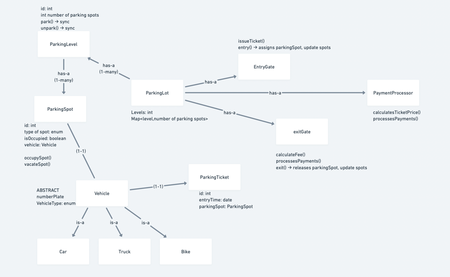

# Solution: Parking Lot

## Components Used

1. `ParkingLot`: Manages multiple levels and parking spots, assigns and releases spots, tracks availability.
    - `getInstance()`: Returns a singleton instance of the parking lot.
    - `addLevel(ParkingLevel level)`: Adds a parking level to the parking lot.
    - `getTicketById(String ticketId)`: Retrieves a parking ticket by its ID.
    - `findAvailableSpot(VehicleType vehicleType)`: Finds an available parking spot based on the vehicle type.

2. `ParkingLevel`: Represents a level in the parking lot, contains a set of parking spots.
    - `findParkingSpot(VehicleType type)`: Finds an available parking spot that matches the vehicle type (car, bike, truck).
    - `isFull()`: Checks if the level is fully occupied (returns true if all spots are occupied).

3. `ParkingSpot`: Represents an individual parking spot, tracks availability and the type of vehicle it can accommodate.
    - `occupySpot(Vehicle vehicle)`: Marks the spot as occupied and assigns a vehicle.
    - `vacateSpot()`: Frees the parking spot and clears the vehicle.

4. `Vehicle` (Abstract Class): Abstract class representing vehicles (e.g., Vehicle.Car, Motorcycle, Vehicle.Truck).
    - `getVehicleType()`: Returns the vehicle type (car, bike, truck).
    - `getLicenseNumber()`: Returns the vehicle's license plate number.

5. `Car`, `Bike`, `Truck` (Concrete Classes): Represent specific types of vehicles (car, bike, truck), extend the Vehicle class.
    - Inherits all methods from the Vehicle class

6. `ParkingLotTicket`: Issues a ticket when a vehicle is parked, keeps track of entry time and parking spot.
    - `getTicketId()`: Retrieves the ticket ID.
    - `getVehicle()`: Retrieves the vehicle associated with the ticket.
    - `getParkingSpot()`: Retrieves the parking spot associated with the ticket.
    - `getEntryTime()`: Retrieves the entry time when the ticket was issued.

7. `EntryGate`: Handles vehicle entry, assigns available spots, and issues tickets.
    - `entry(Vehicle vehicle)`: Issues a parking ticket for the vehicle entering the parking lot.
    - `issueTicket(Vehicle vehicle)`: Finds an available parking spot and issues a ticket.
    - `assignParkingSpot(ParkingSpot availableSpot, Vehicle vehicle)`: Assigns a vehicle to a parking spot.

8. `ExitGate`: Handles vehicle exit, calculates fees, releases parking spots, and processes payments.
    - `exit(String ticketId)`: Handles vehicle exit, calculates the parking fee, and releases the spot.
    - `calculateFee(long duration)`: Calculates the parking fee based on the duration of stay.

9. `PaymentProcessor`: Handles parking fee calculations and payments.
    - `setStrategy(PaymentStrategy strategy)`: Sets the payment strategy (e.g., hourly, per minute).
    - `calculateStrategy(long duration)`: Calculates the parking fee based on the strategy.
   
## Patterns Used

- `ParkingLot` uses singleton method:  The system should have only one instance of the parking lot that manages the entire structure.
- `PaymentProcessor` uses Strategy pattern: Different parking lots may have different pricing models.
- `ParkingDisplay` uses Observer pattern: Real-time update of parking space availability.
- `EntryGate` and `ExitGate` uses command pattern: To handle parking entry and exit as commands for scalability.
- To handle `concurreny` used synchronized methods: To handle multiple entry and exit points

## Representation

