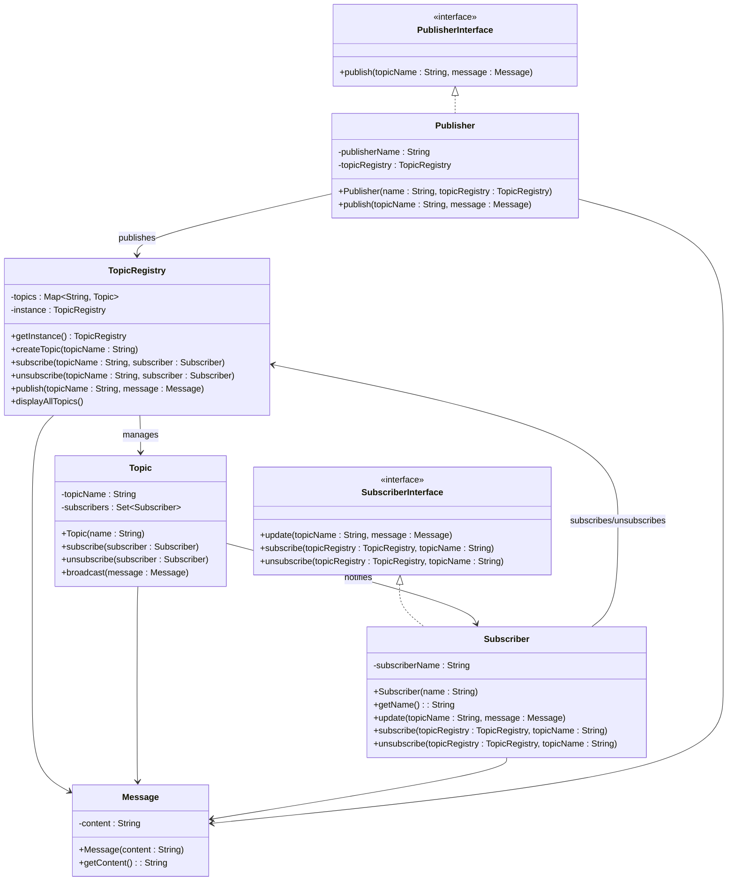

# PubSub Model
The `Publisher-Subscriber` (Pub-Sub) Model enables event-driven communication between publishers and subscribers through topics. Publishers send messages to topics, and subscribers receive updates when new messages are published. This model decouples components, enhancing scalability and modularity.

## Components Used

1. `Message`
   - Represents the content that is published to a topic.
   - Contains a `content` field and a getter method.
2. `Publisher`
   - Responsible for publishing messages to topics. 
   - Contains a `publisherName` and a reference to `TopicRegistry`. 
   - Calls `publish()` on TopicRegistry to send messages to the topic.
3. `Subscriber`
   - Represents entities that receive messages from subscribed topics.
   - Stores a `subscriberName` for identification.
   - Implements an `update()` method to receive messages when a topic is updated.
   - Provides `subscribe()` and `unsubscribe()` methods for managing subscriptions dynamically.
4. `Topic`
   - Represents a messaging channel where publishers send messages and subscribers receive them.
   - Maintains a Set<Subscriber> to store all subscribers for that topic.
   - Provides `subscribe()` and `unsubscribe()` methods to manage subscribers.
   - Uses `broadcast()` to send messages to all subscribed users.
5. `TopicRegistry` (Singleton Pattern)
   - Centralized component that manages all topics.
   - Uses a Map<String, Topic> to store topics dynamically.
   - Ensures only one instance of TopicRegistry exists.
   - Provides methods to:
     - `createTopic()`: Create new topics.
     - `subscribe()`: Add subscribers to topics.
     - `unsubscribe()`: Remove subscribers from topics.
     - `publish()`: Distribute messages to subscribers.
     - `displayAllTopics()`: Show all available topics.

