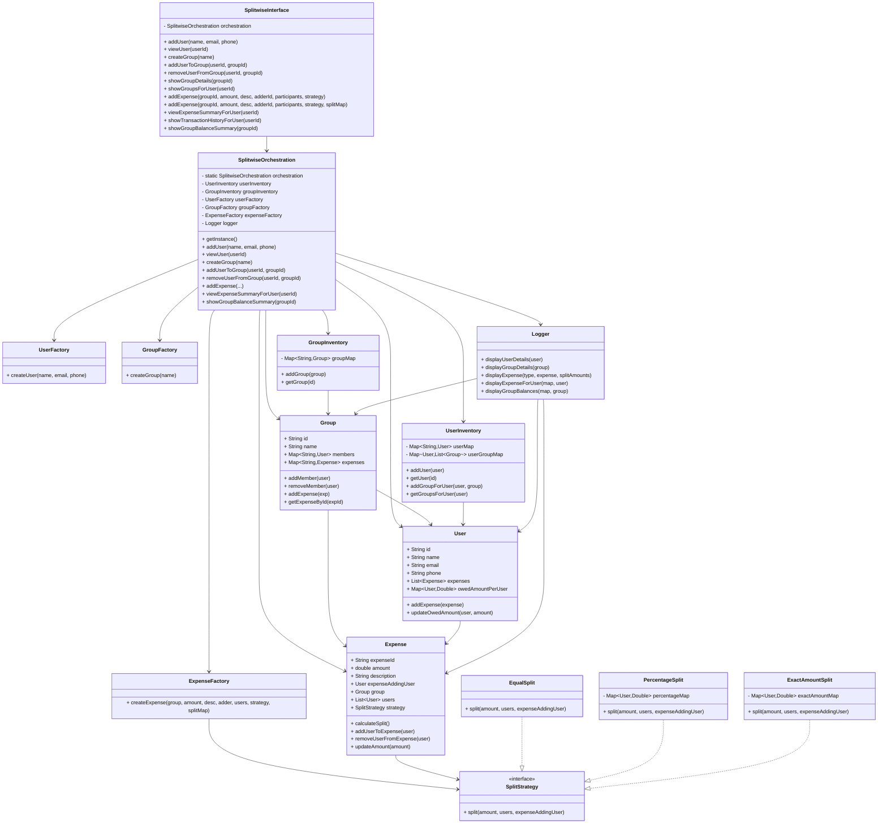

# Design expense sharing app: Splitwise

## According to the requirements, here are the actors and APIs needed for the Splitwise application:

1. User Management:
   - Create User: `POST /user` 
     - Input: User details (name, email, password, etc.)
   - Update User Profile: `PUT /users/{userId}`
   - Get User Profile: `GET /users/{userId}`
   - List Expenses for User: `GET /users/{userId}/expenses`
   - Transaction History: `GET /users/{userId}/transactions`
   - List Groups for User: `GET /users/{userId}/groups`

2. Group Management:
    - Create Group: `POST /groups`
    - Add User to Group: `POST /groups/{groupId}/users`
    - Remove User from Group: `DELETE /groups/{groupId}/users/{userId}`
    - Get Group Details: `GET /groups/{groupId}`
    - Delete Group: `DELETE /groups/{groupId}`
    - Group Expense Summary: `GET /groups/{groupId}/summary`
   
3. Expense Management:
    - Add Expense: `POST /groups/{groupId}/expenses`
    - Get Expense Details: `GET /groups/{groupId}/expenses/{expenseId}`
    - List Expenses in Group: `GET /groups/{groupId}/expenses`
    - Update Expense: `PUT /groups/{groupId}/expenses/{expenseId}`
    - Delete Expense: `DELETE /groups/{groupId}/expenses/{expenseId}`
    - Settle Up: `POST /users/{userId}/settle/{otherUserId}`

4. Split Methods:
   - Equal Split: Handled in the Add Expense API
   - Percentage Split: Handled in the Add Expense API
   - Exact Amounts: Handled in the Add Expense API

## Class Diagram

## Design Patterns Used

| **Design Pattern**                                | **Used In / Classes**                                                                                                               | **Type**   | **Purpose**                                                                                                            | **Key Benefit**                                                            |
|---------------------------------------------------|-------------------------------------------------------------------------------------------------------------------------------------|------------|------------------------------------------------------------------------------------------------------------------------|----------------------------------------------------------------------------|
| **Singleton**                                     | `SplitwiseOrchestration`, `UserInventory`, `GroupInventory`, `Logger`                                                               | Creational | Ensures only one global instance is used throughout the system for coordination, data access, and logging.             | Centralized control and shared state consistency.                          |
| **Factory Method**                                | `UserFactory`, `GroupFactory`, `ExpenseFactory`                                                                                     | Creational | Encapsulates the object creation logic for `User`, `Group`, and `Expense` objects, hiding instantiation details.       | Reduces coupling; simplifies object creation.                              |
| **Strategy Pattern**                              | `SplitStrategy` (interface), `EqualSplit`, `PercentageSplit`, `ExactAmountSplit`                                                    | Behavioral | Allows flexible choice of splitting logic at runtime. Different strategies can be swapped without modifying `Expense`. | Promotes open/closed principle and cleaner extension for new split types.  |
| **Facade Pattern**                                | `SplitwiseInterface`                                                                                                                | Structural | Acts as the unified entry point for all client operations like adding users, creating groups, or adding expenses.      | Simplifies usage; hides orchestration and internal subsystem complexities. |
| **Observer (Lightweight Use)**                    | `User` and `Expense` (implicit relationship)                                                                                        | Behavioral | When an expense is added/updated, user owed amounts are automatically updated.                                         | Keeps user balances consistent with changes in expenses.                   |
| **Builder (Optional - for future extensibility)** | Could be applied in `ExpenseFactory` when creating complex expense objects with optional fields like description, map, or metadata. | Creational | Handles construction of complex `Expense` objects step-by-step.                                                        | Improves readability and flexibility for complex object creation.          |
