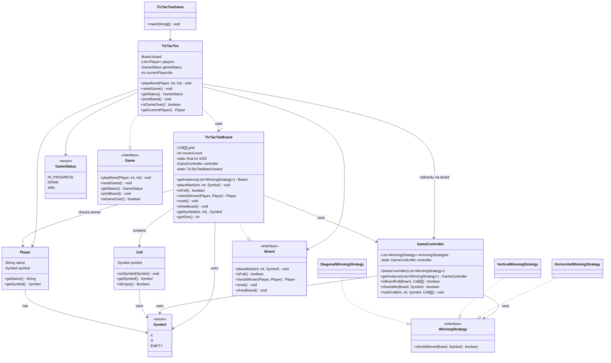

# Tic Tac Toe game
This is an object-oriented design of the Tic Tac Toe game for two players using clean separation of concerns. The system:

- Enforces rules (valid move, win, draw)
- Uses strategy pattern for pluggable winning logic 
- Promotes reusability and flexibility with interfaces like Game, Board, and WinningStrategy

## Design Patterns Used

| **Pattern**                | **Usage**                                                                 |
| -------------------------- | ------------------------------------------------------------------------- |
| **Strategy**               | `WinningStrategy` allows multiple pluggable strategies (Horizontal, etc.) |
| **Singleton**              | `GameController` ensures one controller instance per game lifecycle       |
| **Factory (partial)**      | `TicTacToeBoard.getInstance()` controls board instantiation               |
| **Interface-based design** | `Game`, `Board`, `WinningStrategy` promote loose coupling                 |

## Class Structure

| **Component**     | **Responsibility**                                                      |
| ----------------- | ----------------------------------------------------------------------- |
| `TicTacToeGame`   | Entry point: initializes players and game loop                          |
| `TicTacToe`       | Core game engine: manages turns, checks status, controls game flow      |
| `TicTacToeBoard`  | Manages the grid, symbols, reset, and win condition via controller      |
| `GameController`  | Central utility for validating moves, checking wins, and handling rules |
| `WinningStrategy` | Strategy interface for different win-check algorithms (H, V, Diagonal)  |
| `Player`          | Holds player details (name + symbol)                                    |
| `Symbol`          | Enum representing X, O, or EMPTY                                        |
| `Cell`            | Represents each cell in the board grid                                  |

## Future Enhancements
| **Enhancement Area**                | **Recommendation**                                                                    |
| ----------------------------------- | ------------------------------------------------------------------------------------- |
| **Exception handling**              | Avoid printing inside controller (`System.out.print`) – use proper exception messages |
| **Make `GameController` stateless** | Remove singleton, pass strategy list explicitly. Avoid tight coupling with board      |
| **Board factory**                   | Move `getInstance()` to a factory class to support different board sizes/types        |
| **Dynamic board size**              | Allow users to input board size instead of hardcoded 3x3                              |
| **Undo/Redo**                       | Maintain move history to support undo feature                                         |
| **Timer support**                   | Add timers per move and per game (for competitive play)                               |
| **Minimax / AI bot**                | Add bot player using strategy pattern                                                 |
| **Multiplayer support**             | Extend to online multiplayer using sockets or REST                                    |
