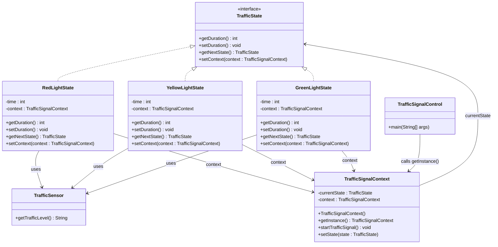

# Traffic Signal Control System

## Design Overview
- Design Pattern Used: **State Pattern**
  - Traffic light behavior (duration, transitions) depends on its state. 
  - The State pattern allows each signal state (Red, Yellow, Green) to encapsulate its own behavior and transition logic. 
  - It ensures open/closed principle: you can add new states without modifying existing logic.

## Class Structure

| **Component**              | **Responsibility**                                                                   |
| -------------------------- | ------------------------------------------------------------------------------------ |
| `TrafficState` (interface) | Common contract for Red, Yellow, and Green states. Defines duration and transitions. |
| `RedLightState`            | Sets red light duration based on traffic. Transitions to Yellow.                     |
| `YellowLightState`         | Sets caution time. Transitions to Green.                                             |
| `GreenLightState`          | Sets green duration. Transitions to Red.                                             |
| `TrafficSensor`            | Simulates current traffic level or emergency presence.                               |
| `TrafficSignalContext`     | Singleton managing current state and its transitions. Acts as finite state machine.  |
| `TrafficSignalControl`     | Main runner class that starts the system.                                            |

## Flow

- `TrafficSignalContext` starts in `RedLightState`. 
- Each state's `setDuration()` uses `TrafficSensor` to determine duration. 
- After duration, context transitions to `getNextState()`. 
- If `EMERGENCY` is detected, transition to `GreenLightState` immediately. 
- Loop continues infinitely in a controlled and extensible way.