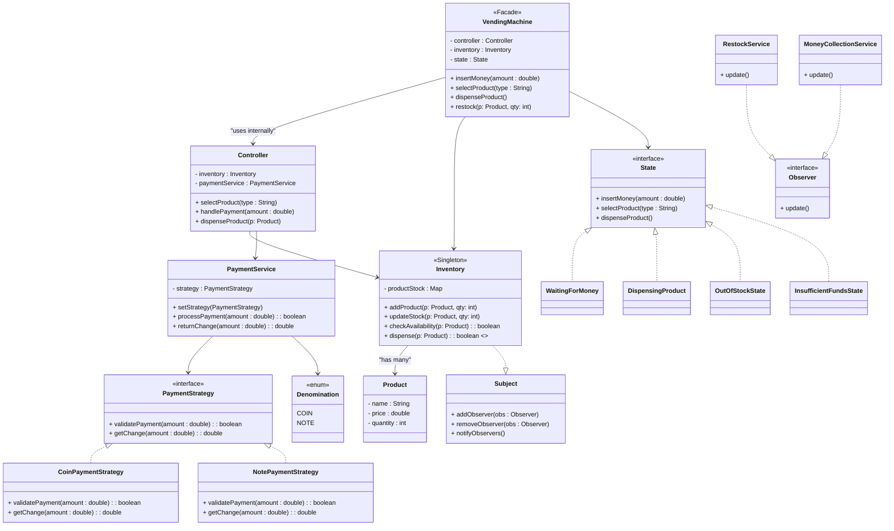

# Vending Machine

## Actors (Initial Thoughts)

- Vending Machine
  - has-a inventory
  - has-a (many) product

- Product 
  - Represents different items with prices & quantities. 

- Payment 
  - Uses ENUM for denominations (coins, notes). 
  - PaymentService with two different Strategies (coins, notes). 
  - Handles payment validation + returns change.

- Controller 
  - Orchestrates product dispensing. 
  - Calls Inventory update after successful transaction.

- Inventory 
  - Maintains Product → Quantity mapping.
  - Must be thread-safe (handles concurrent transactions).

- Concurrency
  - Synchronization around critical sections (inventory updates, cash handling). 
  - Restocking & Money Collection
  
- Provided via external Interfaces. 
  - Uses Observer Pattern for event-driven restock/collection.

- State Handling 
  - Machine phases represented with State Pattern:
    - Waiting for Money
    - Dispensing Product
    - Exception states (Out of Stock, Insufficient Funds, etc.)

## Rough Flow

