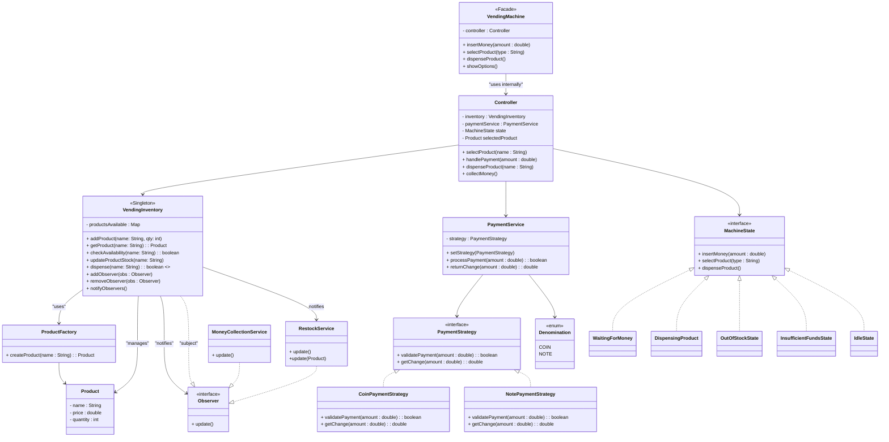

# Vending Machine


## Actors (Initial Thoughts)

- Vending Machine (facade)
  - has-a controller

- Product 
  - Represents different items with prices & quantities. 

- Payment 
  - Uses ENUM for denominations (coins, notes). 
  - PaymentService with two different Strategies (coins, notes). 
  - Handles payment validation + returns change.

- Controller 
  - Orchestrates product dispensing. 
  - Calls Inventory update after successful transaction.
  - has-a inventory
  - has-a state
  - has-a payment strategy

- Inventory 
  - Maintains Product → Quantity mapping.
  - has-a (many) product
  - Must be thread-safe (handles concurrent transactions).
  - Is a subject, Whenever products are added (restock) or money is collected, the Inventory notifies observers.

- Concurrency
  - Synchronization around critical sections (inventory updates, cash handling). 
  - Restocking & Money Collection
  
- Provided via external Interfaces. 
  - Uses Observer Pattern for event-driven restock/collection.

- State Handling 
  - Machine phases represented with State Pattern:
    - Waiting for Money
    - Dispensing Product
    - Exception states (Out of Stock, Insufficient Funds, etc.)

## Rough Flow



## Actors & Responsibilities

### 1. `MyVendingMachine` (Facade)

* Entry point for the client.
* Provides simple methods:

  * `selectProduct()`
  * `insertMoney()`
  * `dispenseProduct()`
  * `showOptions()`
* Internally delegates requests to the **VendingMachineController**.

---

### 2. `VendingMachineController` (Core Orchestrator)

* Coordinates between **inventory**, **payment service**, and **state machine**.
* Maintains the current state (`Idle`, `WaitingForMoney`, etc.) and current product selection.
* Routes calls:

  * `selectProduct()` → handled by current state
  * `handlePayment()` → forwards to current state
  * `dispenseProduct()` → handled by current state
* Responsible for giving change (`collectMoney()`).

---

### 3. `MachineState` & Implementations (State Pattern)

Represents different machine conditions:

* **IdleState** → waiting for user to pick a product.
* **WaitingForMoneyState** → product selected, waiting for payment.
* **DispensingProductState** → dispensing product + returning change.
* **OutOfStockState** → selected product not available.
* **InsufficientFundsState** → user inserted less money, needs to add more.

Each state defines allowed operations and restricts invalid actions.

---

### 4. `VendingInventory` (Singleton + Subject)

* Manages stock of products.
* Provides methods to check availability, dispense, and update stock.
* Notifies observers (e.g., `RestockService`) when product stock changes.

---

### 5. `Product` & `ProductFactory`

* **Product**: Represents an item (name, price, quantity).
* **ProductFactory**: Creates predefined products (`coke`, `pepsi`, `water`).

---

### 6. `VendingPaymentService` (Payment Handler)

* Handles received money, tracks balance, and calculates change.
* Uses **PaymentStrategy** to handle mode-specific logic (coin/note).

---

### 7. `PaymentStrategy` & Implementations (Strategy Pattern)

* **CoinPaymentStrategy** → handles payment in coins.
* **NotePaymentStrategy** → handles payment in notes.

---

### 8. `Observer` Pattern (Restock Service)

* `RestockService` observes inventory stock changes.
* Prints a notification and alerts if restock is needed.

---

## Flow (High-Level)

1. **User selects product** → `IdleState` validates availability.
2. Machine enters `WaitingForMoneyState`.
3. **User inserts money** → payment processed via `VendingPaymentService` and appropriate strategy.
4. If enough → moves to `DispensingProductState` → product dispensed + change returned → state resets to `IdleState`.
5. If insufficient → `InsufficientFundsState` prompts for more money.
6. If product is out of stock → `OutOfStockState`.


## Changes to ensure thread safety and Concurrency
### 1. VendingMachineController

- Original: VendingMachineController.currentSelection was a single shared field.

- Change: Made it ThreadLocal<Product>, so each user/thread can select a product independently without collisions.

- ```private ThreadLocal<Product> currentSelection;```

### 2. Per-thread payment tracking

- Original: VendingPaymentService.amountReceived was shared across threads → race conditions.

- Change: Made amountReceived ThreadLocal or used ThreadLocal PaymentService per thread.

- Ensures each transaction maintains its own payment state.

- ```private ThreadLocal<Double> amountReceived = ThreadLocal.withInitial(() -> 0.0);```

### 3. Synchronized inventory operations

- Original: Inventory methods could be accessed concurrently → stock updates could collide.

- Change: Added synchronized to critical inventory methods:

  - addProduct()
  - getProduct()
  - dispense()
  - updateProductStock()

- ```public synchronized void dispense(String productName) { ... }```

- Ensures that stock decrement, availability check, and notification happen atomically.