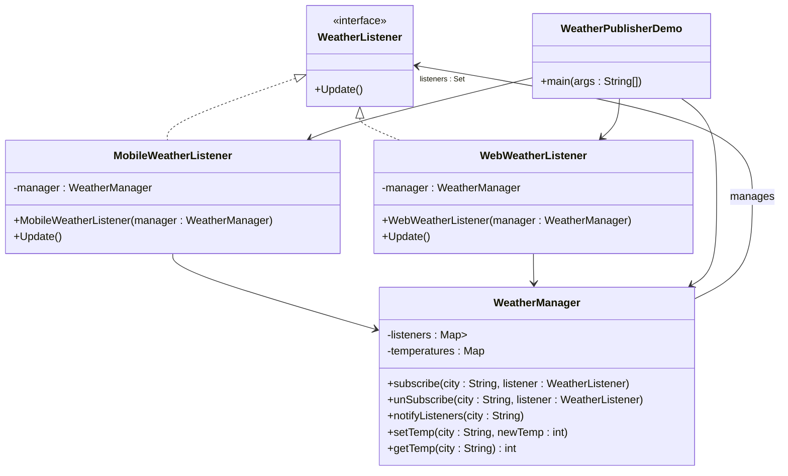

# Solution: Weather Pub Sub Model

Weather Publisher App is implemented using the Observer Design Pattern, where multiple listeners (observers) get notified whenever there is a change in weather temperature for a particular city. 

## Observer Design Pattern
- The `Observer` Pattern allows multiple objects (observers) to be notified of state changes in a subject.
- In this case, `WeatherManager` is the `Subject` (Observable), and `WeatherListener` implementations (WebWeatherListener and MobileWeatherListener) are the `Observers`.

## Components and Their Roles
1.  **WeatherListener (`Interface`)**

    Defines a contract for all observers with a method Update(), which is triggered whenever the weather updates.
2. **WeatherManager (`Observable`)**

    - Maintains a list of subscribers (listeners) for different cities. 
    - Stores city-wise temperature data. 
    - Notifies all subscribed listeners when a city's temperature is updated. 
    - Provides methods to:
      - **Subscribe** (`subscribe`): Register a listener to a specific city's weather updates. 
      - **Unsubscribe** (`unSubscribe`): Remove a listener from a city's updates. 
      - **Notify** (`notifyListeners`): Inform all subscribed listeners when a city's temperature changes. 
      - **Set temperature** (`setTemp`): Update the temperature of a city and notify relevant listeners. 
      - **Get temperature** (`getTemp`): Fetch the current temperature of a city.

3. **WebWeatherListener (`Observer`)**

    - Implements WeatherListener to simulate a web-based weather update system.
    - Prints "Weather Updated on Web" when notified.
4. **MobileWeatherListener (`Observer`)**

    - Implements WeatherListener to simulate a mobile app weather update system.
    - Prints "Weather Updated on Mobile" when notified.

## Class Diagram

