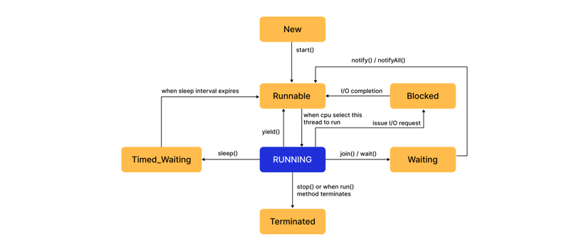

# Threads

> Fundamental units of execution that allows programs to perform multiple tasks concurrently.
> 
> Can utilize [multi-core](#1-multicore) processors efficiently and improve overall application performance.

# Process vs Thread

| **Aspect**         | **Process**                                                                                                            | **Thread**                                                                                                                                                                                                                         |
|--------------------|------------------------------------------------------------------------------------------------------------------------|------------------------------------------------------------------------------------------------------------------------------------------------------------------------------------------------------------------------------------|
| **Definition**     | An independent program in execution, with its own memory space.                                                        | A smaller unit of execution inside a process, sharing the same memory space with other threads of that process.                                                                                                                    |
| **Memory**         | Has **separate** memory (code, data, stack, heap).                                                                     | Shares the process's memory (code, data, heap) but has its **own** stack. , allowing efficient data sharing                                                                                                                        |
| **Communication**  | Requires **Inter-Process Communication (IPC)** mechanisms (e.g., pipes, sockets, or message queues).                   | Can communicate easily via shared variables in the same process.                                                                                                                                                                   |
| **Isolation**      | Independent — if one process crashes, it usually doesn’t crash others.                                                 | Less isolated — if one thread misbehaves (e.g., corrupts shared memory), it can crash the whole process.                                                                                                                           |
| **Overhead**       | Higher (switching between processes is slower).                                                                        | Lower (switching between threads is faster).                                                                                                                                                                                       |
| **Switching Cost** | More expensive due to context switching (saving/restoring process state).                                              | Less expensive due to lighter context switching (only saving/restoring thread state).                                                                                                                                              |
| **Analogy**        | A separate office building (process) with its own rooms (memory).                                                      | A team working in the same office (process), sharing resources but having their own desks (stacks).                                                                                                                                |
| **Usage**          | Use processes for isolation and safety.                                                                                | Use threads for speed and shared work within one application. Improve Responsiveness and performance                                                                                                                               |
| **Example**        | - Running a web server as a separate process, <br/> - Image Processing pipelines(handle large computations seperately) | - **Mobile Apps**, <br/>- **E-Commerce Platforms**(multiple users to browse, add to cart and checkout simultaneously), <br/>- **Audio streaming platforms** (Threads for responsive UI, while continously buffering in background) |

# Key features of Threads
1. **Lightweight**
    - Threads are smaller units of execution within a process.
    - Creating and switching between threads is faster than processes.

2. **Shared Memory Space**
    - All threads in a process share **code**, **data**, and **heap**.
    - Each thread has its **own stack** for function calls and local variables.

3. **Independent Execution Path**
    - Each thread can run independently but still be part of the same process.

4. **Faster Context Switching**
    - Switching between threads is quicker than between processes because less state needs to be saved/restored.

5. **Easy Communication**
    - Since threads share memory, they can communicate without special mechanisms like IPC.
    - Requires **synchronization** to prevent race conditions.

6. **Better Resource Utilization**
    - Threads can run in parallel on multicore CPUs for improved performance.

7. **Not Fully Isolated**
    - A fault in one thread (e.g., memory corruption) can crash the entire process.

# Creating Thread in Java

## 1. Extending the `Thread` class

   ```java
   class MyThread extends Thread{
       @Override
       public void run(){
           System.out.println("Thread is running");
           //some logic
       }
   }
   
   public class ThreadExample {
       public static void main(String[] args) {
           MyThread thread1 = new MyThread();
           
           thread1.start(); // Start the thread1
       }
   }
   ```
   Refer for complete example [here](./../code/multithreading/ThreadExample.java)

   #### Drawbacks:
   - **Single Inheritance Limitation** → Cannot extend another class if you extend `Thread`.
   - **Tight Coupling** → Task logic is tied directly to the thread object.
   - **Manual Management** → You have to handle creation, starting, and stopping of threads yourself.
   - **Poor Scalability** → Creating many threads manually can lead to high memory and CPU overhead.

---

## 2. Implementing the `Runnable` interface

   ```java
   class MyRunnable implements Runnable {
       @Override
       public void run() {
           System.out.println("Thread is running");
           //some logic
       }
   }
   
   public class ThreadExample {
       public static void main(String[] args) {
           Thread thread1 = new Thread(new MyRunnable());
           
           thread1.start(); // Start the thread1
       }
   }
   ```
   Refer for complete example [here](./../code/multithreading/RunnableExample.java)

   ### How `Runnable` Works in Java

   ```plaintext
   [Start Program]
   |
   v
   [Create class implementing Runnable]
   |
   v
   [Override run() method with task code]
   |
   v
   [Create Runnable object]
   |
   v
   [Create Thread object with Runnable as parameter]
   |
   v
   [Call thread.start()]
   |
   v
   [JVM creates new thread]
   |
   v
   [Thread calls run() of Runnable]
   |
   v
   [Task executes in parallel with main thread]
   |
   v
   [Thread finishes execution]
   |
   v
   [End Program]
   ```

   Advantages:
   - **Decoupling** → Task logic is separate from thread management.
   - **Multiple Inheritance** → Can implement multiple interfaces.
   - **Better Resource Management** → Use thread pools for efficient resource utilization.
   - **Easier Testing** → Runnable can be tested independently of threading concerns.
   - Same `Runnable` instance can be shared across multiple threads.
   
   Disadvantages:
   - **More Boilerplate** → Requires more code to set up compared to extending `Thread`.
   - **Manual Thread Creation** → You still need to create and manage threads explicitly.
   - **No Thread Control** → Cannot directly control thread lifecycle (e.g., pause, resume) like with `Thread` class.
   
---

## 3. Implementing `Callable` Interface
   - Similar to `Runnable`, but:
      - Can **return a result**.
      - Can **throw [checked exceptions](#2-checked-exceptions).**
      - Works with **[Future](#4-future)** objects to retrieve results asynchronously (after task completion).
      - Used with [ExecutorService](#5-executor-service) for concurrent execution.
      
      

   ```java
   import java.util.concurrent.Callable;
   import java.util.concurrent.ExecutorService;
   import java.util.concurrent.Executors;
   import java.util.concurrent.Future;
   
   class MyCallable implements Callable<String> {
      @Override
      public String call() throws Exception {
         System.out.println("Callable task is running");
         // some logic
         return "Task Completed";
      }
   }
   
   public class CallableExample {
      public static void main(String[] args) throws Exception {
         ExecutorService executor = Executors.newSingleThreadExecutor();
   
         Future<String> future = executor.submit(new MyCallable()); // Start task in a separate thread
   
         String result = future.get(); // Wait and get the result from call()
   
         System.out.println("Result from Callable: " + result);
   
         executor.shutdown();
      }
   }
   ```
   Refer for complete example [here](./../code/multithreading/CallableExample.java)

   ### Callable Flow
    Callable task  -->  submitted to ExecutorService  -->  runs in a thread
                  ^                                    |
                  |                                    v
            Future object  <--------- result returned via Future.get()
---

## Difference between `Thread`, `Runnable` and `Callable`

| Aspect / Feature               | **Thread**                      | **Runnable**                                | **Callable**                                                    |
| ------------------------------ | ------------------------------- | ------------------------------------------- | --------------------------------------------------------------- |
| **Type**                       | Class                           | Functional Interface                        | Functional Interface                                            |
| **Method to implement**        | `void run()`                    | `void run()`                                | `V call() throws Exception`                                     |
| **Returns value?**             | ❌ No                            | ❌ No                                        | ✅ Yes (returns a value of type `V`)                             |
| **Throws Checked Exceptions?** | ❌ Not allowed                   | ❌ Not allowed                               | ✅ Allowed                                                       |
| **How to execute**             | `thread.start()`                | Create `Thread` → pass Runnable → `start()` | Submit to `ExecutorService` → `submit(callable)` → get `Future` |
| **Thread management**          | Manual                          | Manual                                      | Managed by ExecutorService (thread pool)                        |
| **When to use**                | Very simple/quick demo programs | When task needs to be decoupled from Thread | When task produces **result** and/or **may throw exception**    |


---

# Thread Life Cycle

> The thread life cycle represents the different states a `Thread` can be in, from creation to completion.

## Thread States

### 1. `New`: 
   - The thread is created but not yet started. (Thread object is instantiated)
   - Exists after creating Thread t = new Thread(...).
   - Not scheduled for running until .start() is called.
   - No system resources are allocated yet.
      ```java
      Thread thread = new Thread(() -> System.out.println("Hello from thread")); 
      // Thread is in NEW state here
      ```   

### 2. `Runnable`: 
   - The thread is ready to run and waiting for CPU time.
   - After calling .start(), the thread moves to the Runnable state.
   - The thread scheduler picks threads from this state to run on the CPU.
   - The thread may not run immediately; it depends on CPU availability and scheduling.
      ```java
      Thread thread = new Thread(() -> System.out.println("Hello from thread")); 
      thread.start(); // Thread moves to RUNNABLE state here
      System.out.println(thread.getState());
      ```
   
### 3. `Running`:
   - The thread is currently executing its task.
   - The thread scheduler has selected the thread from the Runnable state to run on the CPU.
   - The thread remains in this state until it completes its task, is preempted, or voluntarily yields control.
   - Only one thread per CPU core can be RUNNING at a time.
      ```java
      // When the CPU scheduler picks a RUNNABLE thread, it enters the RUNNING state 
      // Inside the run() method of the thread
      public void run() {
          System.out.println("Thread is running"); // Thread is in RUNNING state here
      }
      ```
### 4. `Blocked`:
   - The thread is waiting to acquire a lock to enter a synchronized block/method.
   - It cannot proceed until the lock becomes available.
   - This state occurs when multiple threads try to access a synchronized resource simultaneously.
      ```java
      //synchronized method
      synchronized void synchronizedMethod() {
          // If another thread holds the lock, this thread enters BLOCKED state
      }
      ```
        or

        ```java
        //synchronized block
        synchronized(lockObject) { 
        // If another thread holds lockObject's monitor,  
        // this thread will be BLOCKED until lock is available
        }
        ```
  
### 5. `Waiting`:
   - The thread is waiting indefinitely for another thread to perform a particular action (like notify).
   - Entered by calling `wait()`, `join()` without timeout, or `park()`.
   - It can only be moved out of this state by another thread calling `notify()` or `notifyAll()` on the same object.
   - The thread does not consume CPU resources while waiting.
      ```java
      synchronized void waitMethod() {
          try {
              wait(); // Thread enters WAITING state here
          } catch (InterruptedException e) {
              e.printStackTrace();
          }
      }
      ```
   

### 6. `Timed Waiting`:
   - The thread is waiting for a specified amount of time.
   - Entered by calling methods like `sleep()`, `wait(timeout)`, `join(timeout)`, or `parkNanos()`.
   - After the timeout expires, the thread automatically moves back to the Runnable state.
   - The thread does not consume CPU resources while waiting.
      ```java
      try {
          Thread.sleep(1000); // Thread enters TIMED_WAITING state here for 1 second
      } catch (InterruptedException e) {
          e.printStackTrace();
      }
      ```

### 7. `Terminated`:
   - The thread has completed its execution or has been terminated.
   - It cannot be restarted once it reaches this state.
   - This state occurs when the `run()` method finishes or if the thread is stopped using deprecated methods (not recommended).
      ```java
      // After the run() method completes, the thread enters TERMINATED state
      public void run() {
          System.out.println("Thread is running");
          // Thread will enter TERMINATED state after this method completes
      }
      ```


  
---
# Thread Pools

A thread pool is a collection of pre-initialized worker threads that are reused to execute multiple tasks concurrently.
- Instead of creating a new thread for every task → threads are taken from the pool.
- Managed by the Executor Framework (`java.util.concurrent`).

- Thread pools help by:
  - **Resource Management**: Limit the number of threads to prevent system overload. 
  - **Performance Improvement**: Reuse existing threads instead of creating new ones. 
  - **Predictability**: Control thread creation and scheduling for better application behavior. 
  - **Task Management**: Queuing, scheduling, and monitoring tasks becomes streamlined. 

## Creating a Thread Pool

Using `Executors` factory methods:
```java
// Fixed number of threads - Bounded
ExecutorService fixedPool = Executors.newFixedThreadPool(3);

// Single thread pool (sequential execution)
ExecutorService singlePool = Executors.newSingleThreadExecutor();

// Cached pool (creates new threads as needed, reuses idle threads) - unbounded, good for short-lived tasks.
ExecutorService cachedPool = Executors.newCachedThreadPool();

// Scheduled pool (run tasks after delay or periodically)
ScheduledExecutorService scheduledPool = Executors.newScheduledThreadPool(2);

```
Refer for complete example [here](./../code/multithreading/ThreadPoolExample.java)

### Working Explanation:
1. Thread Pool Creation: 
   - `Executors.newFixedThreadPool(3)` creates a pool with 3 reusable threads.
2. Task Submission:
   - Five tasks are submitted. Since only 3 threads exist, the first 3 tasks start immediately. 
   - As tasks complete, the available threads pick up the remaining tasks.
---

## Lifecycle of Thread Pool

1. **Creation**: 
   - A thread pool is created using `Executors` factory methods.
   - When a thread pool is created, it may pre-create some threads (core threads) in the NEW state and immediately start them to RUNNABLE.
2. **Task Execution**: 
   - Available threads pick up tasks from the queue and execute them.
   - When a task is submitted: An idle thread in the pool executes the task.
   - The thread's state changes according to task operations (RUNNABLE, RUNNING, BLOCKED, WAITING, etc.) 
   - After completing the task: Thread does not die → goes back to idle (RUNNABLE), waiting for the next task.
3. **Pool Shutdown**: 
   - When `shutdown()` or `shutdownNow()` is called, the pool stops accepting new tasks.
   - Existing tasks are completed before threads are terminated.
   - Threads transition to TERMINATED state after completing their tasks and the pool is fully shut down.

```java
import java.util.concurrent.*;

// Task class simulating various thread states
class Task implements Runnable {
    private final int taskId;

    public Task(int taskId) {
        this.taskId = taskId;
    }

    @Override
    public void run() {
        System.out.println(Thread.currentThread().getName() + " - STARTING Task " + taskId);

        try {
            // Simulating different thread states

            // RUNNABLE → TIMED_WAITING (sleep)
            Thread.sleep(2000);

            synchronized (this) {
                System.out.println(Thread.currentThread().getName() + " - WAITING on Task " + taskId);

                // RUNNING → WAITING (wait)
                this.wait(1000);

                // After timeout/notify → RUNNABLE again
            }

            // Re-enters RUNNING when picked by scheduler
            System.out.println(Thread.currentThread().getName() + " - Task " + taskId + " COMPLETED");

        } catch (InterruptedException e) {
            Thread.currentThread().interrupt();

            System.out.println(Thread.currentThread().getName() + " - INTERRUPTED Task " + taskId);

            // If interrupted in TIMED_WAITING / WAITING → becomes RUNNABLE
            // If interrupted while RUNNING → may go TERMINATED depending on shutdown
        }

        // After completion:
        // → goes back to RUNNABLE waiting in pool
        // → or TERMINATED if pool is shutting down
    }
}

public class ThreadPoolLifecycleDemo {
    public static void main(String[] args) {
        // Step 1: Create a Thread Pool with 3 core threads
        ExecutorService executor = Executors.newFixedThreadPool(3);
        System.out.println("Thread Pool Created 🏊‍♂️");

        // Step 2: Submit 5 tasks to the pool
        for (int i = 1; i <= 5; i++) {
            executor.execute(new Task(i));
        }

        // Step 3: Initiate shutdown after all tasks are submitted
        executor.shutdown();
        System.out.println("Thread Pool Shutdown Initiated 🚦");

        try {
            // Wait for all threads to finish
            if (!executor.awaitTermination(10, TimeUnit.SECONDS)) {
                executor.shutdownNow(); // Interrupts running/waiting threads
                System.out.println("Forcing Shutdown! 🚧");
            }
        } catch (InterruptedException e) {
            executor.shutdownNow();
        }

        System.out.println("All Threads Terminated ✅");

        // Once shutdown is complete:
        // → all threads (RUNNING, BLOCKED, WAITING, TIMED_WAITING)
        // → will finish/interrupt → TERMINATED
    }
}
```

---
## Thread Life Cycle Management
1. **Handle interrupted exceptions properly to allow threads to exit gracefully**: 
   - A worker thread checking for updates in a loop should exit gracefully when interrupted instead of ignoring the exception.
2. **Avoid thread leaks by ensuring threads are properly terminated when no longer needed**:  
   - A thread waiting indefinitely for a signal can cause a leak. Use timeouts to prevent this while acquiring locks or waiting on conditions.
   - Wait with a timeout instead of indefinitely.

---
# FAQs

#### Q1. What is the difference between `start()` and `run()` in Java threads?
- The `start()` method begins thread execution by invoking the `run()` method in a new thread of execution.
- While the `run()` method contains the code that defines the thread's task, calling `run()` directly does not start a new thread; it executes the code in the current thread.

    ```java
    class MyThread extends Thread {
        public void run(){
            System.out.println("Thread is running");
        }
    }
    
    class ThreadExample {
        public static void main(String[] args) {
            MyThread thread = new MyThread();
    
            thread.run(); // Executes run() in the current(main) thread, not a new one
            thread.start(); // Starts a new thread and calls run() in that new thread
        }
    }
    ```


#### Q2.Can we call the start() method multiple times on the same thread object in Java?
- No, calling `start()` multiple times on the same thread object will throw an `IllegalThreadStateException`.
- A thread can only be started once; subsequent calls to `start()` on the same thread instance are illegal.
    ```java
    class MyThread extends Thread {
        public void run() {
            System.out.println("Thread is running");
        }
    }
    
    class ThreadExample {
        public static void main(String[] args) {
            MyThread thread = new MyThread();
            thread.start(); // First call - valid
            thread.start(); // Second call - throws IllegalThreadStateException
        }
    }
    ```

#### Q3. What is thread safety and how can we achieve it in Java?
- **Thread safety** refers to the property of a piece of code or data structure that guarantees safe execution by multiple threads concurrently without causing data corruption or unexpected behavior.
- It can be achieved through:
    - `Synchronization`: Using synchronized blocks or methods to ensure that only one thread can access a resource at a time.
    - `Immutable objects`: Creating objects that cannot be modified after creation, ensuring thread safety by design.
    - `Concurrent collections`: Using thread-safe collections like `ConcurrentHashMap`, `CopyOnWriteArrayList`, etc.
    - `Atomic variables`: Using classes from the `java.util.concurrent.atomic` package, such as `AtomicInteger`, which provide lock-free thread-safe operations.
    - `ThreadLocal`: Using `ThreadLocal` variables to provide each thread with its own instance of a variable, avoiding shared state.

#### Q4. What happens if exception occurs in a thread's run method?
- If an exception occurs in a thread's `run()` method and is not caught, the thread will terminate, and the exception will be printed to the console.
- The exception does not get propagated to the main thread or other threads, and the program may continue running unless the exception is critical (like `OutOfMemoryError`).


#### Q5. What is the difference between `sleep()` and `wait()` in Java?
- `Sleep()`:
    - Belongs to the `Thread` class.
    - Causes the current thread to pause execution for a specified duration.
    - Does not release any locks held by the thread.
    - Used for delaying execution without affecting synchronization.
- `Wait()`:
    - Belongs to the `Object` class.
    - Causes the current thread to release the lock it holds on an object and wait until another thread calls `notify()` or `notifyAll()` on that object.
    - Used for inter-thread communication and synchronization.
    - Must be called from a synchronized context (inside a synchronized block or method).

#### Q6. What happens to the resource a thread was holding when the `wait()` method is called?
- When a thread calls the `wait()` method on an object, it releases the lock it holds on that object.
- This allows other threads to acquire the lock and proceed with their execution.
- The waiting thread remains in the waiting state until another thread calls `notify()` or `notifyAll()` on the same object, at which point it can attempt to reacquire the lock and continue execution.

#### Q7. What happens when the `notify()` or `notifyAll()` method is called on an object?
- Another thread holding the same lock can call `notify()` or `notifyAll()` on that object to wake up waiting threads.
- `notify()`: Wakes up a single thread that is waiting on the object's monitor. If multiple threads are waiting, one is chosen arbitrarily.
- `notifyAll()`: Wakes up all threads that are waiting on the object's monitor. All awakened threads will compete to acquire the lock once it is released.
- The idle thread(s) will not proceed until they can successfully reacquire the lock on the object. i.e. thread(s) don't start executing immediately after notify/notifyAll is called.

    ```java
    class SharedResource {
        synchronized void waitMethod() {
            try {
                System.out.println(Thread.currentThread().getName() + " waiting...");
                wait(); // releases lock, waits to be notified
                System.out.println(Thread.currentThread().getName() + " resumed!");
            } catch (InterruptedException e) {
                e.printStackTrace();
            }
        }
    
        synchronized void notifyOne() {
            notify(); // wakes up ONE waiting thread
        }
    
        synchronized void notifyAllThreads() {
            notifyAll(); // wakes up ALL waiting threads
        }
    }
    
    public class NotifyExample {
        public static void main(String[] args) throws InterruptedException {
            SharedResource resource = new SharedResource();
    
            Runnable task = () -> resource.waitMethod();
    
            Thread t1 = new Thread(task, "Thread-1");
            Thread t2 = new Thread(task, "Thread-2");
            Thread t3 = new Thread(task, "Thread-3");
    
            t1.start();
            t2.start();
            t3.start();
    
            Thread.sleep(1000);
    
            // Try notify() vs notifyAll()
            resource.notifyOne();      // only ONE thread wakes up
            // resource.notifyAllThreads(); // ALL threads wake up
        }
    }
    
    ```
#### Q8. How Another Thread Wakes the waiting Thread?
- A thread that is in the waiting state (after calling `wait()`) can be woken up by another thread that holds the same object's lock.
- The waking thread can call either `notify()` or `notifyAll()` on the same object to wake up one or all waiting threads, respectively.
- Scenario: Chef and Waiter analogy
    - Thread A (`Waiter`) takes the customer's order and waits for the chef to prepare the food.
    - Thread B (`Chef`) prepares the food and notifies the waiter when it's ready.
- Both threads synchronize on the same `Restaurant` object to coordinate their actions.

    ```java
    // WaiterThread.java
    class WaiterThread extends Thread {
        private final Object lock;
    
        public WaiterThread(Object restaurantLock) {
            this.lock = restaurantLock;
        }
    
        @Override
        public void run() {
            synchronized (lock) {
                try {
                    System.out.println("Waiter: Waiting for the food to be ready... ⏳");
                    lock.wait();  // Waiter enters WAITING state
                    System.out.println("Waiter: Food is ready! Delivering to the customer. 🍽️");
                } catch (InterruptedException e) {
                    Thread.currentThread().interrupt();
                }
            }
        }
    }
    
    ```
    
    ```java
    // ChefThread.java
    class ChefThread extends Thread {
        private final Object lock;
    
        public ChefThread(Object restaurantLock) {
            this.lock = restaurantLock;
        }
    
        @Override
        public void run() {
            try {
                Thread.sleep(2000); // Simulate food preparation time
                synchronized (lock) {
                    System.out.println("Chef: Food is ready! Notifying the waiter. 🔔");
                    lock.notify(); // Wake up the waiting waiter thread
                }
            } catch (InterruptedException e) {
                Thread.currentThread().interrupt();
            }
        }
    }
    ```
    
    ```java
    // RestaurantSimulation.java
    public class RestaurantSimulation {
        public static void main(String[] args) {
            Object restaurantLock = new Object(); // act as lock object
    
            Thread waiter = new WaiterThread(restaurantLock);
            Thread chef = new ChefThread(restaurantLock);
    
            waiter.start();
            chef.start();
        }
    }
    ```
    
    ```
    // Output:
    Waiter: Waiting for the food to be ready... ⏳
    Chef: Food is ready! Notifying the waiter. 🔔
    Waiter: Food is ready! Delivering to the customer. 🍽️
    ```
#### Q9. Differentiate between `shutdown()` and `shutdownNow()` methods of ExecutorService?
- `shutdown()`
  - Initiates a graceful shutdown. 
  - No new tasks are accepted. 
  - Already submitted tasks (in queue + running) will complete normally. 
  - Threads terminate after finishing their tasks.
  - ```java
    executorService.shutdown();
    ```
  - Use when you want an orderly shutdown without abruptly killing tasks.
- `shutdownNow()`
  - Initiates an immediate shutdown. 
  - Attempts to stop all running tasks by interrupting them. 
  - Removes all waiting tasks from the queue. 
  - Returns a List<Runnable> of tasks that never started.
  - ```java
    List<Runnable> pendingTasks = executorService.shutdownNow();
    ```
  - Running tasks may not stop immediately — it depends on whether they handle interrupts properly.

#### Q10. What happens to a thread in a thread pool after it finishes executing a task?
- After task completion, the thread doesn't terminate but returns to the pool, ready to execute another task. 
- This reuse eliminates the overhead of constantly creating and destroying threads. 

#### Q11. How does a ThreadPoolExecutor's queue size affect its behavior?
- The queue stores tasks when all core threads are busy. 
- A larger queue can handle more pending tasks but consumes more memory. 
- If the queue reaches capacity, the pool creates additional threads up to `maxPoolSize`.
- If `maxPoolSize` is reached and the queue is full, the rejection policy is applied.

# Glossary

#### 1. `Multicore`

   - A multicore processor is a single computing component with two or more independent actual processing units (called "cores").
   - Each core can read and execute program instructions, allowing for parallel processing.
   - This means that a multicore processor can perform multiple tasks simultaneously, improving performance and efficiency for applications that are designed to take advantage of multiple cores.
   - Multicore processors are commonly used in modern computers, smartphones, and other devices to enhance multitasking capabilities and overall system performance.
   - Example-
       - Single-core → One worker doing all the jobs sequentially.
       - Quad-core → Four workers doing separate jobs at the same time.

#### 2. `Checked exceptions`
   - Exceptions that must be either caught or declared in the method signature, ensuring that the programmer handles them appropriately.
   - They are checked at compile time, meaning the compiler verifies that these exceptions are handled in the code.
   - Examples: `IOException`, `SQLException`, `InterruptedException`(Thread Interruption).

#### 3. `Unchecked exceptions`
   - Exceptions that do not need to be explicitly handled or declared.
   - They are checked at runtime, meaning the compiler does not enforce handling them.
   - Examples: `NullPointerException`, `ArrayIndexOutOfBoundsException`, `IllegalArgumentException`.

#### 4. `Future`
  - Represents the result of an asynchronous computation.
  - It allows you to retrieve the result of a task once it completes, or check if it is done.
  - Used with `Callable` to get results after task completion.
  - Can also check if the task is still running or has completed.

#### 5. `Executor Service`
   - An `Executor` is a  java interface that represents an object capable of running *submitted* tasks.
   - While `ExecutorService` is a  more advanced sub-interface of `Executor` that supports **thread pooling**, **task scheduling**, and **lifecycle management** (shutdown, etc.).
   - Instead of creating threads manually, we submit tasks to an executor.
   - The executor manages threads internally and reuses them (thread pool → better performance & scalability).
