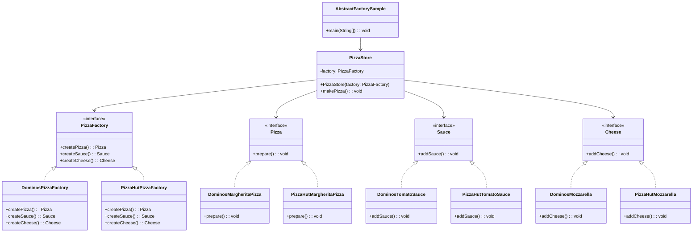

# Abstract Factory: Design Pattern

> A creational design pattern that lets you produce families of related objects without specifying their concrete classes.
> 
> It's a factory of factories that creates objects that are designed to work together.

## When to use Abstract Factory Pattern

- When you need to create families of related products
- When you want to ensure that products from the same family are used together
- When you need to support multiple product lines or platforms
- When you want to hide the creation logic of complex object families
- When you need to switch between different families of products at runtime

## Real world analogy

- Think of different pizza restaurant chains like Domino's, Pizza Hut, and Brik Oven. 
- Each chain is like an abstract factory that creates a complete family of pizza products. 
- When you choose Domino's, you get their specific style of pizza base, sauce, cheese, and toppings that all work together. 
- You can't mix Pizza Hut's base with Domino's sauce - each factory creates products designed to complement each other within that brand family.

## Problem Solved

- Ensures that related products are created together and are compatible
- Provides consistency across product families
- Makes it easy to switch between different families of products
- Encapsulates the creation of complex object families
- Promotes loose coupling between client code and concrete product classes
- Makes adding new product families easier without changing existing code

| References | Links                                                                                     |
|------------|-------------------------------------------------------------------------------------------|
| Article Reference | [Refactoring Guru](https://refactoring.guru/design-patterns/abstract-factory)             |
| Boiler Plate Code | [Observer Example](../../code/designPatterns/abstractFactory/AbstractFactoryExample.java) |

## Sample Code

[Pizza Factory Sample](../../code/designPatterns/abstractFactory/AbstractFactorySample.java)

