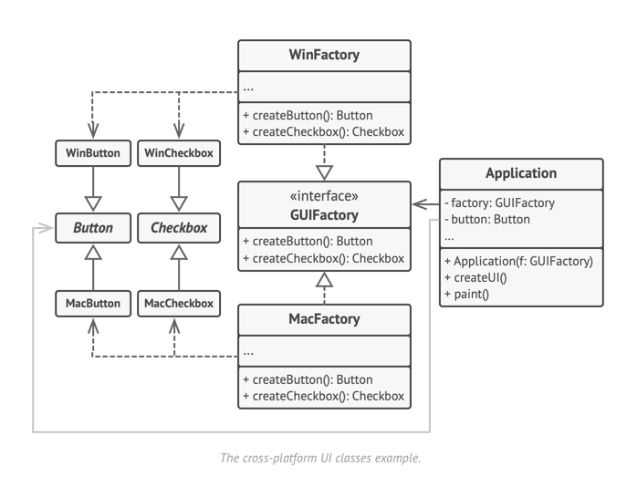

# Abstract Factory: Design Pattern

> A creational design pattern that lets you produce families of related objects without specifying their concrete classes.

- Factory of factories
- 

### Article Reference - [here](https://refactoring.guru/design-patterns/abstract-factory)
### Java Example - [here](../../code/designPatterns/AbstractFactoryExample.java)

