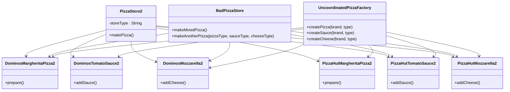

# Abstract Factory: Design Pattern

> A creational design pattern that lets you produce families of related objects without specifying their concrete classes.
> 
> It's a factory of factories that creates objects that are designed to work together.

## When to use Abstract Factory Pattern

- When you need to create families of related products
- When you want to ensure that products from the same family are used together
- When you need to support multiple product lines or platforms
- When you want to hide the creation logic of complex object families
- When you need to switch between different families of products at runtime

## Real world analogy

- Think of different pizza restaurant chains like Domino's, Pizza Hut, and Brik Oven. 
- Each chain is like an abstract factory that creates a complete family of pizza products. 
- When you choose Domino's, you get their specific style of pizza base, sauce, cheese, and toppings that all work together. 
- You can't mix Pizza Hut's base with Domino's sauce - each factory creates products designed to complement each other within that brand family.

## Problem Solved

- Ensures that related products are created together and are compatible
- Provides consistency across product families
- Makes it easy to switch between different families of products
- Encapsulates the creation of complex object families
- Promotes loose coupling between client code and concrete product classes
- Makes adding new product families easier without changing existing code

## Class Structure

## Violation Code

[Pizza Factory - Violation Code](../../code/designPatterns/abstractFactory/AbstractFactoryViolation.java)

### Issue with the Violation Code
1. No family consistency guarantee - can mix Dominos pizza with Pizza Hut sauce
2. Tight coupling - client code depends on concrete product classes
3. Violates Open/Closed Principle - adding new families requires modifying existing code
4. Code duplication - creation logic repeated in multiple places
5. Error-prone - easy to accidentally mix product families
6. Hard to maintain - changes to product families affect multiple classes
7. No polymorphism - can't treat different families uniformly
8. Violates Single Responsibility - client handles both business logic and product creation
9. Complex conditional logic - becomes unwieldy with more families
10. Type safety issues - casting required with uncoordinated factory methods

## Enhanced Code

[Pizza Factory - Sample](../../code/designPatterns/abstractFactory/AbstractFactorySample.java)

## Common LLD Problems Using Abstract Factory Pattern:

### 1. Cross-Platform UI Toolkit
- **Abstract Factory:** `WidgetFactory`
- **Products:** `Button`, `Checkbox`, `TextField`
- **Variants:** `MacWidgetFactory`, `WindowsWidgetFactory`, `LinuxWidgetFactory`
- **Context:** UI components differ by OS but belong to the same "family".

---

### 2. Theme-Based UI System (Dark/Light Mode)
- **Abstract Factory:** `UIThemeFactory`
- **Products:** `ThemedButton`, `ThemedNavbar`, `ThemedCard`
- **Variants:** `DarkThemeFactory`, `LightThemeFactory`
- **Context:** Dynamically render full UI component sets based on selected theme.

---

### 3. Cloud Infrastructure Provisioning
- **Abstract Factory:** `CloudResourceFactory`
- **Products:** `Compute`, `Storage`, `Database`
- **Variants:** `AWSFactory`, `AzureFactory`, `GCPFactory`
- **Context:** Provision services in a cloud-agnostic way.

---

### 4. Operating System Driver Loader
- **Abstract Factory:** `DriverFactory`
- **Products:** `KeyboardDriver`, `MouseDriver`, `PrinterDriver`
- **Variants:** `WindowsDriverFactory`, `LinuxDriverFactory`, `MacDriverFactory`
- **Context:** Load platform-specific drivers transparently.

---

### 5. Game Environment Generator
- **Abstract Factory:** `GameEnvironmentFactory`
- **Products:** `Enemy`, `Terrain`, `NPC`
- **Variants:** `DesertWorldFactory`, `SnowWorldFactory`, `ForestWorldFactory`
- **Context:** Generate game entities tailored to level/environment.

---

### 6. Car Manufacturing System
- **Abstract Factory:** `CarPartsFactory`
- **Products:** `Engine`, `Tyre`, `Suspension`
- **Variants:** `LuxuryCarPartsFactory`, `SportsCarPartsFactory`
- **Context:** Build cars from consistent component sets.

---

### 7. OS-Specific File System or IO API
- **Abstract Factory:** `FileSystemFactory`
- **Products:** `File`, `Directory`, `PathResolver`
- **Variants:** `UnixFileSystemFactory`, `WindowsFileSystemFactory`
- **Context:** Provide a platform-independent file handling system.

---

### 8. Cross-Device Media Renderer
- **Abstract Factory:** `MediaRendererFactory`
- **Products:** `VideoPlayer`, `AudioPlayer`, `SubtitleRenderer`
- **Variants:** `MobileRendererFactory`, `DesktopRendererFactory`, `SmartTVRendererFactory`
- **Context:** Render media differently based on the device type.

---

| References | Links                                                                                     |
|------------|-------------------------------------------------------------------------------------------|
| Article Reference | [Refactoring Guru](https://refactoring.guru/design-patterns/abstract-factory)             |
| Boiler Plate Code | [Observer Example](../../code/designPatterns/abstractFactory/AbstractFactoryExample.java) |
