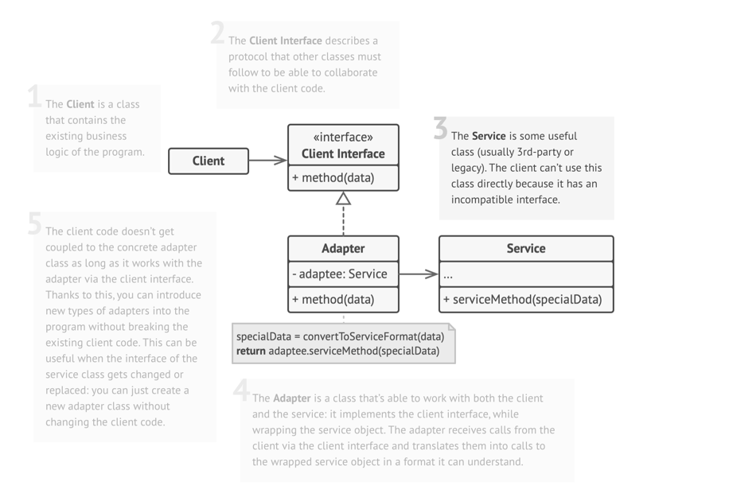
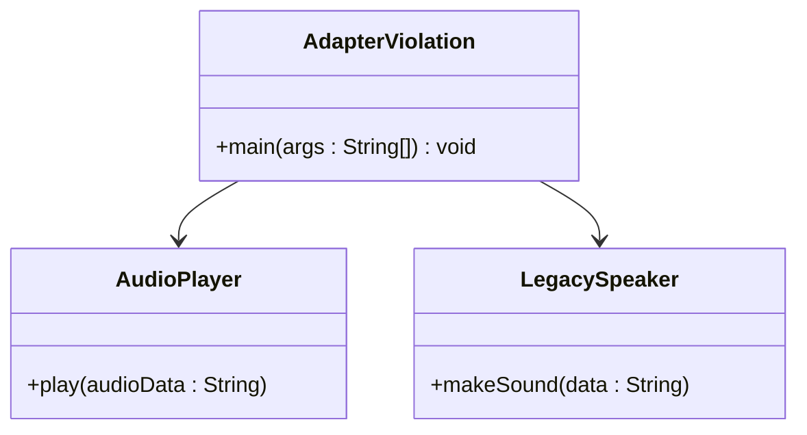
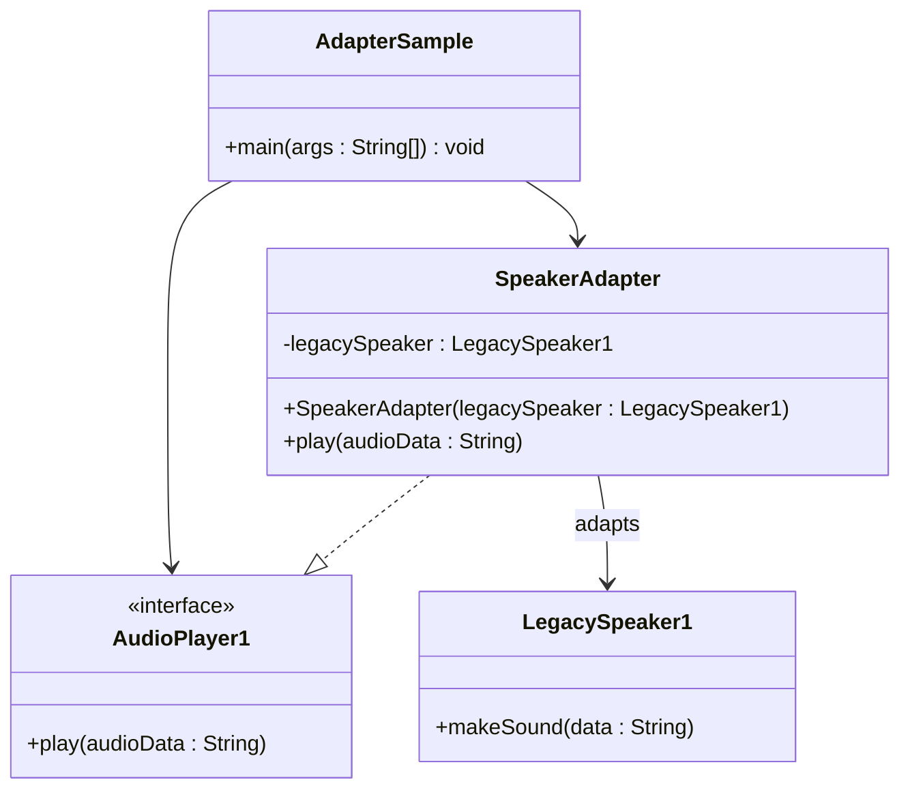

# Adapter: Structural Design Pattern

> allows incompatible interfaces to work together. 
> 
> It acts as a bridge between two incompatible interfaces by converting one interface into the one that client expects.

## When to use Adapter Pattern

- You want to use an existing class, but its interface doesn't match your requirement.
- You need to integrate legacy or third-party code with a new system.
- You want to make unrelated classes work together by converting their interfaces.

## Real world analogy

- Think of a mobile charger adapter:
  - Your laptop has a USB-C port, but your headphones have a 3.5mm jack.
  - You can't plug the jack directly into the USB-C port.
  - So, you use a USB-C to 3.5mm adapter:
    - 🎧 Headphones → 3.5mm
    - 🔌 Adapter → converts 3.5mm to USB-C
    - 💻 Laptop → USB-C input

## Problem Solved

- Bridges mismatch between old/new interfaces 
- Allows code reuse without modifying existing classes 
- Enables integration with third-party or legacy systems 
- Removes the need to rewrite existing functionality 
- Promotes Single Responsibility Principle and Open/Closed Principle

## Class Structure

## Violation Code

[Audio Player - Violation Code](../../code/designPatterns/adapter/AdapterViolation.java)

### Issues with above code
1. Incompatible interface prevents reuse 
2. `LegacySpeaker` cannot be used with `AudioPlayer` 
3. You’d have to rewrite or duplicate logic 
4. Violates Open/Closed Principle (you need to modify `AudioPlayer`)
5. Tight coupling between incompatible components

## Enhanced Code
[Audio Player - Example](../../code/designPatterns/adapter/AdapterSample.java)

## Common LLD Problems Using Adapter Pattern:

### 1. Payment Gateway Integration
- **Adapters:** `StripeAdapter`, `PayPalAdapter`, `RazorpayAdapter`
- **Context:** Different gateways have different APIs — use adapters to unify payment processing behind a common interface.

---

### 2. Third-party API Integration
- **Adapters:** `TwitterAdapter`, `FacebookAdapter`, `LinkedInAdapter`
- **Context:** Each platform provides different SDKs or formats; adapters provide a unified interface to the application.

---

### 3. Legacy System Wrapping
- **Adapters:** `LegacyOrderServiceAdapter`
- **Context:** Wrap outdated systems so they can work with modern interfaces without major code refactoring.

---

### 4. File Format Conversion
- **Adapters:** `DocxToPDFAdapter`, `CSVToJSONAdapter`
- **Context:** Convert or adapt data from one file format to another using a common processing interface.

---

### 5. Logging System Integration
- **Adapters:** `Log4jAdapter`, `SLF4JAdapter`, `ConsoleLoggerAdapter`
- **Context:** Integrate various logging frameworks into a consistent application-wide logging interface.

---

### 6. Media Player Supporting Multiple Formats
- **Adapters:** `MP4Adapter`, `VLCAdapter`, `AVIAdapter`
- **Context:** Each media format is handled through a different adapter that supports a common player interface.

---

### 7. Database Abstraction Layer
- **Adapters:** `MySQLAdapter`, `PostgresAdapter`, `MongoDBAdapter`
- **Context:** Provide a unified interface to interact with different databases in a pluggable way.

---

### 8. E-commerce Shipping Provider Integration
- **Adapters:** `FedExAdapter`, `UPSAdapter`, `BlueDartAdapter`
- **Context:** Normalize communication with different shipping APIs using a standard shipping service interface.

---

| References | Links                                                                          |
|------------|--------------------------------------------------------------------------------|
| Article Reference | [Refactoring Guru](https://refactoring.guru/design-patterns/adapter)         |

