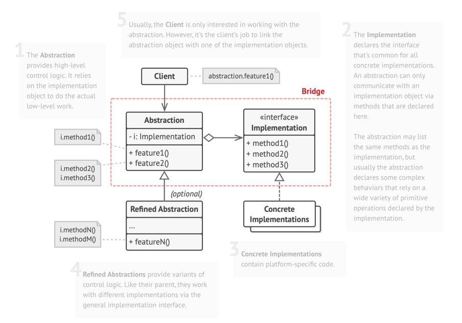
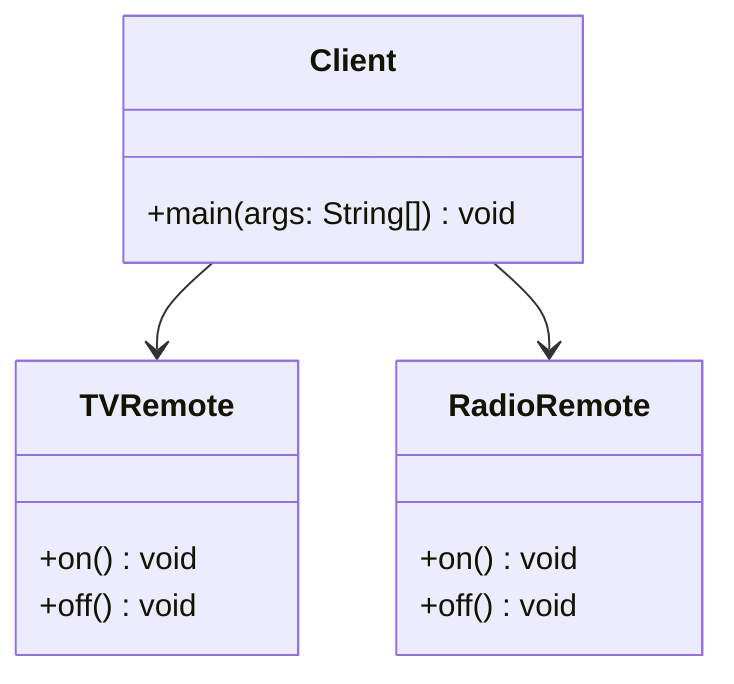

# Bridge: Structural Design Pattern

> The Bridge Pattern decouples an abstraction from its implementation so that the two can evolve independently. 
> 
> It separates what is done from how it is done.

## When to use Bridge Pattern
- When a class has multiple dimensions of variation (e.g., shapes × colors, devices × remotes).
- When you want to avoid class explosion caused by combining multiple features in subclasses.
- When you need both abstraction and implementation to evolve independently.

## Real World Analogy

- A Remote Control is the abstraction. 
- Different Devices (TV, Radio, Projector) are the implementations. 
- You can use the same remote to control different devices, and devices can work with different remotes. 
- Without Bridge, you’d need TVRemote, RadioRemote, ProjectorRemote separately (class explosion).

## What Problem it solves

- Eliminates the need for creating a new class for each abstraction–implementation combination. 
- Promotes flexibility: You can change abstraction and implementation independently. 
- Reduces tight coupling between abstraction and implementation.

## Class Structure

## Violation Code

[Remote Control - Violation Code](./../../code/designPatterns/bridge/BridgeViolation.java)

### Issues with above code

1. Class explosion: Adding a new device requires a new remote class. 
2. No flexibility: Remote and device are tightly bound. 
3. Poor maintainability: Changes in one require changes in the other.

## Enhanced Code