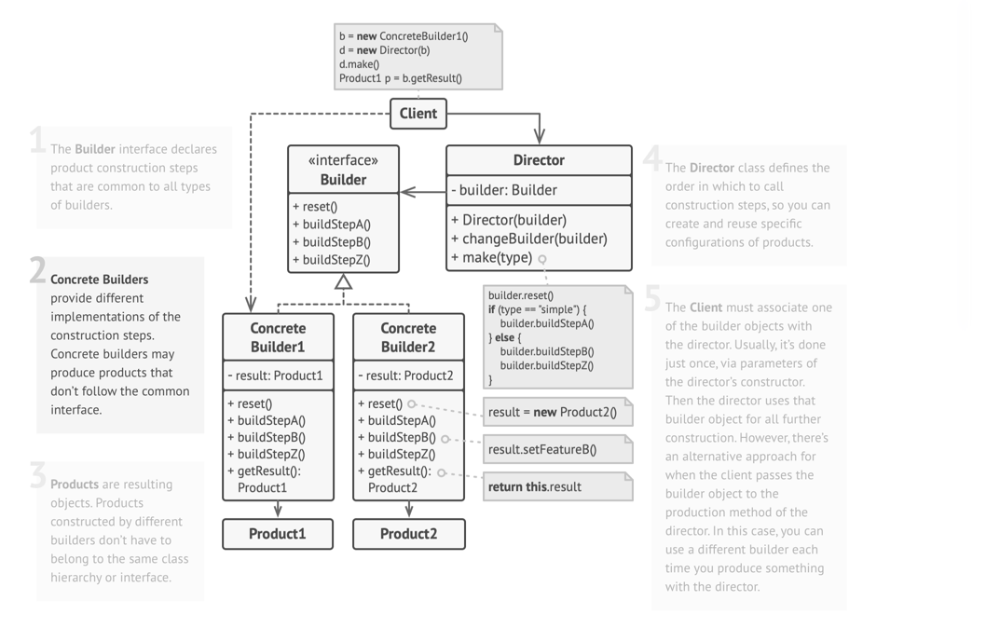
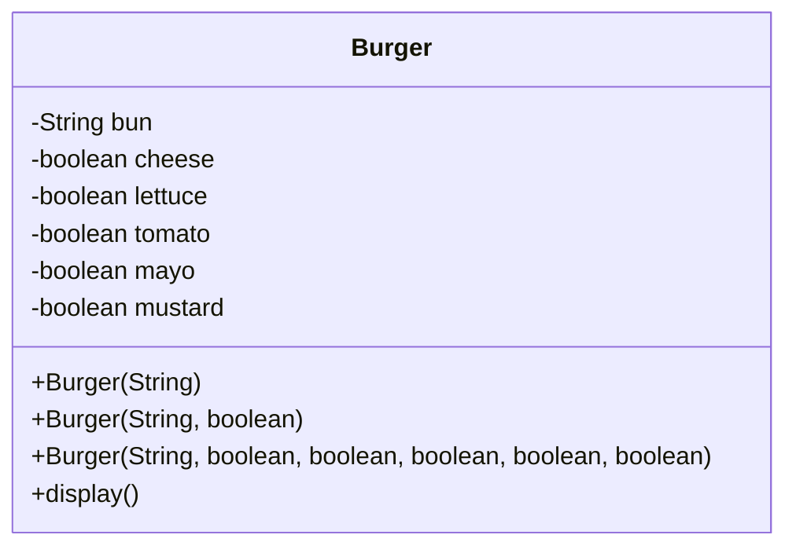
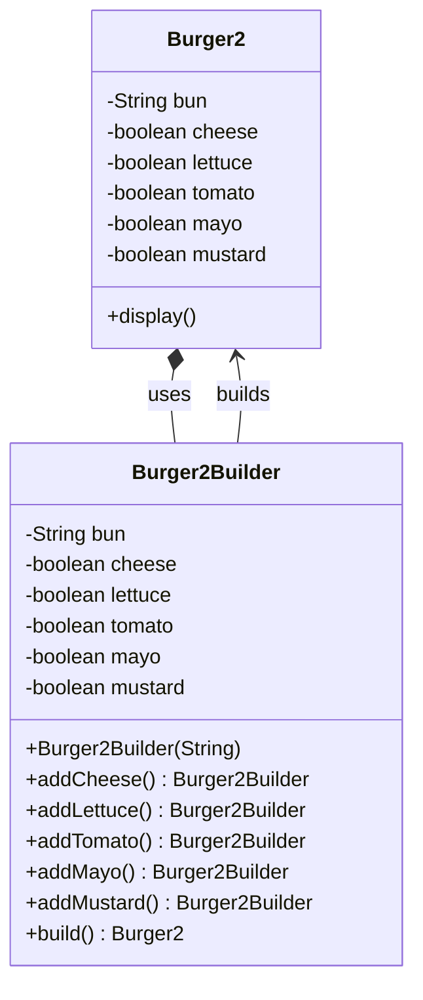

# Builder: Creational Design Pattern

> separates the construction of a complex object from its representation so that the same construction process can create different representations.

## When to Use Builder Pattern

- When an object needs to be created with many optional or mandatory fields.
- When object construction involves multiple steps or complex logic.
- When you want to avoid telescoping constructors (too many constructor overloads).
- When immutability of the constructed object is needed.

## Real-World Analogy

Think of a Subway order counter at a fast food restaurant:
- You walk up and ask for a custom burger.
- You specify what you want: bun type, sauces, toppings, etc.
- The counter (builder) takes your order step-by-step and finally gives you the complete sub.

The burger is constructed step by step, based on the customer’s input. The burger object is the same, but its final composition varies based on what was selected.

## Problem Solved

- Avoids constructor overloading hell.
- Ensures immutability by constructing the object only once.
- Makes object creation more readable and flexible.
- Avoids setting null/defaults for unused fields.
- Easy to build variations of the same object.

## Class Structure

## Violation Code

[Burger Builder - Violation Code](../../code/designPatterns/builder/BuilderViolation.java)

### Issue with Violation Code

1. Too many constructors (hard to maintain and understand). 
2. Hard to read which parameter is what (true, true, false...). 
3. Cannot skip optional parameters cleanly. 
4. Not extensible (adding a new ingredient = all constructors break). 
5. Inflexible for runtime custom configuration.

## Enhanced Code

[Burger Builder - Enhanced Code](../../code/designPatterns/builder/BuilderSample.java)

## Common LLD Problems Using Builder Pattern:

### 1. Object Construction with Optional Parameters
- **Example:** `User`, `Student`, `Employee`
- **Context:** When creating an object with many optional fields (e.g., name, email, age, address, etc.).

---

### 2. HTML/XML/JSON Builders
- **Example:** `HTMLBuilder`, `XMLBuilder`, `JSONBuilder`
- **Context:** Build complex hierarchical markup or structured documents with nested elements.

---

### 3. SpotifyUi Form Builder
- **Example:** `FormBuilder`, `ComponentBuilder`
- **Context:** Build GUI elements like forms, dropdowns, and dynamic inputs step-by-step.

---

### 4. SQL Query Builder
- **Example:** `SelectQueryBuilder`, `InsertQueryBuilder`
- **Context:** Build SQL queries dynamically with conditions, joins, filters, and ordering.

---

### 5. Notification Builder
- **Example:** `NotificationBuilder` for emails, SMS, or app alerts
- **Context:** Construct message content with various optional sections (header, body, footer, attachments).

---

### 6. Game Character/Avatar Builder
- **Example:** `CharacterBuilder`, `AvatarBuilder`
- **Context:** Create characters by choosing name, costume, weapons, skills, etc.

---

### 7. Report Generator
- **Example:** `ReportBuilder`, `PDFReportBuilder`
- **Context:** Generate complex reports with headers, data tables, charts, summaries.

---

### 8. House/Vehicle/PC Customizer
- **Example:** `HouseBuilder`, `CarBuilder`, `PCBuilder`
- **Context:** Build custom products (houses, cars, computers) with flexible combinations of parts.

---

| References | Links                                                                                            |
|------------|--------------------------------------------------------------------------------------------------|
| Article Reference | [Refactoring Guru](https://refactoring.guru/design-patterns/builder) |

