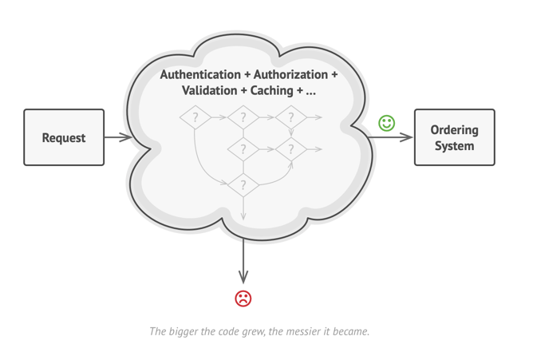
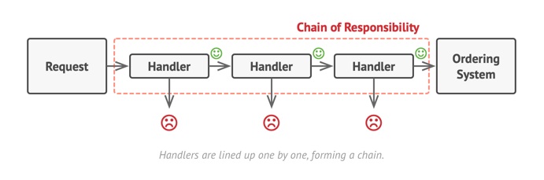
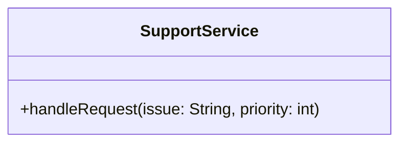
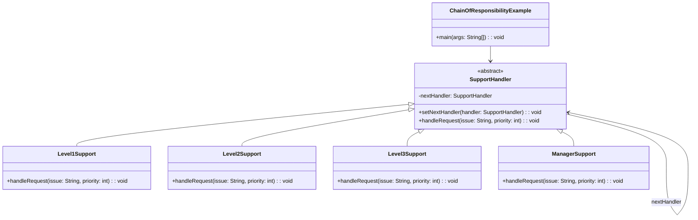

# Chain of Responsibility: Design Pattern

> A Behavioral design pattern that lets you pass requests along a chain of handlers. 
> 
> When a request is received, each handler decides either to process the request or to pass it to the next handler in the chain.

## Problem

## Solution

## When to use Chain of Responsibility Pattern

- When you want to decouple request senders from receivers
- When multiple objects can handle a request, but you don't know which one in advance
- When you want to issue requests to one of several objects without specifying the receiver explicitly
- When the set of objects that can handle a request should be specified dynamically
- When you want to process requests in a specific order

## Real world analogy

- Think of a customer service call center. 
- When you call with a problem, your call goes through a chain: first to the automated system (handles simple queries), then to a junior representative (handles basic issues), then to a senior representative (handles complex problems), and finally to a supervisor (handles escalated complaints). 
- Each level in the chain handles what they can and passes more difficult issues to the next level.

## Problem Solved

- Eliminates tight coupling between sender and receiver
- Allows multiple objects to handle requests without the sender knowing which one will process it
- Provides flexibility in assigning responsibilities to objects
- Allows you to add or remove handlers dynamically
- Promotes single responsibility principle by giving each handler one specific task

## Violation Code

[Call Center - Violation Code](../../code/designPatterns/chainOfResponsibility/ChainOfResponsibilityViolation.java)

### Issues with Violation Code
1. No Abstraction Layer – There's no common Handler interface or abstract class to define a consistent handleRequest() method.
2. Tight Coupling – All logic for all support levels is packed into a single method, making the code hard to modify or extend.
3. No Delegation – Each level isn't responsible for its own logic; there's no delegation to a nextHandler.
4. Violates Open/Closed Principle – Adding a new support level (e.g., Level 4) means modifying existing if-else logic.
5. Difficult to Test – Cannot test support levels independently; all logic is tightly coupled in one place.

## Enhanced Code

[Call Center - Sample](../../code/designPatterns/chainOfResponsibility/ChainOfResponsibilitySample.java)
> Use builder/factory to create the chain of handlers

## Common LLD Problems Using Chain Of Responsibility Pattern:

### 1. Logging System
- **Handlers:** `ErrorLogger`, `WarningLogger`, `InfoLogger`, `DebugLogger`
- **Context:** Messages are passed through logger levels based on severity.

---

### 2. HTTP Request Handling / Middleware (Web Frameworks)
- **Handlers:** `AuthMiddleware`, `RateLimiter`, `Logger`, `RequestValidator`
- **Context:** Requests go through a chain of middleware for pre-processing.

---

### 3. Technical Support System
- **Handlers:** `Level1Support`, `Level2Support`, `Level3Support`
- **Context:** Escalates user issues to the next support level until resolved.

---

### 4. Event Handling System
- **Handlers:** `MouseEventHandler`, `KeyboardEventHandler`, `TouchEventHandler`
- **Context:** Event is passed until a handler processes it.

---

### 5. Expense Approval Workflow
- **Handlers:** `ManagerApproval`, `DirectorApproval`, `CFOApproval`
- **Context:** Expense requests are escalated until approved at the right authority level.

---

### 6. Access Control / Authorization Layer
- **Handlers:** `RoleCheckHandler`, `PermissionHandler`, `OwnershipHandler`
- **Context:** Verifies user access by checking multiple rules in a chain.

---

### 7. Form Validation Pipeline
- **Handlers:** `EmptyFieldValidator`, `EmailValidator`, `PasswordStrengthValidator`
- **Context:** Each validator passes or blocks the form submission.

---

### 8. Spam Filter / Email Classifier
- **Handlers:** `KeywordFilter`, `SenderFilter`, `DomainReputationFilter`
- **Context:** Emails are passed through multiple filters to determine legitimacy.

---

| References | Links                                                                                                                 |
|------------|-----------------------------------------------------------------------------------------------------------------------|
| Article Reference | [Refactoring Guru](https://refactoring.guru/design-patterns/chain-of-responsibility)                                  |
| Boiler Plate Code | [Chain of Resposnsibility Example](../../code/designPatterns/chainOfResponsibility/ChainOfResponsibilityExample.java) |

