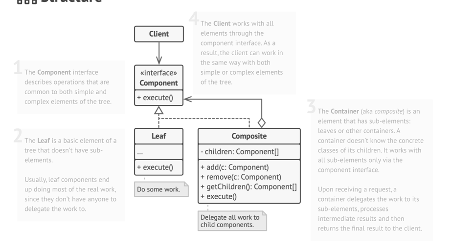
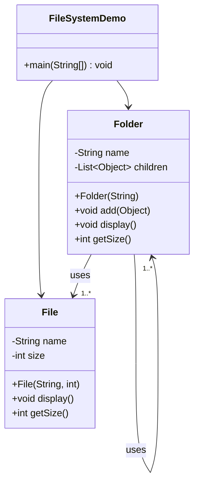
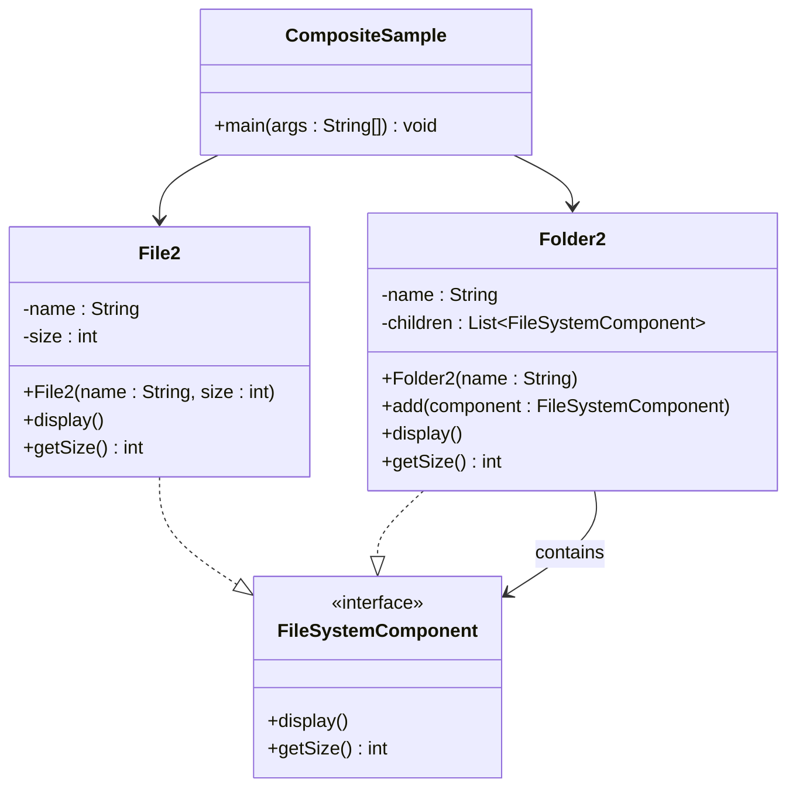

# Composite: Structural Design Pattern

> used to treat individual objects and compositions of objects uniformly. 
> 
> It lets you compose objects into tree structures to represent part-whole hierarchies.

## When to Use Composite Pattern

- You want to represent a tree-like structure (like a folder-file system or UI components). 
- Clients should treat both individual objects and groups of objects the same way. 
- You need to simplify code that deals with hierarchies of objects.

## Real World Analogy

- Think of a folder structure in your computer:
  - A file is a single unit — it can be opened and has a size.  
  - A folder can contain multiple files or even subfolders. 
- Both files and folders support operations like getSize(), display(), etc.
- The folder and file are treated the same way from the client’s perspective, even though their internal structure differs.

## Problems Solved

- Avoids writing special-case logic to treat individual and composite objects differently 
- Treats leaves and containers uniformly 
- Models real-world tree structures (like DOM, filesystem, etc.)
- Simplifies client code — no need to differentiate between leaf and composite 
- Supports recursive behavior (e.g., display all elements)

## class Structure

## Violation Code

[File System - Violation Code](../../code/designPatterns/composite/CompositeViolation.java)

### Issues with the above code
1. No common interface — File and Folder treated as Object 
2. Manual type checking (instanceof) required 
3. Violates Open/Closed Principle — adding new types (like Shortcut) needs changes everywhere 
4. Client tightly coupled to internal structure 
5. Hard to manage or extend hierarchy cleanly

## Enhanced Code

[File System - Example](../../code/designPatterns/composite/CompositeSample.java)

## Common LLD Problems Using Composite Pattern:

### 1. File System Hierarchy
- **Components:** `File`, `Directory`
- **Context:** A directory can contain files and subdirectories, all treated uniformly as file system nodes.

---

### 2. UI Component Trees
- **Components:** `Button`, `Label`, `TextField`, `Panel`, `Window`
- **Context:** Build nested UI layouts where each container can hold other components or containers.

---

### 3. Organization Hierarchy
- **Components:** `Employee`, `Manager`, `Director`
- **Context:** Managers can have subordinates (employees or other managers), enabling traversal of reporting structures.

---

### 4. Menu System
- **Components:** `MenuItem`, `SubMenu`
- **Context:** Render hierarchical menus where items may contain nested submenus.

---

### 5. HTML/XML DOM Tree
- **Components:** `HTMLElement`, `TextNode`, `CommentNode`
- **Context:** Every node (element or text) is treated uniformly for traversal and rendering.

---

### 6. Graphics Editors (e.g. Illustrator, Figma)
- **Components:** `Line`, `Circle`, `Group`, `Rectangle`
- **Context:** Allow grouping of shapes and operations like move, resize, or delete to apply to both individual shapes and groups.

---

### 7. Access Control / Permissions
- **Components:** `Permission`, `PermissionGroup`
- **Context:** Group multiple permissions and assign them together to users or roles.

---

### 8. Product Bundling in Ecommerce
- **Components:** `Product`, `Bundle`
- **Context:** Treat single products and bundles (which contain multiple products or other bundles) in a unified way.

---

| References | Links                                                                  |
|------------|------------------------------------------------------------------------|
| Article Reference | [Refactoring Guru](https://refactoring.guru/design-patterns/composite) |
