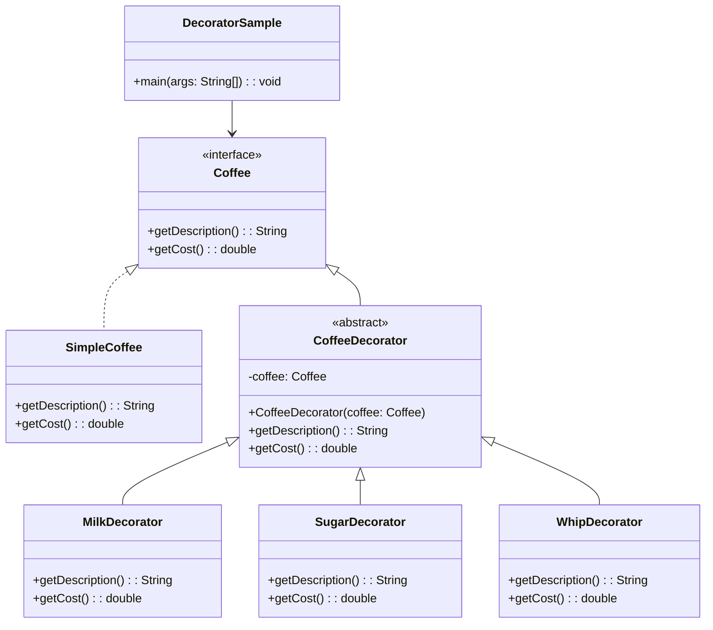

# Decorator: Design Pattern

> A structural design pattern that lets you attach new behaviors to objects by placing these objects inside special wrapper objects that contain the behaviors.
> 
> It provides a flexible alternative to subclassing for extending functionality by wrapping objects in decorator classes.

## When to use Decorator Pattern

- When you want to add responsibilities to objects dynamically and transparently
- When extension by subclassing is impractical or would result in too many subclasses
- When you need to add features to objects at runtime
- When you want to wrap objects with additional functionality without changing their interface

## Real world analogy
- Think of ordering pizza. 
- You start with a basic pizza base (margherita), then add toppings based on your preferences: pepperoni for meat lovers, mushrooms for vegetarians, extra cheese for indulgence. 
- Each topping adds flavor and cost without changing the underlying pizza base, and you can combine multiple toppings in any order to create your perfect pizza.

## Problem Solved
- Avoids the explosion of subclasses when you need multiple combinations of features
- Allows adding/removing responsibilities at runtime
- Provides flexible alternative to inheritance
- Enables composition over inheritance
- Maintains single responsibility principle by separating core functionality from decorative features

## Problem

## Solution

| References | Links                                                                       |
|------------|-----------------------------------------------------------------------------|
| Article Reference | [Refactoring Guru](https://refactoring.guru/design-patterns/decorator)       |
| Boiler Plate Code | [Observer Example](../../code/designPatterns/decorator/DecoratorExample.java) |

## Sample Code

[Coffee Machine Example](../../code/designPatterns/decorator/DecoratorSample.java)

