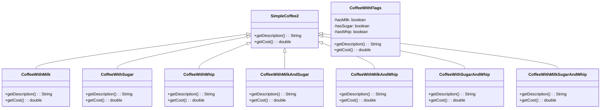

# Decorator: Design Pattern

> A structural design pattern that lets you attach new behaviors to objects by placing these objects inside special wrapper objects that contain the behaviors.
> 
> It provides a flexible alternative to subclassing for extending functionality by wrapping objects in decorator classes.

## When to use Decorator Pattern

- When you want to add responsibilities to objects dynamically and transparently
- When extension by subclassing is impractical or would result in too many subclasses
- When you need to add features to objects at runtime
- When you want to wrap objects with additional functionality without changing their interface

## Real world analogy
- Think of ordering pizza. 
- You start with a basic pizza base (margherita), then add toppings based on your preferences: pepperoni for meat lovers, mushrooms for vegetarians, extra cheese for indulgence. 
- Each topping adds flavor and cost without changing the underlying pizza base, and you can combine multiple toppings in any order to create your perfect pizza.

## Problem Solved
- Avoids the explosion of subclasses when you need multiple combinations of features
- Allows adding/removing responsibilities at runtime
- Provides flexible alternative to inheritance
- Enables composition over inheritance
- Maintains single responsibility principle by separating core functionality from decorative features

## Class Structure

## Problem

## Solution

## Violation Code

[Coffee Machine - violation Code](../../code/designPatterns/decorator/DecoratorViolation.java)

### Issues with Above Code
1. Class explosion - N add-ons = 2^N possible combinations
2. Violates Open/Closed Principle - adding new add-ons requires many new classes
3. Code duplication - similar logic repeated across many classes
4. Hard to maintain - changes to base cost logic need updates in all classes
5. No runtime flexibility - combinations are fixed at compile time
6. Boolean flag approach becomes unwieldy with many options
7. Violates Single Responsibility - each class handles multiple concerns
8. No composition - can't build objects dynamically

## Enhanced Code

[Coffee Machine - Example](../../code/designPatterns/decorator/DecoratorSample.java)

## Common LLD Problems Using Decorator Pattern:

### 1. Text Editor / Rich Text Formatting
- **Decorators:** `BoldText`, `ItalicText`, `UnderlineText`, `HighlightText`
- **Context:** Apply multiple text styles without modifying core `TextComponent`.

---

### 2. UI Component Styling
- **Decorators:** `BorderDecorator`, `ShadowDecorator`, `PaddingDecorator`, `ColorDecorator`
- **Context:** Dynamically enhance visual components in GUI frameworks (like JavaFX/Swing).

---

### 3. Coffee Shop Billing System
- **Decorators:** `MilkDecorator`, `SugarDecorator`, `WhipDecorator`, `VanillaDecorator`
- **Context:** Add ingredients to a base coffee and calculate final cost dynamically.

---

### 4. File I/O Streams (Java / .NET)
- **Decorators:** `BufferedInputStream`, `DataInputStream`, `ZipInputStream`
- **Context:** Enhance file streams with buffering, compression, encryption.

---

### 5. Logging System
- **Decorators:** `TimestampLogger`, `ErrorLevelLogger`, `FileLogger`, `EncryptedLogger`
- **Context:** Add cross-cutting logging concerns (metadata, formatting, destinations).

---

### 6. Authentication & Authorization Middleware
- **Decorators:** `JWTValidator`, `OAuthWrapper`, `RoleBasedAccessControl`
- **Context:** Stack multiple validation/auth layers in web apps (e.g., Express.js or Spring filters).

---

### 7. Notification Enhancer
- **Decorators:** `SlackNotifier`, `EmailNotifier`, `SMSNotifier`, `PushNotifier`
- **Context:** Add channels to a base notification dynamically without hardcoding all variations.

---

### 8. Data Transformation Pipelines
- **Decorators:** `TrimDecorator`, `LowercaseDecorator`, `SanitizeDecorator`, `EncryptDecorator`
- **Context:** Process input data in modular, stackable transformations before saving or displaying.

| References | Links                                                                          |
|------------|--------------------------------------------------------------------------------|
| Article Reference | [Refactoring Guru](https://refactoring.guru/design-patterns/decorator)         |
| Boiler Plate Code | [Decorator Example](../../code/designPatterns/decorator/DecoratorExample.java) |

