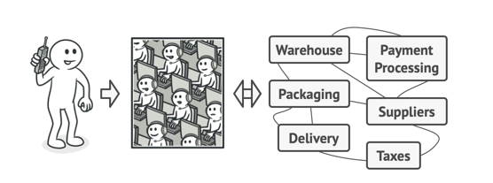
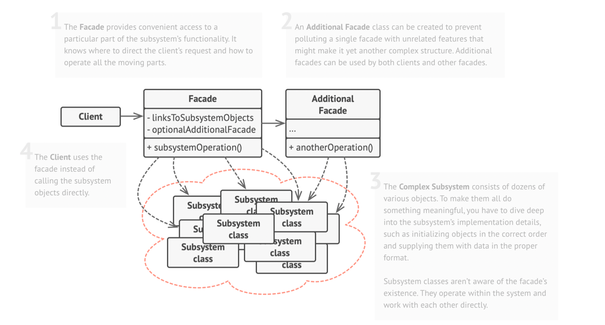
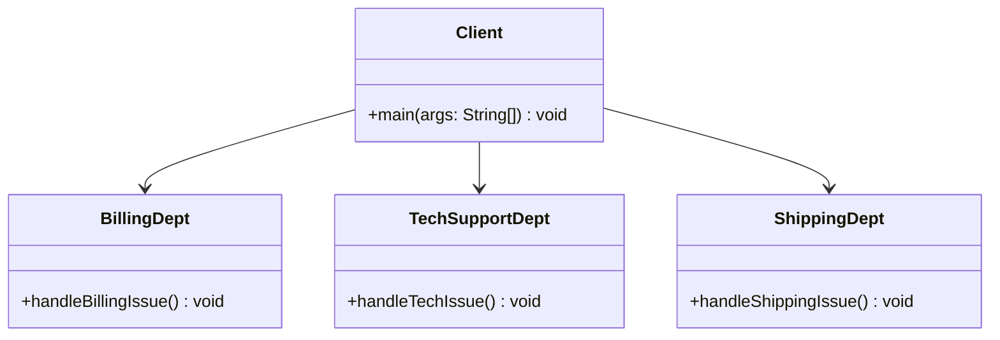
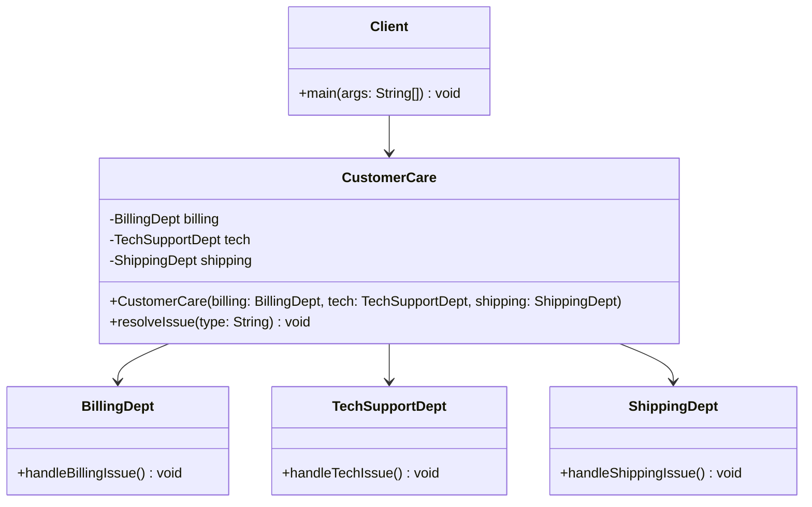

# Facade: A Structural Design Pattern

> Provides a unified, simplified interface to a complex subsystem. 
> 
> It hides the complexities of the subsystem and provides a client-friendly, high-level interface.

## When to Use Facade Pattern

- When a system is very complex or has multiple subsystems that are difficult to work with directly. 
- When you want to provide a higher-level interface that makes a system easier to use. 
- When you need to decouple client code from the subsystem implementations.

## Real World Analogy
- You call customer care (Facade) with one number. 
- The customer care representative listens to your problem and internally connects with different departments (Billing, Technical, Shipping, etc.). 
- As a customer, you don’t need to call each department separately — the Facade (Customer Care) hides that complexity.

    

## Problems Solved

- Simplifies complex systems by providing a clear and simple interface.
- Reduces dependencies between clients and subsystems, promoting loose coupling.
- Makes it easier to use and understand complex libraries or frameworks.
- Improves maintainability by isolating changes to the subsystem from the client code.

## Class Structure

## Violation Code

[Customer Care - Violation Code](../../code/designPatterns/facade/FacadeViolation.java)

### Issues with Violation Code

- Customer (client) knows too much about the internal organization. 
- Tight coupling between client and subsystems. 
- If a new department is added or process changes, client must also change. 
- Repetitive effort for the customer → frustrating experience.

## Enhanced Code with Facade Pattern

[Customer Care - Facade Code](../../code/designPatterns/facade/FacadeExample.java)

## Common LLD Problems Using Facade Pattern:

1. **Home Theater System**
    - Combine DVD Player, Projector, Sound System, Lights into a single `HomeTheaterFacade`.

2. **Online Travel Booking System**
    - Integrates Flight, Hotel, Car Rental, and Payment services with `TravelBookingFacade`.

3. **Banking Application**
    - Simplifies Account, Loan, Credit, Ledger, and Notification subsystems with `BankServiceFacade`.

4. **E-commerce Checkout System**
    - Unifies Cart, Payment, Inventory, Shipping, and Notification via `CheckoutFacade`.

5. **Smart Home Automation**
    - Controls Lights, AC, Curtains, TV, and Security through `SmartHomeFacade`.

6. **Document Conversion Tool**
    - Wraps PDF, Word, and Image processing subsystems in `DocumentConverterFacade`.

7. **Social Media Integration Service**
    - Provides a single interface for Facebook, Twitter, and LinkedIn APIs with `SocialMediaFacade`.

8. **Hospital Management System**
    - Combines Patient Records, Billing, Pharmacy, Lab Tests, and Notifications via `HospitalFacade`.