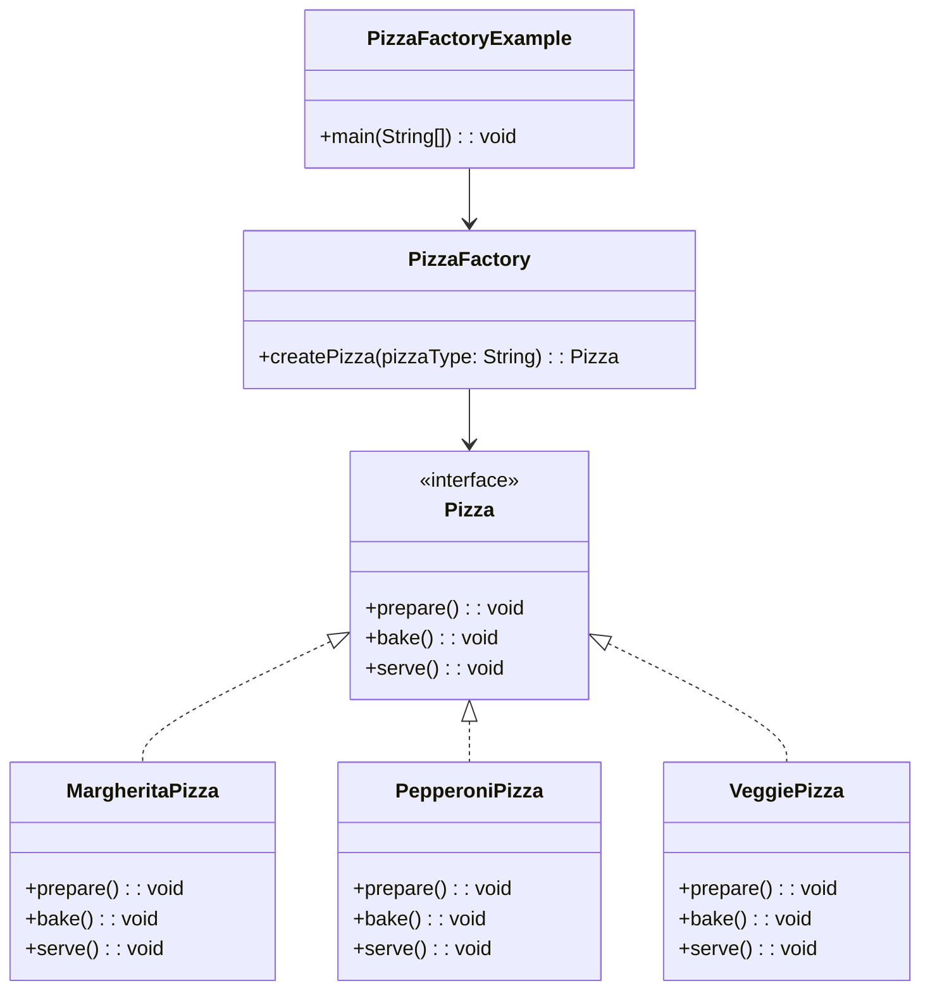

# Factory: Design Pattern

> A creational design pattern that provides an interface for creating objects in a superclass, but allows subclasses to alter the type of objects that will be created.
> 
>  It encapsulates object creation logic in a separate method or class, allowing the system to create objects based on given parameters or conditions.

## When to use Factory Method Pattern

- When you don't know beforehand the exact types of objects your code should work with
- When you want to provide a library of products and reveal only their interfaces
- When you need to centralize object creation logic
- When object creation involves complex logic that shouldn't be repeated
- When you want to decouple object creation from object usage

## Real world analogy

- Think of a pizza restaurant kitchen. 
- When you order a pizza, you don't go into the kitchen and make it yourself. 
- You simply tell the chef what type of pizza you want (Margherita, Pepperoni, Veggie), and the kitchen factory produces the specific pizza for you. 
- The kitchen knows all the recipes and ingredients needed - you just specify the type, and the factory handles the complex creation process.

## Problem Solved

- Eliminates the need for clients to know specific classes
- Centralizes object creation logic in one place
- Makes it easy to add new product types without changing existing code
- Reduces coupling between classes
- Provides a consistent interface for object creation
- Handles complex object initialization logic

The Factory Method pattern suggests that you replace direct object construction calls (using the `new` operator) with calls to a special factory method.

| References | Links                                                                       |
|------------|-----------------------------------------------------------------------------|
| Article Reference | [Refactoring Guru](https://refactoring.guru/design-patterns/factory-method) |
| Boiler Plate Code | [Observer Example](../../code/designPatterns/factory/FactoryExample.java)   |

## Sample Code

[Pizza factory Sample](../../code/designPatterns/factory/FactorySample.java)

