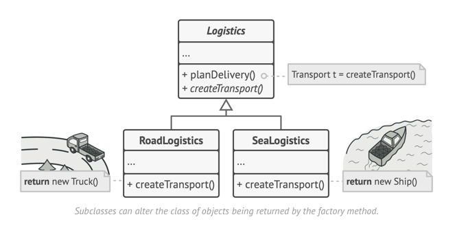

# Factory: Design Pattern

> A creational design pattern that provides an interface for creating objects in a superclass, but allows subclasses to alter the type of objects that will be created.

The Factory Method pattern suggests that you replace direct object construction calls (using the `new` operator) with calls to a special factory method.

### Article Reference - [here](https://refactoring.guru/design-patterns/factory-method)
### Java Example - [here](../../code/designPatterns/FactoryExample.java)

