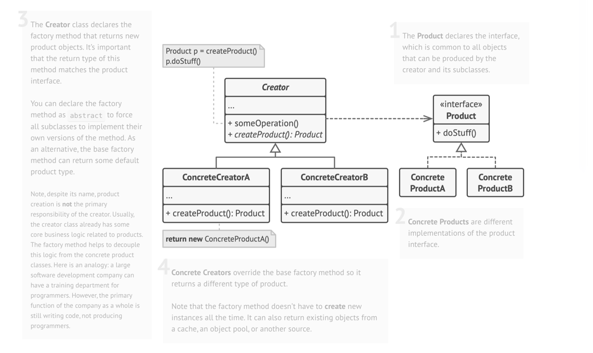

# Factory: Creational Design Pattern

> provides an interface for creating objects in a superclass, but allows subclasses to alter the type of objects that will be created.
> 
>  It encapsulates object creation logic in a separate method or class, allowing the system to create objects based on given parameters or conditions.

## When to use Factory Method Pattern

- The exact type of object to be created isn't known until runtime.
- Object creation logic is **complex**, **repetitive**, or **needs encapsulation**.
- You want to follow the Open/Closed Principle, open for extension, closed for modification.

## Real world analogy

- Think of a notification desk in a company that must send messages to users.
- Initially, the desk only sends emails, so it prepares and sends them directly.
- As new channels appear (SMS, Push, Slack, WhatsApp), the desk becomes overloaded creating each type manually.
- Instead of the desk handling creation, a Notification Factory produces the correct notification object for each channel.

## Problem Solved

- Eliminates the need for clients to know specific classes
- Centralizes object creation logic in one place
- Makes it easy to add new product types without changing existing code
- Reduces coupling between classes
- Provides a consistent interface for object creation
- Handles complex object initialization logic

The Factory Method pattern suggests that you replace direct object construction calls (using the `new` operator) with calls to a special factory method.

## Class Structure



## Violation code

```java
class NotificationService {
    public void sendNotification(String type, String message) {
        if (type.equals("EMAIL")) {
            EmailNotification email = new EmailNotification();
            email.send(message);
        } else if (type.equals("SMS")) {
            SMSNotification sms = new SMSNotification();
            sms.send(message);
        } else if (type.equals("Push")) {
            PushNotification sms = new PushNotification();
            sms.send(message);
        } else if (type.equals("Slack")) {
            SlackNotification sms = new SlackNotification();
            sms.send(message);
        } else if (type.equals("WhatsApp")) {
            WhatsAppNotification sms = new WhatsAppNotification();
            sms.send(message);
        }
    }
}
```
### Issues with above code
1. Tight coupling - Client code depends directly on concrete pizza classes
2. Violates Open/Closed Principle - adding new pizza types requires modifying existing code
3. Code duplication - object creation logic repeated in multiple places
4. Violates Single Responsibility - client classes handle both business logic AND object creation
5. Hard to maintain - changes to object creation affect multiple classes
6. No centralized creation logic - creation scattered throughout application
7. Difficult to test - can't easily substitute mock objects
8. Violates DRY principle - same creation logic written multiple times

## Enhanced Code

```java
public interface Notification {
    void send(String message);
}


public class EmailNotification implements Notification {
    @Override
    public void send(String message) {
        System.out.println("Sending EMAIL: " + message);
    }
}

public class SMSNotification implements Notification {
    @Override
    public void send(String message) {
        System.out.println("Sending SMS: " + message);
    }
}

public class PushNotification implements Notification {
    @Override
    public void send(String message) {
        System.out.println("Sending PUSH: " + message);
    }
}

public class SlackNotification implements Notification {
    @Override
    public void send(String message) {
        System.out.println("Sending SLACK: " + message);
    }
}

public class WhatsAppNotification implements Notification {
    @Override
    public void send(String message) {
        System.out.println("Sending WHATSAPP: " + message);
    }
}

public class NotificationFactory {

    public static Notification createNotification(String type) {
        switch (type) {
            case "EMAIL":
                return new EmailNotification();
            case "SMS":
                return new SMSNotification();
            case "PUSH":
                return new PushNotification();
            case "SLACK":
                return new SlackNotification();
            case "WHATSAPP":
                return new WhatsAppNotification();
            default:
                throw new IllegalArgumentException("Unknown notification type: " + type);
        }
    }
}

public class NotificationService {

    public void sendNotification(String type, String message) {
        Notification notification = NotificationFactory.createNotification(type);
        notification.send(message);
    }
}

```

## Common LLD Problems Using Factory Pattern:

### 1. Notification Sender System
- **Factory:** `NotificationFactory.create("email" | "sms" | "push")`
- **Products:** `EmailNotification`, `SMSNotification`, `PushNotification`
- **Context:** Create the right notification handler without exposing instantiation logic.

---

### 2. Food Ordering / Pizza System
- **Factory:** `PizzaFactory.create("margherita" | "veggie" | "pepperoni")`
- **Products:** `MargheritaPizza`, `VeggiePizza`, `PepperoniPizza`
- **Context:** Decouple pizza creation from ordering logic.

---

### 3. Shape Drawing Tool / Graphics Editor
- **Factory:** `ShapeFactory.create("circle" | "rectangle" | "triangle")`
- **Products:** `Circle`, `Rectangle`, `Triangle`
- **Context:** Used to create different shape objects in drawing or diagramming tools.

---

### 4. Payment Gateway Integration
- **Factory:** `PaymentFactory.getPayment("upi" | "credit_card" | "paypal")`
- **Products:** `UPIPayment`, `CreditCardPayment`, `PayPalPayment`
- **Context:** Abstract away the initialization of payment processors.

---

### 5. Document Reader / File Parser
- **Factory:** `ParserFactory.getParser("pdf" | "docx" | "csv")`
- **Products:** `PDFParser`, `DocxParser`, `CSVParser`
- **Context:** Read files of various formats without hardcoding parser logic.

---

### 6. Vehicle Manufacturing System
- **Factory:** `VehicleFactory.getVehicle("car" | "bike" | "truck")`
- **Products:** `Car`, `Bike`, `Truck`
- **Context:** Manage object creation for different vehicle types.

---

### 7. Cloud Provider SDK Generator
- **Factory:** `CloudFactory.getProvider("aws" | "gcp" | "azure")`
- **Products:** `AWSClient`, `GCPClient`, `AzureClient`
- **Context:** Simplify instantiation and configuration of cloud-specific clients.

---

### 8. Database Connection Provider
- **Factory:** `ConnectionFactory.getConnection("mysql" | "postgres" | "mongodb")`
- **Products:** `MySQLConnection`, `PostgresConnection`, `MongoDBConnection`
- **Context:** Unified access to different database types without changing business logic.

---


| References | Links                                                                       |
|------------|-----------------------------------------------------------------------------|
| Article Reference | [Refactoring Guru](https://refactoring.guru/design-patterns/factory-method) |
| Boiler Plate Code | [Factory Example](../../code/designPatterns/factory/FactoryExample.java)    |


