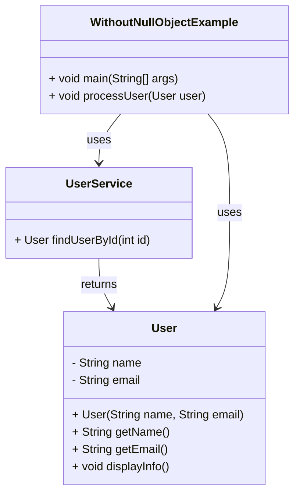
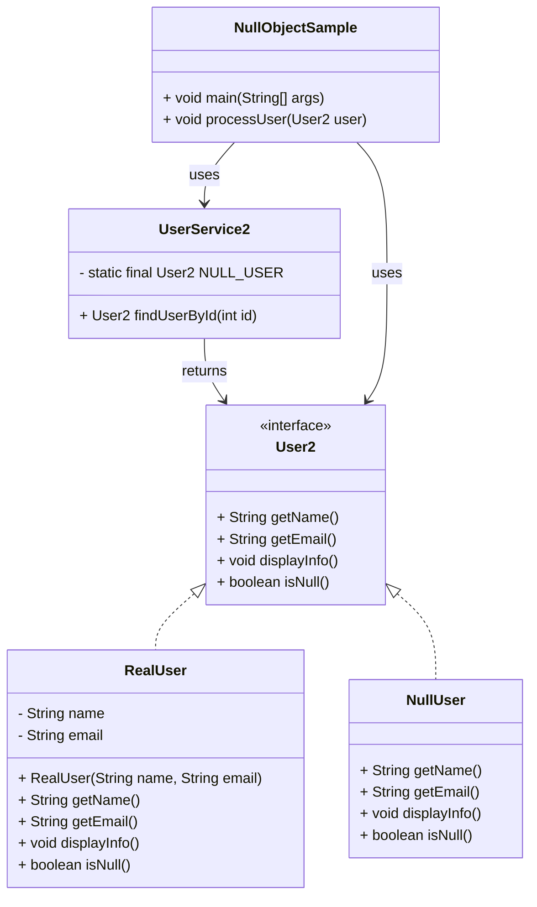

# Null Object: Design Pattern

> The Null Object pattern provides a default object with neutral behavior to avoid null reference checks. 
> 
> Instead of returning null, it returns an object that implements the expected interface but performs no operations or provides default behavior.

## When to use Null Object Pattern

- When you want to eliminate null checks throughout your code 
- When you need a default behavior for missing objects 
- When you want to avoid NullPointerException 
- When you have optional dependencies that might not be available 
- When you want to simplify client code by removing conditional logic

## Real world analogy

- Think of a TV remote control. 
- When the battery dies, instead of having no remote (null), you get a "dummy" remote that looks the same but doesn't actually control the TV. 
- You can still press buttons without the remote breaking, but nothing happens. 
- This prevents you from having to check "do I have a working remote?" before every button press.

## Problem Solved
- Eliminates the need for null checks in client code 
- Prevents NullPointerException at runtime 
- Provides consistent behavior when objects are missing 
- Reduces conditional logic complexity

## Violation code

[User Service - Violation Code](../../code/designPatterns/factory/FactoryViolation.java)

### Issues with above code

1. Repetitive Null Checks: Every method call requires null checking, making code verbose
2. NullPointerException Risk: Forgetting null checks can cause runtime crashes
3. Code Complexity: Multiple nested if-else statements make code hard to read
4. Maintenance Burden: Adding new methods requires updating all null checks
5. Inconsistent Behavior: Different parts of code might handle null differently
6. Poor Readability: Business logic is mixed with null checking logic
7. Error Prone: Easy to miss null checks in complex scenarios

## Enhanced Code

[User Service - Sample](../../code/designPatterns/nullObject/NullObjectSample.java)

## Common LLD Problems Using Null Object Pattern:

### 1. Logger System
- **Null Object:** `NullLogger`
- **Context:** If no logger is configured, `NullLogger` silently ignores log calls instead of throwing `NullPointerException`.

---

### 2. User Profile / Authentication System
- **Null Object:** `GuestUser`, `NullUser`
- **Context:** When no user is logged in, use a default `GuestUser` that returns safe defaults for name, role, etc.

---

### 3. Payment System
- **Null Object:** `NoPaymentMethod`
- **Context:** If no payment method is available, avoid runtime exceptions by using a dummy object that does nothing.

---

### 4. Notification System
- **Null Object:** `NoOpNotifier`
- **Context:** When notification settings are disabled, use a null notifier to prevent conditional logic everywhere.

---

