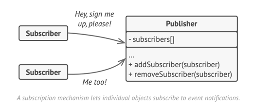
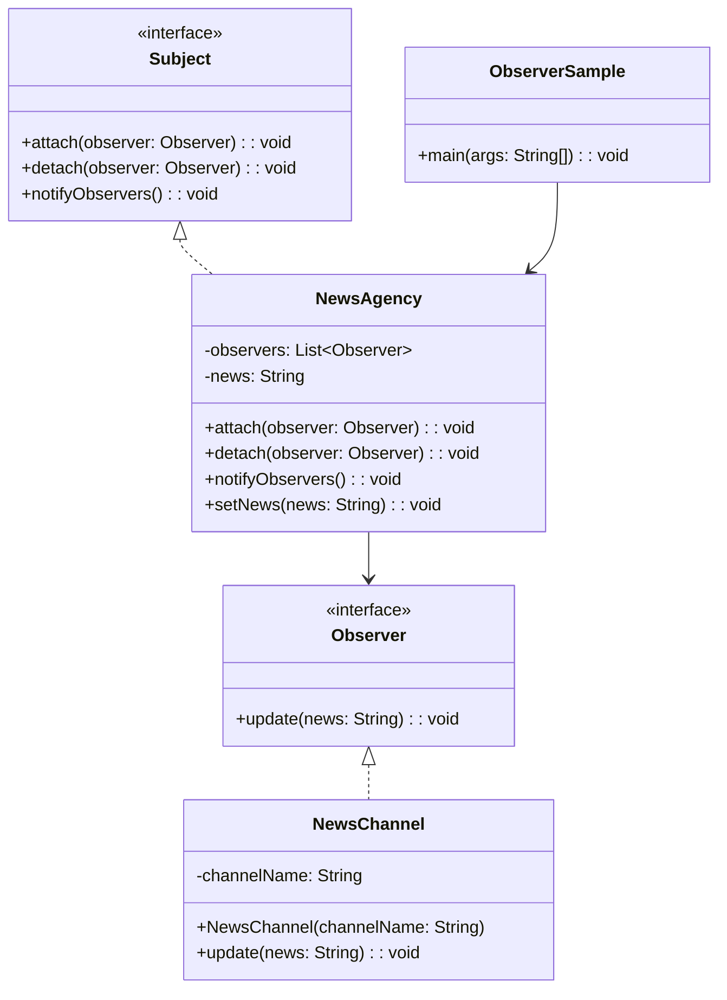

# Observer: Design Pattern

> A behavioral design pattern that lets you define a subscription mechanism to notify multiple objects about any events that happen to the object they’re observing.
> 
> Defines a one-to-many dependency between objects

## When to use Observer Pattern

- When changes to one object require changing many other objects
- When you want to notify multiple objects about events without making them tightly coupled
- When you need to broadcast information to an unknown number of listeners
- When you want to implement event-driven systems

## Real world analogy

- Think of a newspaper subscription service. 
- When a new newspaper edition is published, all subscribers automatically receive a copy. 
- Subscribers can join or leave the subscription list anytime. 
- The newspaper doesn't need to know who the subscribers are individually - it just notifies everyone on the list when new content is available.

## Problem Solved

- Reduces tight coupling between objects
- Allows dynamic relationships between subjects and observers
- Supports broadcast communication without knowing specific receivers
- Makes it easy to add/remove observers without modifying the subject 
- Enables event-driven programming patterns

## Summary

- The `Publisher` issues events of interest to other objects. These events occur when the publisher changes its state or executes some behaviors. Publishers contain a subscription infrastructure that lets new subscribers join and current subscribers leave the list.
- When a new event happens, the publisher goes over the subscription list and calls the notification method declared in the subscriber interface on each subscriber object.
- The `Subscriber interface` declares the notification interface. In most cases, it consists of a single update method. The method may have several parameters that let the publisher pass some event details along with the update.
- `Concrete Subscribers` perform some actions in response to notifications issued by the publisher. All of these classes must implement the same interface so the publisher isn’t coupled to concrete classes.
- Usually, subscribers need some contextual information to handle the update correctly. For this reason, publishers often pass some context data as arguments of the notification method. The publisher can pass itself as an argument, letting subscriber fetch any required data directly.
- The Client creates publisher and subscriber objects separately and then registers subscribers for publisher updates.

| References | Links                                                                       |
|------------|-----------------------------------------------------------------------------|
| Article Reference | [Refactoring Guru](https://refactoring.guru/design-patterns/observer)       |
| Boiler Plate Code | [Observer Example](../../code/designPatterns/observer/ObserverExample.java) |

## Sample Code

[News Broadcast Example](../../code/designPatterns/observer/ObserverSample.java)

## Common LLD Problems Using Observer Pattern:

### 1. Notification System
- **Observers:** `EmailNotifier`, `SMSNotifier`, `PushNotifier`
- **Context:** Notify users across multiple channels on events like sign-up, purchase, or delivery.

---

### 2. Stock Market Ticker / Crypto Price Tracker
- **Observers:** `TraderDashboard`, `MobileApp`, `AlertService`
- **Context:** Broadcast price updates to all subscribed clients in real-time.

---

### 3. Chat / Messaging Application
- **Observers:** `MobileClient`, `DesktopApp`, `WebApp`
- **Context:** When a message is sent, notify all members in the group or chat room.

---

### 4. Real-time Dashboard / Admin Panel
- **Observers:** `UIComponent`, `AnalyticsWidget`, `NotificationBanner`
- **Context:** Reflect backend changes (e.g. order status, user activity) in real time.

---

### 5. Event Bus / Pub-Sub in Microservices
- **Observers:** `InventoryService`, `BillingService`, `NotificationService`
- **Context:** When an event like `OrderPlaced` is published, notify relevant services.

---

### 6. File System Watcher
- **Observers:** `BackupService`, `LogMonitor`, `Indexer`
- **Context:** Detect changes in file/directory and trigger actions accordingly.

---

### 7. Social Media Feed
- **Observers:** `FollowerFeed`, `NotificationService`, `EmailDigest`
- **Context:** Notify followers when a user posts new content.

---

### 8. Weather Monitoring System
- **Observers:** `CurrentDisplay`, `ForecastPanel`, `AlertSystem`
- **Context:** On weather data update, notify all UI displays and alert modules.

---