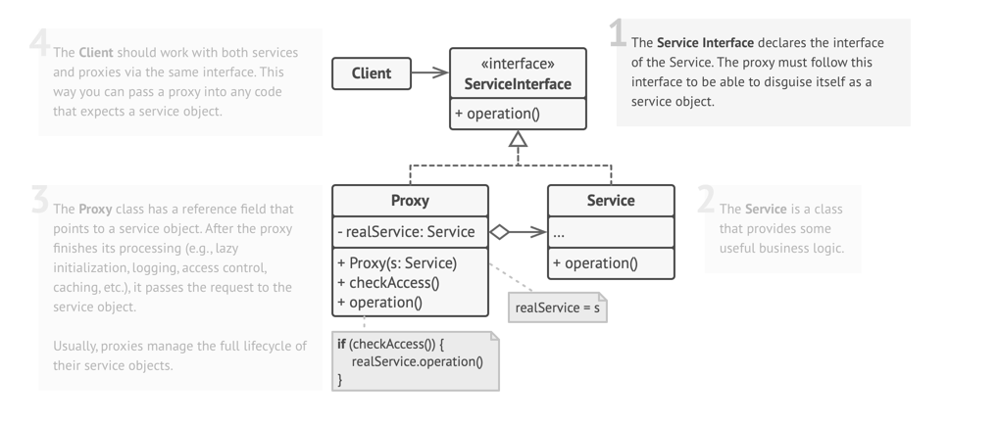
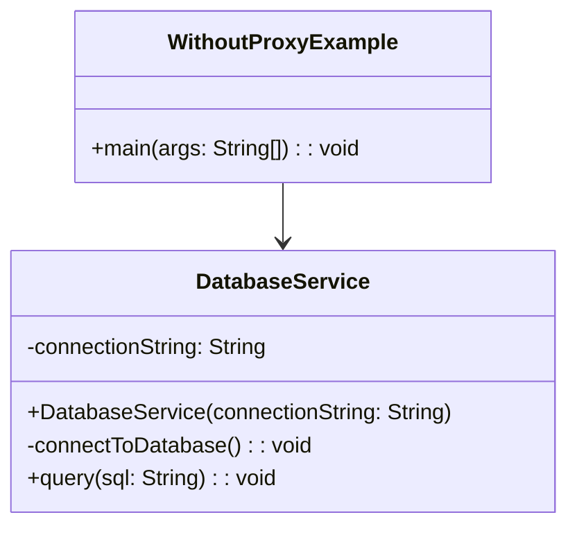
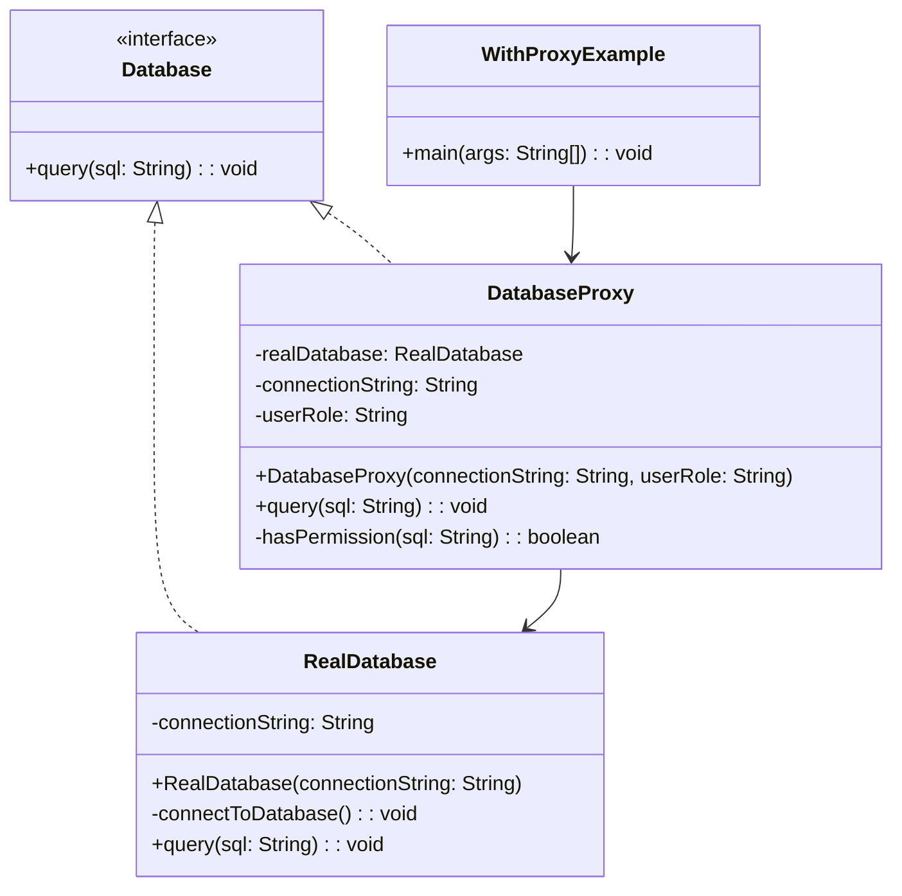

# Proxy: Design Pattern

> A structural design pattern that lets you provide a substitute or placeholder for another object to control access to it.
> 
> The proxy acts as an intermediary that can add additional functionality like lazy loading, access control, caching, or logging without changing the original object.

## When to Use Proxy Pattern

- When you need to control access to an object
- When you want to add functionality without modifying the original object
- When you need lazy initialization of expensive objects
- When you want to cache results or add logging
- When you need to check permissions before accessing an object
- When working with remote objects or services

## Real world analogy
  
- Think of a security guard at a corporate building. 
- The guard acts as a proxy between visitors and the building's occupants. 
- Before allowing access, the guard checks credentials, logs entry times, and may restrict access to certain floors. 
- The guard doesn't replace the building or its occupants, but controls and monitors access to them.

## Problems Solved
- Controls access to objects without modifying their code 
- Adds additional behavior transparently 
- Provides lazy loading for expensive object creation 
- Enables caching and performance optimization 
- Allows security checks and access control 
- Helps with logging and monitoring
- Manages remote object communication

## Class Structure

## Violation Code

[Database - Violation Code](../../code/designPatterns/proxy/ProxyViolation.java)

### Issues with above code
1. Resource Waste: Database connections are created immediately upon object creation, even if never used
2. No Access Control: Any user can execute any SQL query, including dangerous operations like DELETE
3. No Logging: No way to track who executed what queries or when
4. No Caching: Same queries are executed multiple times without caching results
5. Poor Performance: Expensive operations happen upfront, slowing down application startup
6. Security Risk: No validation or permission checks before executing queries

## Enhanced Code with Proxy Pattern
[Database - Sample](../../code/designPatterns/proxy/ProxySample.java)

## Common LLD Problems Using Proxy Pattern:

### 1. Virtual Proxy (Lazy Initialization)
- **Proxy:** `ImageProxy`, `DocumentProxy`
- **Context:** Delay loading of expensive resources like large images or PDFs until needed.

---

### 2. Access Control Proxy / Authorization Layer
- **Proxy:** `SecureDatabaseProxy`, `ProtectedResourceProxy`
- **Context:** Grant or restrict access to users based on roles or permissions.

---

### 3. Remote Proxy (RPC / gRPC / RMI)
- **Proxy:** `RemoteServiceProxy`
- **Context:** Client interacts with local proxy which internally communicates with a remote service/server.

---

### 4. Caching Proxy
- **Proxy:** `CachedWeatherServiceProxy`, `CachedProductServiceProxy`
- **Context:** Serve data from cache instead of fetching from backend every time.

---

### 5. Logging and Monitoring Proxy
- **Proxy:** `LoggingProxy`, `AnalyticsProxy`
- **Context:** Wrap service calls to log or monitor activity without changing core logic.

---

### 6. API Rate Limiting Proxy
- **Proxy:** `RateLimitingProxy`
- **Context:** Limit the number of requests to a service over time to avoid abuse or overload.

---

### 7. Database Connection Proxy
- **Proxy:** `ConnectionPoolProxy`
- **Context:** Manage a pool of reusable DB connections, create only when necessary.

---

### 8. Payment Gateway Proxy (Fraud Detection / Logging)
- **Proxy:** `PaymentProxy`
- **Context:** Add pre-checks (e.g. fraud detection, logging, validation) before routing to real payment processor.

---

| References | Links                                                              |
|------------|--------------------------------------------------------------------|
| Article Reference | [Refactoring Guru](https://refactoring.guru/design-patterns/proxy) |
| Boiler Plate Code | [Proxy Example](../../code/designPatterns/proxy/ProxyExample.java) |

