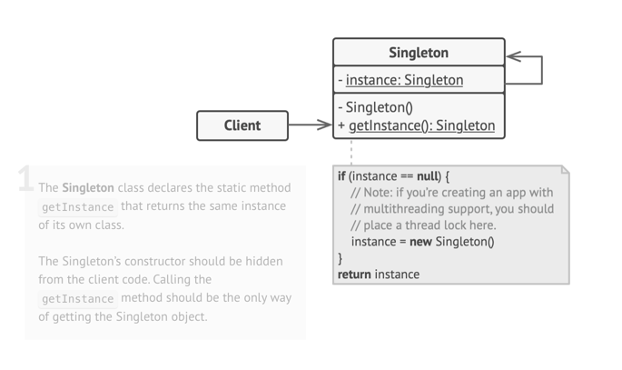
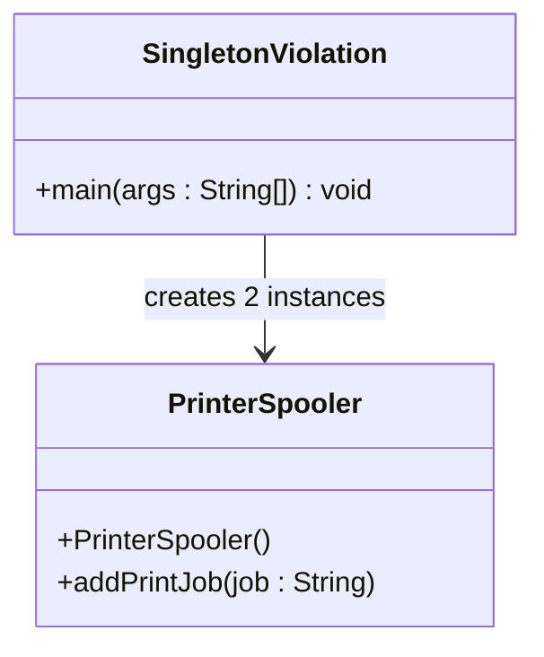
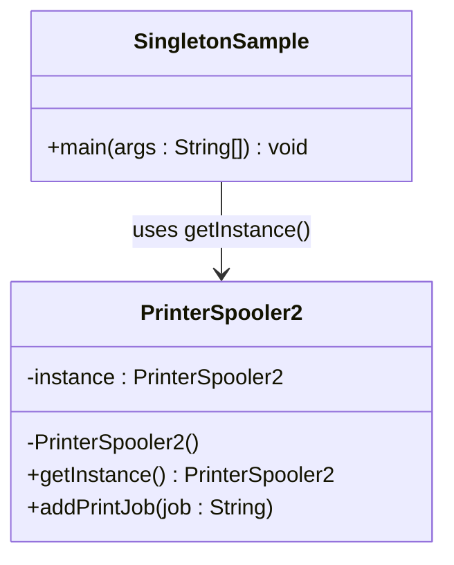

# Single: Creational Design Pattern

> It ensures that a class has only one instance and provides a global access point to that instance.


## When to use Singleton Pattern

- Only one instance of a class should exist throughout the application (e.g., logging, DB connection pool, config manager).
- You want controlled access to that single instance.
- You want to avoid the overhead of multiple instantiations.

## Real world analogy

- Think of a printer spooler in an office:

  - There is only one printer spooler managing all print jobs. 
  - Multiple employees send print requests. 
  - The spooler queues and manages all jobs, ensuring no two jobs conflict. 
  - All employees access the same shared instance of the spooler.

## Problem Solved

- Guarantees exactly one instance 
- Provides a global point of access 
- Controls resource usage (e.g., DB connections)
- Helps coordinate actions across the system 
- Simplifies shared resource management

## Class Structure


## Violation Code

```java
package singleton;


class PrinterSpooler {
    public PrinterSpooler() {
        System.out.println("Spooler started");
    }

    public void addPrintJob(String job) {
        System.out.println("Added print job: " + job);
    }
}

public class SingletonViolation {
    public static void main(String[] args) {
        PrinterSpooler spooler1 = new PrinterSpooler();
        spooler1.addPrintJob("Doc1");

        PrinterSpooler spooler2 = new PrinterSpooler();
        spooler2.addPrintJob("Doc2");

        // ❌ Two separate instances created!
    }
}

```


### Issues with above code

- Multiple instances of PrinterSpooler can be created 
- No control over instantiation 
- Wastes memory and may cause inconsistent behavior
- Violates single point of access principle

## Enhanced Code

```java
package singleton;


// Singleton class
class PrinterSpooler2 {
    private static PrinterSpooler2 instance;

    // Private constructor to prevent instantiation
    private PrinterSpooler2() {
        System.out.println("Spooler initialized");
    }

    // Thread-safe, lazy initialization
    public static synchronized PrinterSpooler2 getInstance() {
        if (instance == null) {
            instance = new PrinterSpooler2();
        }
        return instance;
    }

    public void addPrintJob(String job) {
        System.out.println("Added print job: " + job);
    }
}

// Usage
public class SingletonSample {
    public static void main(String[] args) {
        PrinterSpooler2 spooler1 = PrinterSpooler2.getInstance();
        spooler1.addPrintJob("Doc1");

        PrinterSpooler2 spooler2 = PrinterSpooler2.getInstance();
        spooler2.addPrintJob("Doc2");

        System.out.println("spooler1 == spooler2: " + (spooler1 == spooler2)); // true ✅
    }
}

```


## Common LLD Problems Using Singleton Pattern:

### 1. Configuration Manager
- **Singleton:** `AppConfig`, `EnvironmentConfig`
- **Context:** Ensure only one set of loaded configuration is used throughout the application.

---

### 2. Logger
- **Singleton:** `Logger`
- **Context:** Centralized logging utility shared across all classes to avoid redundant instances.

---

### 3. Database Connection Pool Manager
- **Singleton:** `ConnectionPool`
- **Context:** Ensure controlled and thread-safe access to a shared pool of database connections.

---

### 4. Cache Manager
- **Singleton:** `Cache`
- **Context:** Maintain a consistent in-memory cache instance across the application.

---

### 5. Thread Pool Executor
- **Singleton:** `ThreadPoolManager`, `ExecutorService`
- **Context:** Reuse thread pool across services to manage concurrent execution.

---

### 6. Application State Manager
- **Singleton:** `AppState`, `SessionManager`
- **Context:** Maintain global app/session state like user login info, theme, preferences.

---

### 7. Event Bus / Message Dispatcher
- **Singleton:** `EventBus`, `MessageQueueManager`
- **Context:** A single event dispatcher instance to notify all registered listeners.

---

### 8. Analytics / Metrics Collector
- **Singleton:** `MetricsCollector`, `TelemetryManager`
- **Context:** Track performance, user actions, and events via a globally accessible analytics tracker.

---


| References | Links                                                                                                                 |
|------------|-----------------------------------------------------------------------------------------------------------------------|
| Article Reference | [Refactoring Guru](https://refactoring.guru/design-patterns/singleton)                                  |


