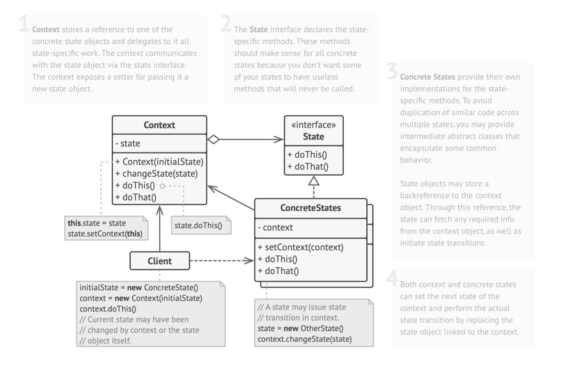
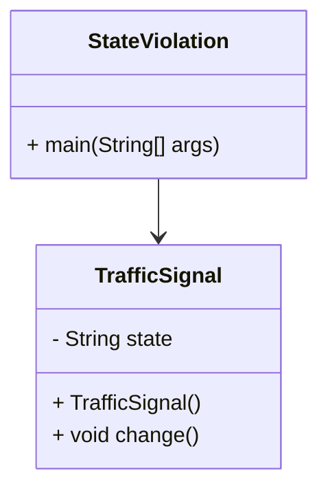
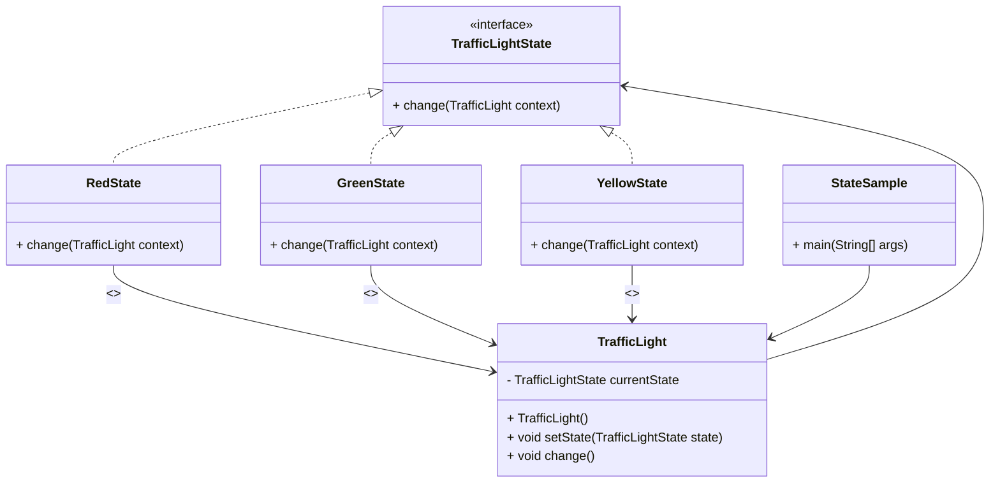

# State: Behavioral Design Pattern

> allows an object to alter its behavior when its internal state changes. 
> 
> It appears as if the object changed its class.

## When to Use State Pattern

- When an object’s behavior depends on its state, and it must change its behavior at runtime depending on that state. 
- When the code has a lot of conditionals (if-else or switch) that depend on the object's state.

## Real World Analogy

- Think of a traffic signal. It behaves differently in Green, Yellow, and Red states:
  - Green → allows cars to pass. 
  - Yellow → warns cars to slow down. 
  - Red → stops the traffic. 
- The traffic signal object is the same, but its behavior changes based on its state.

## Problems Solved

- Eliminates large conditional statements based on the object's state. 
- Encapsulates state-specific behavior into separate classes.
- Makes it easier to add new states without altering existing code.

## Class Structure

## Violation Code

[Traffic Light - Violation Code](../../code/designPatterns/state/StateViolation.java)

### Issues with the above code

1. Logic is tightly coupled with state transitions 
2. Hard to extend (e.g., adding a BLINKING state)
3. Breaks Open/Closed Principle 
4. Difficult to reuse state behavior elsewhere 
5. Harder to test individual states independently

## Enhanced Code

[Traffic Light - Example](../../code/designPatterns/state/StateSample.java)

## Common LLD Problems Using State Pattern:

### 1. Vending Machine
- **States:** `IdleState`, `HasMoneyState`, `DispensingState`, `OutOfStockState`
- **Context:** Machine changes behavior based on current state (e.g., accept money, dispense item, reject input).

---

### 2. Media Player
- **States:** `PlayingState`, `PausedState`, `StoppedState`
- **Context:** Media controls behave differently depending on the current player state.

---

### 3. ATM Machine
- **States:** `CardInsertedState`, `PinEnteredState`, `TransactionState`, `NoCardState`
- **Context:** ATM changes its flow based on where the user is in the process.

---

### 4. Order Processing System
- **States:** `OrderPlaced`, `OrderConfirmed`, `OrderShipped`, `OrderDelivered`, `OrderCancelled`
- **Context:** Transitions occur step-by-step, with different behaviors allowed in each stage.

---

### 5. Traffic Light Controller
- **States:** `GreenLight`, `YellowLight`, `RedLight`
- **Context:** Each light state changes the behavior of the controller and determines the next transition.

---

### 6. Online Document Editor
- **States:** `EditMode`, `ReadOnlyMode`, `CommentMode`
- **Context:** UI and editing capabilities change based on current mode.

---

### 7. Game Character State (e.g. Player or Enemy)
- **States:** `IdleState`, `RunningState`, `JumpingState`, `AttackingState`
- **Context:** A character responds to input or events differently depending on its current state.

---

### 8. TCP Connection State Machine
- **States:** `Closed`, `Listen`, `Established`, `FinWait`, `TimeWait`
- **Context:** Network connection behavior depends on protocol state transitions.

---

| References | Links                                                                       |
|------------|-----------------------------------------------------------------------------|
| Article Reference | [Refactoring Guru](https://refactoring.guru/design-patterns/state) |
