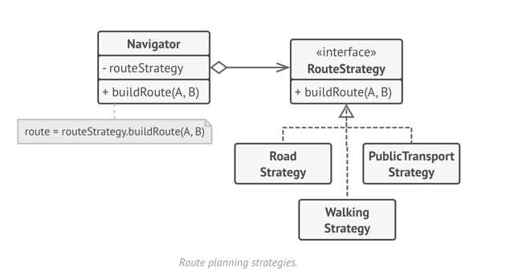
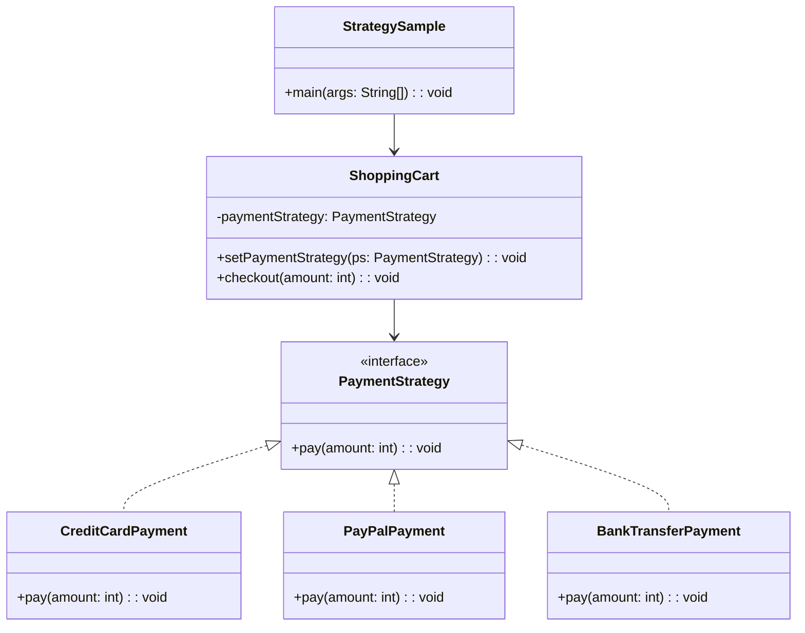

# Strategy: Design Pattern

>A behavioral design pattern that lets you define a family of algorithms, put each of them into a separate class, and make their objects interchangeable.
> 
>  It lets the algorithm vary independently from the clients that use it.

## When to use Strategy Pattern
- When you have multiple ways to perform a task and want to choose the method at runtime
- When you want to avoid long if-else or switch statements for different behaviors
- When you need to add new algorithms without modifying existing code
- When different classes differ only in their behavior

## Real world analogy
Consider navigation apps like Google Maps. 
You can choose different travel strategies: driving (fastest route), walking (pedestrian paths), cycling (bike lanes), or public transit (bus/train routes). 
The destination remains the same, but the strategy to reach it changes based on your selection.

## Problem Solved

- Eliminates complex conditional statements
- Makes it easy to add new algorithms without changing existing code
- Allows runtime selection of algorithms
- Promotes code reusability and separation of concerns
- Reduces code duplication when multiple classes have similar behaviors

## Summary

- You create a `Context class`, that contains `(has-a)` instance of `Strategy interface`.
- The `Strategy interface` is common to all concrete strategies. It declares a method the context uses to execute a strategy.
- Using this strategy interface implement `(is-a)` all concrete classes(strategies).
- The `context` calls the execution method on the linked strategy object each time it needs to run the algorithm. It doesn’t know what type of strategy it works with or how the algorithm is executed.
- The `Client` creates a specific strategy `object` and passes it to the `context`. The context exposes a setter which lets clients replace the strategy associated with the context at runtime.

| References | Links                                                                                            |
|------------|--------------------------------------------------------------------------------------------------|
| Article Reference | [Refactoring Guru](https://refactoring.guru/design-patterns/strategy) |
| Boiler Plate Code | [Strategy Example](../../code/designPatterns/strategy/StrategyExample.java)                      |

## Java Sample Code 

[Sample Code](../../code/designPatterns/strategy/StrategySample.java)
