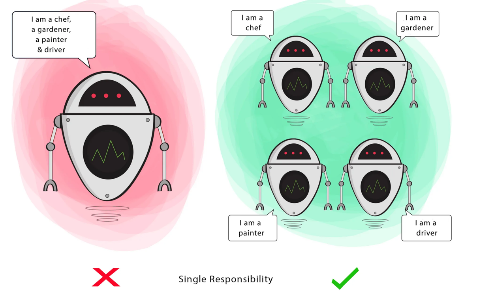

# Guiding Principles

Guiding principles are rules that software engineers should generally follow

This includes 
- SOLID, 
- tradeoffs between encapsulation, 
- abstraction, 
- inheritance, 
- composition, etc...

## SOLID principles

```S``` - **Single Responsibility Principle**

A ```class``` should have ```single responsibility```.

**Goal** - This principle aims to separate behaviours so that if bugs arise as a result of your change, it won’t affect other unrelated behaviours.


