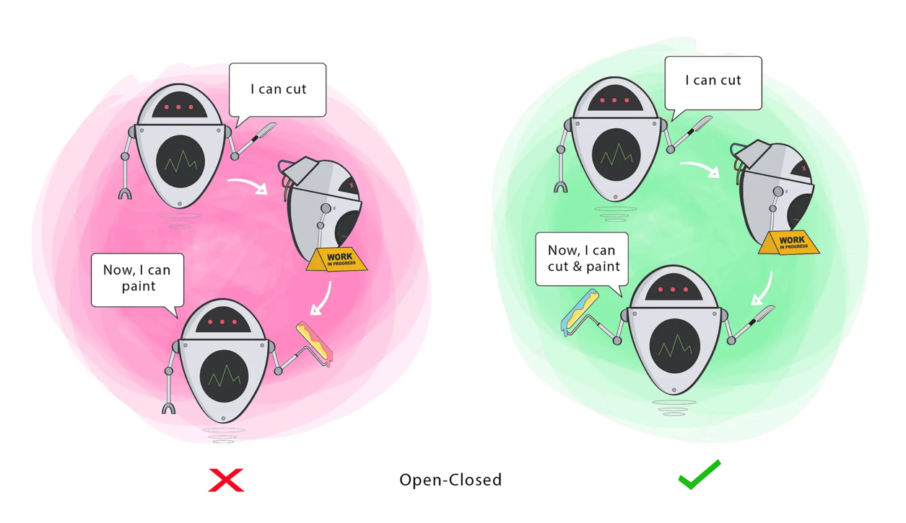

```O``` - **Open Closed Principle**

> Class should be Open for Extension but closed for Extension


- Software entities should be open for extension, but closed for modifications
- Make minimal changes to existing code when introducing new functionality, should not modify already tested code.


  


# Code Sample

Refer [this](./../../code/SOLID/OpenClosed) code for better Understanding.
Explanation:

1. **Interface-Based Design** (TaxCalculator)
    - The TaxCalculator interface defines a contract for tax calculation.
    - The StandardTaxCalculator implements this interface with a 15% tax rate. 
      - If we need a different tax calculation (e.g., GST, VAT, regional tax rates), we do not modify existing code but create new implementations of TaxCalculator.
2. Extending Functionality Without Modification
   - The Order class depends on the TaxCalculator abstraction rather than a concrete implementation.
   - If we want to apply a different tax strategy (e.g., ReducedTaxCalculator or NoTaxCalculator), we simply create new classes implementing TaxCalculator instead of modifying Order.
   


   - **Example of Extension**: 
   Suppose a new tax rule requires a reduced tax rate for certain products. We can create a new class:
      ```java
      class ReducedTaxCalculator implements TaxCalculator {
          private static final double REDUCED_TAX_RATE = 0.05;
          
          public double calculateTax(double amount) {
          return amount * REDUCED_TAX_RATE;
          }
      }
                
      ```
        
   - Now, in Main, we can use:
      ```java
      TaxCalculator taxCalculator = new ReducedTaxCalculator();
     ```
      No changes are made to the Order class, making the system open for extension but closed for modification.
