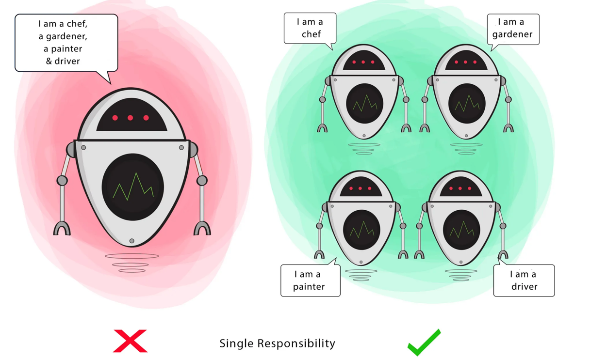

```S``` - **Single Responsibility Principle**

- A ```class``` should have ```single responsibility```.
- Should not have extra/irrelevant functionalities


  **Goal** - This principle aims to separate behaviours so that if bugs arise as a result of your change, it won’t affect other unrelated behaviours.

  
  


# Code Sample

Refer [this](./../../code/SOLID/singleResponsibility) code for better Understanding.
Explanation:
- Before (SRPDemo):

    - Single class handles everything
    - All operations are methods of the `OrderBeforeSRP` class
    - Tightly coupled code 
    - Hard to modify one aspect without affecting others


- After (SRPDemo):

    - Separate classes for each responsibility (`OrderAfterSRP`, `OrderCalculator`, `OrderItem`, `EmailService`, `InvoiceGenerator`)
    - Each operation is handled by a dedicated service 
    - Loose coupling between components
    - Easy to modify or replace individual components
