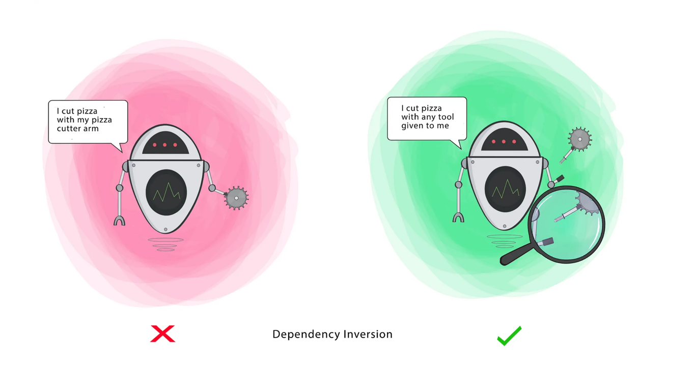

# ```D``` - Dependency Inversion Principle (DIP)

>  - High-level modules should not depend on low-level modules. Both should depend on the abstraction.
> 
>  - Abstractions should not depend on details. Details should depend on abstractions.

- **Low Level class**: Low-level classes contain the implementation details of how something is done. These classes are responsible for the concrete actions and are usually dependent on the abstractions provided by higher-level classes or interfaces.
- **High Level class**: High-level classes contain the core business logic or abstract functionality of the application. These classes typically define what should be done but not how it should be done.


**Goal** - This principle aims at reducing the dependency of a high-level Class on the low-level Class by introducing an interface. 


  


# Code Sample with Explanation

- Violation of DIP [Refer](./../../../code/solidPrinciples/DependencyInversion/DependencyInversionViolation.java):
  - Direct Dependency on Concrete Classes:
    The `Macbook` class is tightly coupled to `WiredMouse2` and `WiredKeyboard2`. It directly creates instances of these concrete classes inside its constructor.
    If you wanted to use a `WirelessMouse2` or a `WirelessKeyboard2`, you would need to modify the `Macbook` class, breaking the **Open/Closed Principle** (part of SOLID principles).
  - Low-level classes (WiredMouse2, WirelessMouse2) and high-level class (Macbook) are coupled.
    This violates the _Dependency Inversion Principle_ because high-level modules (like Macbook) should not depend on low-level modules (like WiredMouse2, WirelessMouse2, etc.). Instead, both should depend on abstractions.


- Solution [Refer](./../../../code/solidPrinciples/DependencyInversion/DependencyInversionViolation.java):
  - **Abstraction Interfaces**:
  
    `Mouse` and `Keyboard` are interfaces that define the expected behavior (click and type methods).
  - **Concrete Implementations**:
  
    `WiredMouse2`, `WirelessMouse2`, `WiredKeyboard2`, and `WirelessKeyboard2` are the concrete classes implementing the `Mouse` and `Keyboard` interfaces.
  - **Macbook Class**:
  
    The `Macbook` class depends on abstractions (Mouse and Keyboard interfaces), not on concrete classes. This is key to the Dependency Inversion Principle.
    The dependencies (mouse and keyboard) are injected via the _**constructor (Dependency Injection)**_.
