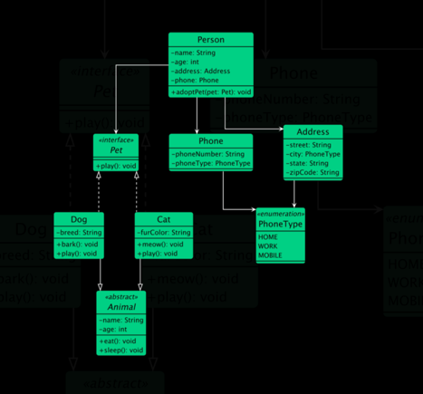

# UML Relations

## Relationships in Class Diagram

### 1. Association

Association represents a "uses-a" relationship between two classes where one class uses or interacts with the other.
- Example: A `Car` has a `Driver`. `Car` class uses, or references `Driver` class.

### 2. Aggregation

Aggregation represents a "has-a" relationship where one class (the whole) contains another class (the part), but the contained class can exist independently.

- Example: A `Car` class has an `Engine` class but the `Engine` class can exist without the `Car` class.

### 3. Composition

Composition represents a strong "has-a" relationship where the part cannot exist without the whole. If the whole is destroyed, the parts are also destroyed.

- Example: A `House` class is composed of `Room` class but the `Room` class can not exist without the `House` class.

### 4. Inheritance

Inheritance (or Generalization) represents an "is-a" relationship where one class (subclass) inherits the attributes and methods of another class (superclass).

- Example: A `Dog` class and a `Cat` class inherit from an `Animal` class, as both dogs and cats are animals.

### 5. Realization/Implementation

Realization or implementation represents a relationship between a class and an interface, where the class implements the methods declared in the interface.

- Example: A `Rectangle` class and a `Circle` class implement the `Shape` interface, which declares a getArea() method.

### 6. Dependency

Dependency represents a "uses" relationship where a change in one class (the supplier) may affect the other class (the client).

- Example: A `Customer` class uses an `Order` class to place order.

---

### Example

- `Inheritance`: Dog and Cat inherit from Animal.
- `Realization/Implementation`: Dog and Cat implement the Pet interface.
- `Aggregation`: Person has an aggregation relationship with Pet, indicating that a person can have multiple pets.
- `Composition`: Person has a composition relationship with Address, indicating that an address cannot exist without a person.
- `Association`: Person has an association relationship with Phone, indicating that a person can have multiple phone numbers.
- `Dependency`: Phone depends on the PhoneType enumeration for the phoneType attribute.

