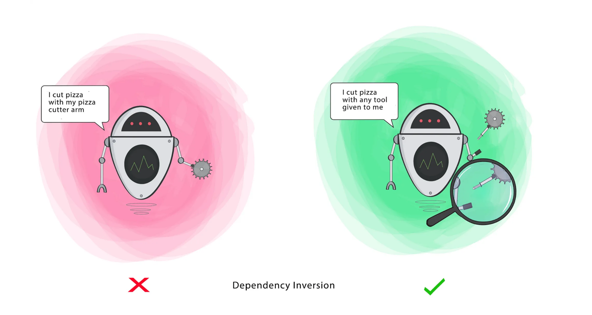

# ```D``` - Dependency Inversion Principle (DIP)

>  - High-level modules should not depend on low-level modules. Both should depend on the abstraction.
> 
>  - Abstractions should not depend on details. Details should depend on abstractions.

- **Low Level class**: Low-level classes contain the implementation details of how something is done. These classes are responsible for the concrete actions and are usually dependent on the abstractions provided by higher-level classes or interfaces.
- **High Level class**: High-level classes contain the core business logic or abstract functionality of the application. These classes typically define what should be done but not how it should be done.


**Goal** - This principle aims at reducing the dependency of a high-level Class on the low-level Class by introducing an interface. 


  

## Violation of DIP

```java
class MySQLDatabase {
    public void connect() {
        System.out.println("Connecting to MySQL");
    }
}

class UserService {
    private MySQLDatabase database = new MySQLDatabase(); // high-level depends on low-level

    public void saveUser() {
        database.connect();
        System.out.println("Saving user");
    }
}

```

### Problem:
- UserService (high-level module) depends directly on MySQLDatabase (low-level module).
- Hard to change the database or unit test.
- Violates DIP: High-level modules should not depend on low-level modules; both should depend on abstractions.

## Following DIP
```java
interface Database {
    void connect();
}

class MySQLDatabase implements Database {
    public void connect() {
        System.out.println("Connecting to MySQL");
    }
}

class UserService {
    private Database database;  // depends on abstraction

    public UserService(Database database) {
        this.database = database;
    }

    public void saveUser() {
        database.connect();
        System.out.println("Saving user");
    }
}

// Usage
class Main {
    public static void main(String[] args) {
        Database db = new MySQLDatabase();
        UserService service = new UserService(db);
        service.saveUser();
    }
}

```

### Benefits:
- UserService now depends on abstraction (Database) instead of a concrete class. 
- Easy to swap database types (e.g., PostgreSQLDatabase) without modifying UserService. 
- Better testability and flexibility.