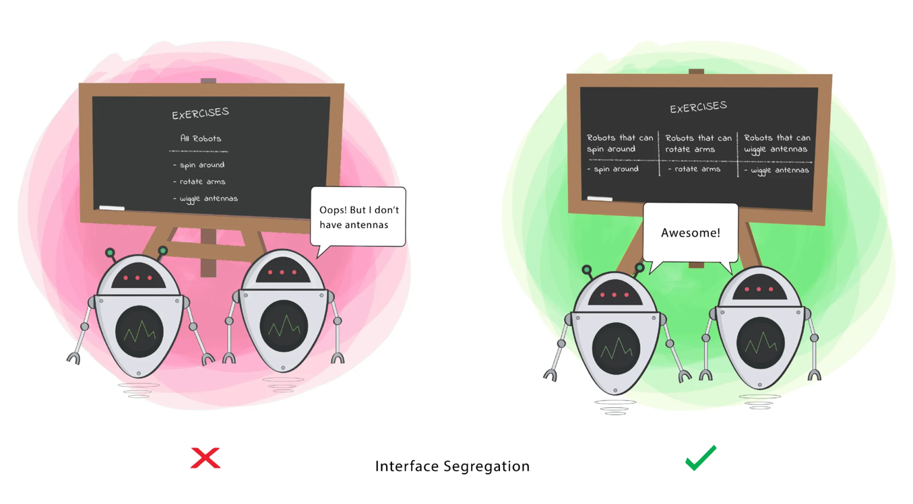
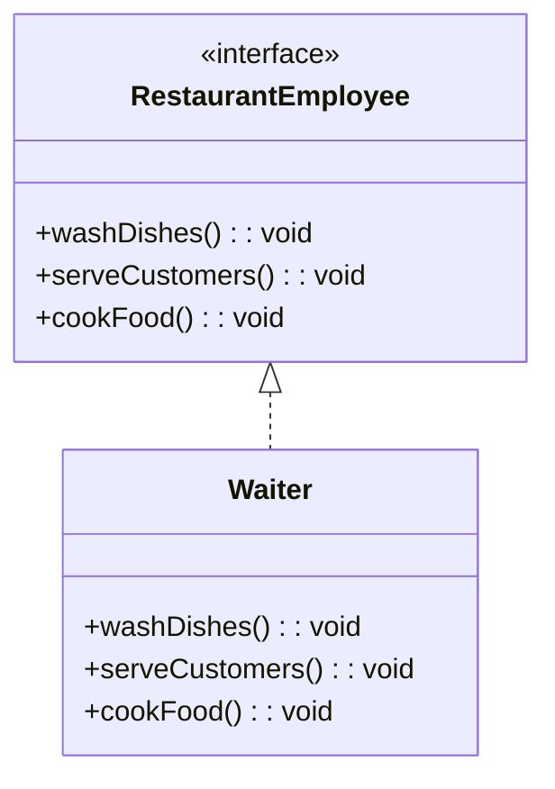
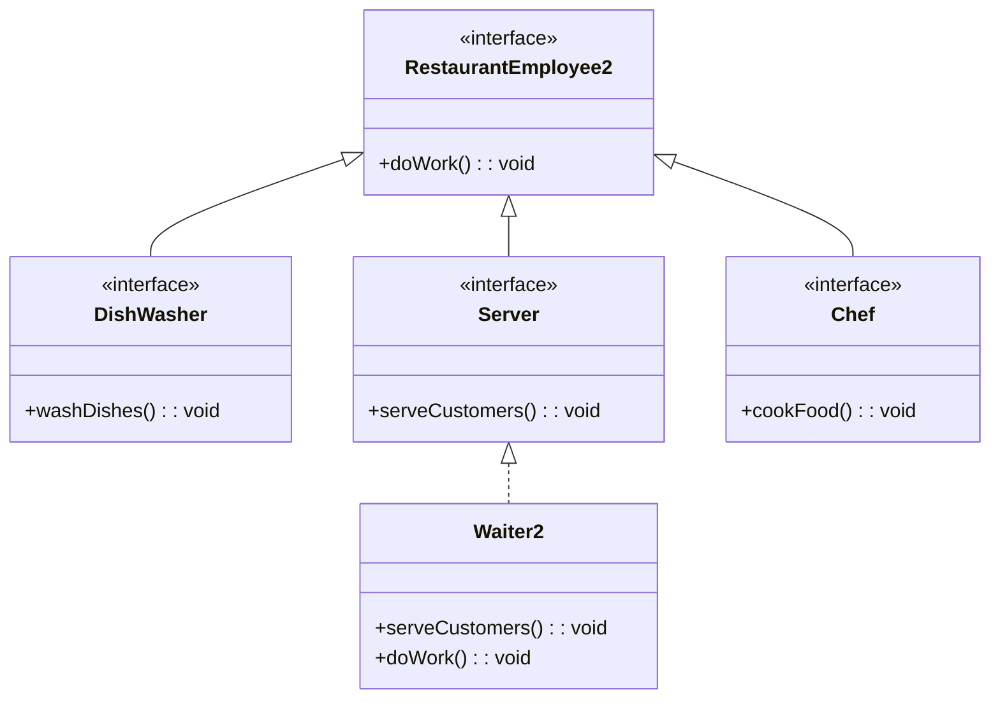

# ```I``` - Interface Segmented Principle (ISP)

> Interfaces should be such, that Clients should not be forced to depend on methods that they do not use.

**Goal** - This principle aims at splitting a set of actions into smaller sets so that a Class executes ONLY the set of actions it requires.


  


# Code Sample with Explanation


- For a singe RestaurantEmployee class, we have a large interface `RestaurantEmployee` that includes methods for washing dishes, serving food, and cooking food.
- But a waiter only needs to serve food, a chef only needs to cook food, and a dishwasher only needs to wash dishes.
- This leads to unused methods or runtime exceptions.
- [Checkout existing implementation](../../code/solidPrinciples/InterfaceSegmentation/InterfaceSegmentationViolation.java)


### Solution :


  - Split the large interface into smaller, more specific interfaces (`DishWasher`, `Server`, `Chef` which extend the `RestaurantEmployee`). 
  - Avoids Unnecessary Implementations – Each class only implements methods relevant to its role.
  - Enhances Code Maintainability – Adding a new role won't affect unrelated classes.
  - Better Extensibility – We can easily introduce new roles without modifying existing code.
- [Checkout Implementation](../../code/solidPrinciples/InterfaceSegmentation/InterfaceSegmentationFixed.java)
