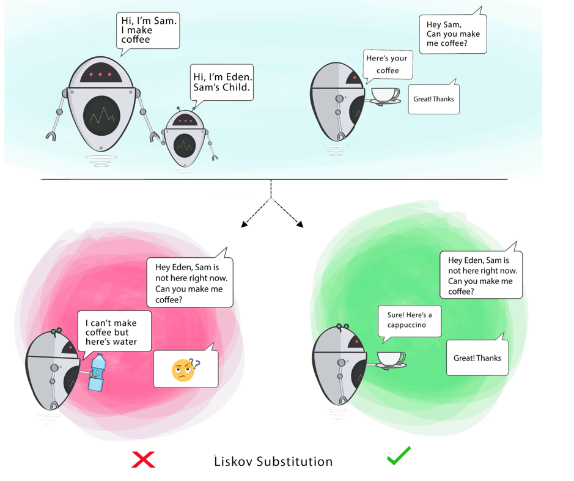

# ```L``` - Liskov Substitution Principle (LSP)

> If S is a subtype of T, then objects of type T in a program may be replaced with objects of type S without altering any of the desirable properties of that program.

**Goal** - This principle aims to enforce consistency so that the parent Class or its child Class can be used in the same way without any errors.

- Subclass should extend the properties of parent class, not narrow it down.


  


# Code Sample with Explanation
- Violation of LSP [Refer](../../code/solidPrinciples/LiskovSubstitution/LiskovSubstitutionViolation.java)
    - The Penguin class extends Bird but does not support fly(), violating LSP.
    - A better approach would be segregating the hierarchy.
- Fixed version: [Refer](../../code/solidPrinciples/LiskovSubstitution/LiskovSubstitutionFixed.java)