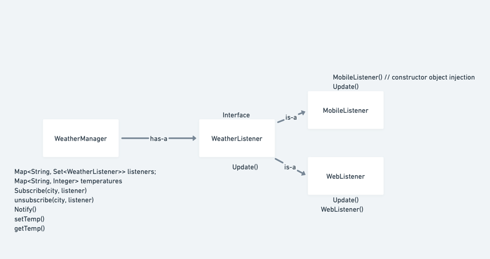

# Weather Publisher Application

Requirements - 

1. Weather collecting application (Publisher) is city specific.
2. We have observers waiting for weather updates for their particular subscribed cities.
3. these observers should be able to subscribe/unsubscribe to the weather app
4. As soon as there is a weather change, observers should be notified.
5. There can be multiple observers.
6. Temperature is the changing parameter. (city->temp)

### [Java Implementation](./../code/src/weatherPublisher)

## Use case Diagram

